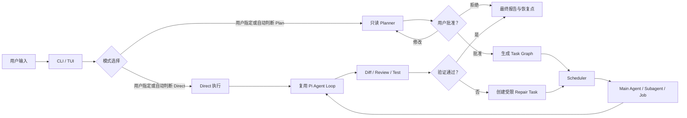
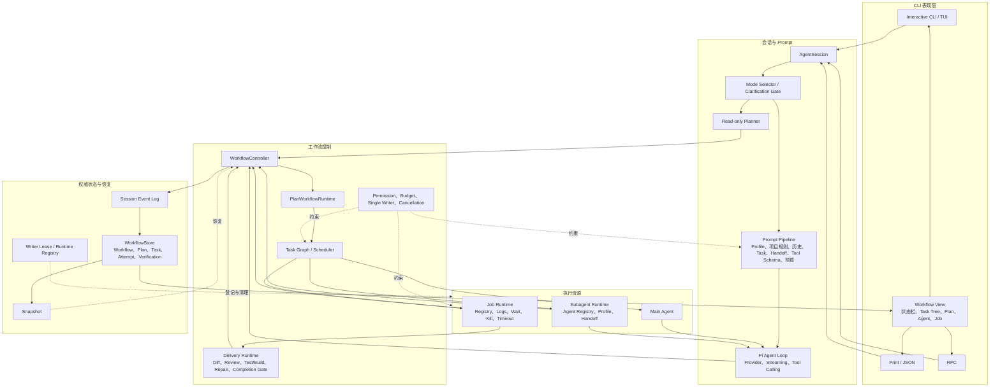
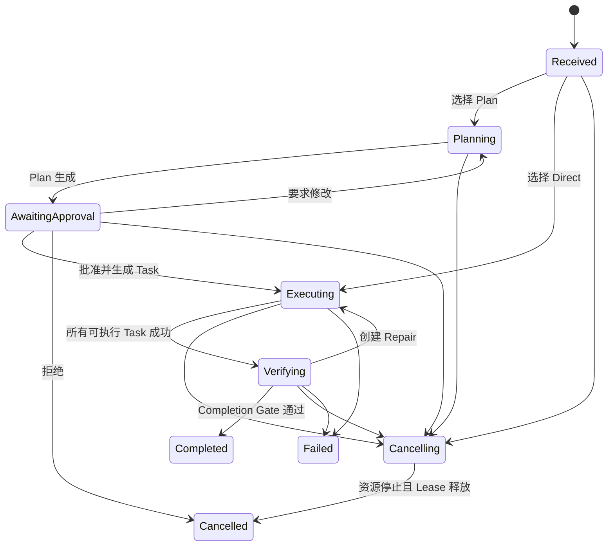

# Pi CLI Agent 二次开发架构

## 1. 定位与边界

本项目是基于 Pi Fork 的 CLI Coding Agent 二次开发。

直接复用 Pi：

- 多模型 Provider、流式 LLM API、Token 与费用统计
- Agent Loop、Tool Calling、并行工具调用
- read、grep、find、ls、edit、write、bash
- AgentSession、JSONL 会话、恢复、分支和压缩
- CLI/TUI、Print、JSON、RPC、Skills、Templates、Extensions

个人新增和产品化：

- Workflow、Plan、Task、Attempt、Verification 领域模型与状态机
- 模式判断、只读 Planner、用户批准和 Plan 版本
- Task Graph、Scheduler、Subagent、Handoff 和后台 Job
- 权限与预算继承、单 Writer Lease、级联取消
- Diff、Review、Test/Build、Repair、Completion Gate 和恢复
- 统一 Workflow View、CLI 控制和非交互输出

## 2. 面向讲解的主流程



没有显式指定模式时，系统采用确定性优先级：用户选择、强制安全策略、Agent 建议、默认 Direct。只有 Plan 批准、关键澄清或权限扩大需要暂停用户。

## 3. 详细组件图



## 4. 状态所有权

采用分层状态管理，不使用一个可任意修改的全局对象。

| 层 | 权威状态 | 更新方式 |
|---|---|---|
| Workflow | 模式、阶段、预算、根 Task、终止原因 | WorkflowController 应用事件 |
| Plan | 内容、版本、批准与拒绝记录 | Plan 命令生成领域事件 |
| Task/Attempt | 依赖、执行人、重试、结果、验证 | Scheduler 和 Runtime 上报事件 |
| Agent/Job | 运行资源、日志、取消和超时 | Registry 保存运行态并向 Controller 汇报 |
| 持久化 | 事实历史与恢复检查点 | Event Log 为事实来源，Snapshot 加速恢复 |
| 展示 | 状态栏、树、面板和机器输出 | Workflow View 从权威状态派生，只读 |

Subagent 和 Job 不直接修改 Workflow；它们只汇报运行结果。Controller 验证实体归属、状态转换和幂等键后更新 Store。

## 5. Prompt 所在位置

Prompt Pipeline 位于模式选择之后、Pi Agent Loop 之前：

1. Planner 使用只读 Planner Prompt，输出结构化 Plan。
2. 批准后，Scheduler 为具体 Task 选择 Agent Profile。
3. Prompt Pipeline 组合 Profile、用户请求、当前 Task、依赖 Handoff、项目规则、必要历史和 Tool Schema。
4. 预算器优先裁剪可选历史，永不丢失安全约束、当前 Task 和必要 Handoff。
5. AgentSession Adapter 将 Prompt Envelope 交给现有 Pi Agent Loop，不重复实现模型调用和 Tool Calling。

## 5.1 模型网关与预算路由

Workflow Model Gateway 位于角色调度和 AgentSession 之间，统一把角色、风险和剩余预算映射到 `fast`、`balanced`、`strong` 三个模型层级：

```text
Mode Advisor / Explorer       → fast
低风险 Direct                  → fast
困难/高风险任务 Planner        → strong
Worker / 普通 Reviewer         → balanced
高风险 Reviewer / Repair      → strong
预算剩余低于 25%               → 向低一档降级
```

自动模式让简单任务和边界明确、低风险的中等任务进入 Direct。困难和高风险任务进入 Plan：Strong Planner 先读取任务与仓库，把实现拆成带文件边界、依赖关系和独立验收条件的 Worker Task；Balanced Worker 执行这些小任务，确定性验证失败时只升级失败节点，验证通过后再由 Reviewer 检查交付。

路由只选择已经在 `ModelRuntime` 中注册且有鉴权的模型；不可用时保留当前模型并记录回退原因。用户显式指定的模型默认优先于自动路由。每次路由保存模型、层级、上一模型和理由，进入 Workflow View、报告和 Session Event Log，便于按成功率、成本和耗时比较路由策略。

通过 `PI_MODEL_FAST`、`PI_MODEL_BALANCED`、`PI_MODEL_STRONG` 配置三个层级，或显式设置 `PI_MODEL_ROUTING=auto` 开启；未配置层级时不改变原有模型行为。

## 6. 状态机



Task 和 Attempt 有独立状态机。Task 表示可交付工作，Attempt 表示某一次 Agent 或 Job 执行；重试创建新 Attempt，不覆盖失败历史。

## 7. CLI 与机器输出

交互命令包括 `/workflow`、`/plan`、`/approve`、`/reject`、`/replan`、`/tasks`、`/task`、`/agents`、`/agent`、`/jobs`、`/job`、`/verify`、`/cancel` 和 `/workflow-resume`。

Pi 原有 `/resume` 用于切换会话，因此 Workflow 恢复使用 `/workflow-resume`，避免破坏既有功能。

- Interactive：输入框上方常驻 Workflow 进度面板，显示阶段、完成/总 Task、运行/等待数量、当前执行者、Verification 和 Repair；Footer 保留简要状态行。
- Print：`--workflow-report` 输出最终人类可读报告。
- JSON：额外输出 `workflow_result`。
- RPC：`get_workflow` 返回同一个可序列化 Workflow View。

## 8. 关键安全约束

- Planner、Explorer、Reviewer 默认只读。
- 子 Agent 的有效权限和预算是父 Agent、Workflow、Task 三层约束的交集。
- 同一工作区默认只允许一个 Writer Lease。
- 父 Workflow 取消时，级联停止 Agent、Job，释放 Lease 后才进入 Cancelled。
- Agent 数量、嵌套深度、并发、时间和 Repair 次数均受预算限制。
- 恢复时不假定旧进程仍然有效；不确定资源标记为 interrupted。
