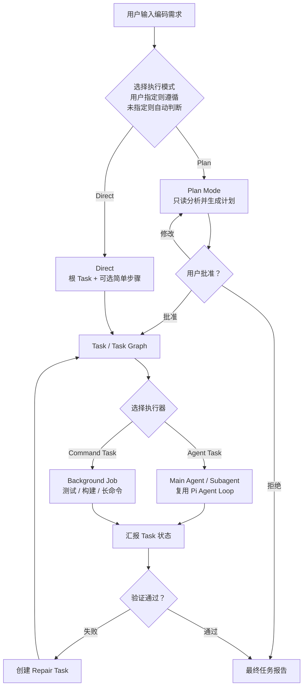

# Pi CLI Coding Agent 长期改进路线图

> 状态：M2 实现中
> 最后更新：2026-07-26
> 项目定位：基于 Pi 二次开发的个人 CLI Coding Agent，用于 Agent 工程学习、作品展示和求职。

## 1. 文档目的

这是一份长期维护的任务计划表，用于：

- 明确哪些能力直接复用 Pi，哪些属于本项目新增。
- 固定模块边界、开发顺序和依赖关系。
- 记录各阶段状态、验收标准和设计决策。
- 防止项目扩张成与 CLI 目标无关的通用平台。
- 为 README、演示、评测和简历提供可验证依据。

M0 设计交付物：

- [`M0 架构基线`](./design/m0-architecture-baseline.md)
- [`M0 核心领域模型`](./design/m0-domain-model.md)
- [`M0 状态、Store 与事件协议`](./design/m0-state-event-protocol.md)
- [`M0 设计验收用例`](./design/m0-acceptance-cases.md)
- [`M0 验证报告`](./design/m0-validation-report.md)

M1 实施计划：

- [`M1 Direct Workflow MVP 实施计划`](./design/m1-direct-workflow-implementation-plan.md)

M2 实施计划：

- [`M2 模式选择与 Prompt Pipeline 实施计划`](./design/m2-mode-prompt-implementation-plan.md)

## 2. 状态约定

| 状态 | 含义 |
|---|---|
| `TODO` | 尚未开始 |
| `DESIGNING` | 正在设计数据模型、协议或交互 |
| `IMPLEMENTING` | 正在实现 |
| `VERIFYING` | 已实现，正在测试和验收 |
| `BLOCKED` | 存在明确阻塞项 |
| `DONE` | 已通过验收 |
| `DEFERRED` | 已明确延期，不属于当前版本 |

更新任务状态时，同时更新：

1. 任务表中的状态。
2. 对应里程碑状态。
3. 文档末尾的决策和变更记录。

## 3. 项目范围

### 3.1 直接复用 Pi

以下能力不重复实现：

- 多模型 Provider 与流式 LLM API。
- 单 Agent Tool Calling Loop。
- 并行 Tool Call。
- `read`、`grep`、`find`、`ls`、`edit`、`write`、`bash`。
- AgentSession 与 Agent 运行状态。
- JSONL 会话、恢复、分支、Fork 和上下文压缩。
- Token 与费用统计。
- TUI、Print、JSON 和 RPC 模式。
- Extensions、Skills、Prompt Templates 和项目规则。
- Project Trust。
- Fake Provider 和现有测试基础设施。

### 3.2 本项目新增

- 自动模式选择和需求澄清。
- 正式 Plan 数据模型、审批和版本管理。
- 统一 Task 数据模型、状态机和 Task Tree。
- Prompt Pipeline。
- 可寻址、可取消、可恢复的 Subagent Runtime。
- 结构化 Handoff。
- Background Job Runtime。
- Task Scheduler。
- 单 Writer、权限继承、预算和级联取消。
- Diff、Review、Test、修复闭环。
- 工作流持久化、恢复和最终报告。

### 3.3 当前不做

- Web UI。
- 远程服务端。
- 跨机器调度。
- 分布式状态管理。
- 通用工作流 DSL。
- 企业级权限平台。
- 完整容器沙箱。
- 自动 Git worktree 合并。
- 复杂的 Agent 自动选择算法。
- 与 CLI Coding Agent 无关的产品能力。

## 4. 目标流程



## 5. 核心架构原则

1. 用户明确选择高于自动判断。
2. 安全策略不能被 Agent 绕过。
3. 未批准的 Plan 不能进入写入阶段。
4. Direct 模式也创建根 Task，统一执行和报告。
5. Plan 管方案和审批，Task 管实际执行进度。
6. Store 是当前聚合状态的唯一读写入口，Event Log 保存持久历史事实；R6 可按 Task Graph 规模拆出 TaskStore。
7. Agent 和 Job 只汇报事实，不直接决定工作流状态。
8. Prompt 只能由 Prompt Pipeline 统一组装。
9. 子 Agent 权限不能超过父 Agent。
10. 同一工作区同时只允许一个 Writer。
11. 父任务取消必须终止全部子 Agent 和 Job。
12. 未通过验证的 Task 不能进入 Succeeded。
13. 重试不能覆盖失败历史。
14. CLI 重启后不能把不确定状态误判为成功。
15. UI 只展示状态，不作为业务状态来源。

## 6. 长期任务计划

下面的 R0-R11 是 12 个开发阶段，不是用户请求在运行时依次经过的 12 个流程。每个阶段都必须形成“设计、实现、CLI 可见、自动测试、可重复演示”的纵向闭环。

### R0：范围与架构基线

| ID | 状态 | 任务 | 交付物与验收标准 | 依赖 |
|---|---|---|---|---|
| R0.1 | `DONE` | 分析 Pi 已有能力 | 区分正式能力、扩展示例和实验模块 | 无 |
| R0.2 | `DONE` | 确定 CLI 项目定位 | 明确基于 Pi 二次开发，只强调新增能力 | R0.1 |
| R0.3 | `DONE` | 固定总体架构 | 明确 CLI、Workflow、State、Runtime、Delivery 层 | R0.2 |
| R0.4 | `DONE` | 定义模块目录 | 给出 Extension 原型和正式 Core 两套目录结构 | R0.3 |
| R0.5 | `DONE` | 建立术语表 | 固定 Workflow、Plan、Task、Attempt、Agent、Job、Handoff 的含义 | R0.3 |
| R0.6 | `DONE` | 固定项目非目标 | README 和设计文档中明确延期项 | R0.2 |

### R1：核心数据模型

| ID | 状态 | 任务 | 交付物与验收标准 | 依赖 |
|---|---|---|---|---|
| R1.1 | `DONE` | 定义 Workflow 模型 | 包含 ID、模式、阶段、根 Task、预算、时间和最终结果 | R0.5 |
| R1.2 | `DONE` | 定义 Task 模型 | 包含父子关系、依赖、分配、预算、Attempt、结果和验证要求 | R0.5 |
| R1.3 | `DONE` | 定义 Plan 模型 | 包含目标、步骤、涉及文件、依赖、风险、验证方式和版本 | R0.5 |
| R1.4 | `DONE` | 定义 Attempt 模型 | 每次执行、失败和重试使用独立记录，不覆盖历史 | R1.2 |
| R1.5 | `DONE` | 定义 Handoff 模型 | 包含结论、文件与行号、修改、测试、风险和未完成项 | R0.5 |
| R1.6 | `DONE` | 定义 Verification 与 WorkflowResult | 区分命令退出、Task 成功、验证通过和 Workflow 完成 | R1.1、R1.2 |
| R1.7 | `DONE` | 固定实体关系与 ID 规则 | Workflow、Plan、Task、Attempt、Agent、Job 可稳定关联 | R1.1-R1.6 |
| R1.8 | `DONE` | 设计模型测试用例 | 列出必填字段、序列化和关系约束的测试场景，实际测试随 R3 实现 | R1.1-R1.7 |

### R2：状态机、Store 与最小 Event Log

| ID | 状态 | 任务 | 交付物与验收标准 | 依赖 |
|---|---|---|---|---|
| R2.1 | `DONE` | 定义 Workflow 状态机 | Received、Clarifying、Planning、AwaitingApproval、Executing、Verifying、Cancelling 及终态 | R1.1 |
| R2.2 | `DONE` | 定义 Task 状态机 | Pending、Ready、Running、Verifying、Succeeded 及异常终态 | R1.2 |
| R2.3 | `DONE` | 定义 Plan 状态机 | Draft、AwaitingApproval、Approved、Rejected、Superseded | R1.3 |
| R2.4 | `DONE` | 定义转换守卫 | 非法转换必须被拒绝并记录原因 | R2.1-R2.3 |
| R2.5 | `DONE` | 设计 WorkflowStore 与 TaskStore | Store 是当前聚合状态的唯一读写入口 | R2.1、R2.2 |
| R2.6 | `DONE` | 定义统一事件协议 | 事件包含实体、类型、版本、时间、来源和载荷 | R1.7 |
| R2.7 | `DONE` | 设计最小追加式 Event Log | 明确存储格式、写入顺序和恢复原则，实际实现放入 R3 | R2.5、R2.6 |
| R2.8 | `DONE` | 设计 WorkflowController | 仅 Controller 可以改变工作流阶段 | R2.1、R2.5 |
| R2.9 | `DONE` | 定义幂等操作 | 重复取消、完成和事件投递不破坏状态 | R2.4、R2.7 |
| R2.10 | `DONE` | 设计状态机测试用例 | 列出合法、非法、失败、阻塞、取消和终态转换场景，实际测试随 R3 实现 | R2.1-R2.9 |

### R3：Direct Workflow MVP

| ID | 状态 | 任务 | 交付物与验收标准 | 依赖 |
|---|---|---|---|---|
| R3.1 | `DONE` | 固定源码与测试边界 | Core 放在 `src/core/workflow`，CLI 仅适配，测试放在 `test/workflow` | M0 |
| R3.2 | `DONE` | 实现 Direct 领域类型 | 将 Workflow、Task、Attempt、Verification 和 Result 的最小子集实现为 TypeScript | R1.1-R1.7、R3.1 |
| R3.3 | `DONE` | 实现状态转换与不变量 | 使用纯函数覆盖合法转换、守卫、revision 和终态规则 | R2.1-R2.4、R3.2 |
| R3.4 | `DONE` | 实现 Workflow Event Batch | 定义事件创建、sequence、entityRevision、commandId 和 Schema 校验 | R2.6、R2.9、R3.2 |
| R3.5 | `DONE` | 实现 Session Event Log 与 Store | 当前分支追加和重放 Event Batch，Store 只能应用已持久化事件 | R2.5、R2.7、R3.3、R3.4 |
| R3.6 | `DONE` | 实现最小 WorkflowController | 支持 Direct start、runtime event、complete、fail、cancel 和幂等命令 | R2.8、R2.9、R3.5 |
| R3.7 | `DONE` | 接入 Direct 请求创建 | 每个普通顶层请求调用 Controller 生成 Workflow、根 Task 和 ModeDecision | R3.6 |
| R3.8 | `DONE` | 对接 Pi AgentSession | 复用 prompt、subscribe、abort 和 SessionManager，正确处理 `willRetry` | R3.6、R3.7 |
| R3.9 | `DONE` | 实现基础 Verification | 检查最终 Agent 结果和活动 Attempt，不虚构 Review/Test/Build | R1.6、R3.8 |
| R3.10 | `DONE` | 实现基础取消 | Executing → Cancelling，等待 AgentSession idle 后再 Cancelled | R2.9、R3.6、R3.8 |
| R3.11 | `DONE` | 生成基础最终报告 | 输出状态、Task、Attempt、修改文件、验证限制、失败原因和资源用量 | R3.9、R3.10 |
| R3.12 | `DONE` | 提供最小 CLI 状态 | `/workflow`、`/workflow-cancel` 和状态行可以展示权威状态 | R3.6、R3.11 |
| R3.13 | `DONE` | 编写领域与持久化测试 | 覆盖类型约束、状态机、Store、Event 重放和幂等 | R3.2-R3.6 |
| R3.14 | `DONE` | 编写 AgentSession 集成测试 | 使用 Fake Provider 覆盖成功、重试、失败、取消和修改文件汇总 | R3.7-R3.13 |
| R3.15 | `DONE` | 建立 Direct 演示场景 | [`M1 Direct Workflow 演示`](./demos/m1-direct-workflow.md) 可重复运行单文件低风险完整闭环 | R3.14 |

### R4：模式选择、Prompt Pipeline 与 Agent Profile

| ID | 状态 | 任务 | 交付物与验收标准 | 依赖 |
|---|---|---|---|---|
| R4.1 | `DONE` | 定义执行模式 | 支持 `auto`、`direct`、`plan` | R1.1 |
| R4.2 | `DONE` | 定义模式优先级 | 用户 Plan > 强制 Plan 策略 > 用户 Direct > Agent 建议 > 默认规则 | R4.1 |
| R4.3 | `DONE` | 定义 ModeDecision | 保存 mode、source、reason、riskLevel 和时间 | R4.2 |
| R4.4 | `DONE` | 设计需求澄清门禁 | 只询问会实质改变实现方案的问题 | R2.8 |
| R4.5 | `DONE` | 设计自动模式建议 | 结构化返回复杂度、风险和建议模式 | R4.3 |
| R4.6 | `DONE` | 定义 Agent Profile | 固定 ModeAdvisor、Planner、Explorer、Worker、Reviewer 的职责 | R0.5 |
| R4.7 | `DONE` | 定义 PromptEnvelope | 包含角色、Task、上下文、工具、约束、输出 Schema 和版本 | R1.2、R4.6 |
| R4.8 | `DONE` | 设计 Prompt 输入与顺序 | 用户需求、Plan、Task、Profile、Handoff、历史、项目规则、Tool Schema | R4.7 |
| R4.9 | `DONE` | 设计裁剪和预算规则 | 不丢失安全约束、当前 Task 和必要 Handoff | R4.8 |
| R4.10 | `DONE` | 对接 AgentSession | 不重复实现 Pi 已有 Prompt 和 Tool Schema 组装能力 | R3.8、R4.8 |
| R4.11 | `TODO` | 设计 Direct 升级 Plan | 发现高复杂度或高风险时先停止写入，再请求批准 | R4.2、R5.2 |
| R4.12 | `TODO` | 编写模式与 Prompt 测试 | 覆盖用户覆盖、自动判断、裁剪、Profile 和版本记录 | R4.1-R4.11 |

### R5：正式 Plan Mode

| ID | 状态 | 任务 | 交付物与验收标准 | 依赖 |
|---|---|---|---|---|
| R5.1 | `TODO` | 复核现有 Plan Mode 示例 | 明确可复用命令、工具限制、Widget 和 Session Entry | R0.1 |
| R5.2 | `TODO` | 实现 Plan 状态机 | Plan 可以创建、待批准、批准、拒绝和被新版本替代 | R1.3、R2.3 |
| R5.3 | `TODO` | 实现 Planner 只读门禁 | Planner 禁用写工具，Bash 受只读策略限制 | R4.6 |
| R5.4 | `TODO` | 实现 Plan 审批记录 | 保存批准、拒绝、修改内容和时间 | R2.7、R5.2 |
| R5.5 | `TODO` | 实现 Plan 版本管理 | 修改或重新规划创建新版本，不覆盖旧版本 | R5.2、R5.4 |
| R5.6 | `TODO` | 实现 Plan 转 Task | 批准后将步骤转换为已有 Task 模型 | R1.2、R1.3 |
| R5.7 | `TODO` | 移除文本进度依赖 | 不依赖 `[DONE:n]`，Plan 进度从关联 Task 推导 | R5.6 |
| R5.8 | `TODO` | 提供 Plan CLI | `/plan`、`/approve`、`/reject`、`/replan` | R5.2-R5.6 |
| R5.9 | `TODO` | 编写 Plan 回归测试 | 覆盖只读、批准、拒绝、修改、版本和 Direct 升级 | R4.11、R5.2-R5.8 |
| R5.10 | `TODO` | 建立 Plan 演示场景 | 复杂任务在批准前不修改代码，批准后进入执行 | R5.9 |

### R6：Task Graph 与 Scheduler

| ID | 状态 | 任务 | 交付物与验收标准 | 依赖 |
|---|---|---|---|---|
| R6.1 | `TODO` | 实现父子 Task 与依赖 | 支持树形拆分和 DAG 依赖 | R1.2、R2.5 |
| R6.2 | `TODO` | 实现 Ready 推导 | 只将依赖满足的 Task 标记为 Ready | R2.2、R6.1 |
| R6.3 | `TODO` | 实现 Task Attempt | 每次调度、失败和重试保留独立记录 | R1.4 |
| R6.4 | `TODO` | 实现 Scheduler | 只选择 Ready 且满足约束的 Task | R6.2 |
| R6.5 | `TODO` | 定义执行器接口 | Task 可以交给 Main Agent、Subagent 或 Job | R6.4 |
| R6.6 | `TODO` | 实现基础串并行规则 | 无依赖只读 Task 可并行，写 Task 暂时串行 | R6.1、R6.4 |
| R6.7 | `TODO` | 实现阻塞和重试 | 失败依赖不会被误判为可执行，重试生成新 Attempt | R6.2、R6.3 |
| R6.8 | `TODO` | 提供 Task Tree 与命令 | `/tasks`、`/task show`、`retry`、`cancel` | R6.1-R6.7 |
| R6.9 | `TODO` | 编写 Scheduler 测试 | 覆盖依赖、并行、阻塞、失败和重试 | R6.1-R6.8 |

### R7：运行保障能力

| ID | 状态 | 任务 | 交付物与验收标准 | 依赖 |
|---|---|---|---|---|
| R7.1 | `TODO` | 定义权限模型 | 有效权限为父权限、Profile、Workflow 和项目策略的交集 | R4.6 |
| R7.2 | `TODO` | 强制只读角色 | Planner、Explorer、Reviewer 在运行时不能写入 | R7.1 |
| R7.3 | `TODO` | 实现 Writer Lease | 同一工作区同时只有一个 Writer | R7.1 |
| R7.4 | `TODO` | 管理 Lease 生命周期 | 支持获取、续约、释放、过期和异常回收 | R7.3 |
| R7.5 | `TODO` | 记录修改归属 | 文件修改关联 Workflow、Task、Agent 和 Attempt | R7.3、R6.3 |
| R7.6 | `TODO` | 定义 Budget | 包含 Token、费用、轮次、时间、并发、Agent 数、深度和重试 | R1.1、R1.2 |
| R7.7 | `TODO` | 实现预算继承 | 子 Task 和 Agent 不能超过父级可用预算 | R7.6 |
| R7.8 | `TODO` | 实现软硬限制 | 软限制警告，硬限制停止继续调度 | R7.6 |
| R7.9 | `TODO` | 实现级联取消 | Workflow → Task → Agent/Job，最后释放 Lease | R2.9、R7.4 |
| R7.10 | `TODO` | 限制并发、深度和重试 | 达到上限时拒绝新执行并记录原因 | R7.6、R7.8 |
| R7.11 | `TODO` | 编写保障能力测试 | 覆盖越权、双 Writer、预算耗尽、重复取消和级联清理 | R7.1-R7.10 |

### R8：Subagent 与结构化 Handoff

| ID | 状态 | 任务 | 交付物与验收标准 | 依赖 |
|---|---|---|---|---|
| R8.1 | `TODO` | 复核现有 Subagent 示例 | 明确可复用的独立进程、parallel、chain、流式和取消能力 | R0.1 |
| R8.2 | `TODO` | 定义 AgentRegistry | 保存 ID、父子关系、Task、Session、Profile、状态、预算和用量 | R1.7、R4.6 |
| R8.3 | `TODO` | 实现 Subagent API | `spawn`、`send`、`wait`、`interrupt`、`list`、`retry` | R8.2 |
| R8.4 | `TODO` | 创建独立 AgentSession | 每个子 Agent 有独立会话和受限上下文 | R4.10、R8.3 |
| R8.5 | `TODO` | 实现权限与预算继承 | 子 Agent 不能扩大权限或突破父级预算 | R7.1、R7.7 |
| R8.6 | `TODO` | 实现 Agent 事件与流式进度 | started、progress、blocked、completed、failed、usage | R2.6、R8.2 |
| R8.7 | `TODO` | 校验结构化 Handoff | 缺少关键结果时不能把 Task 标记为成功 | R1.5、R8.6 |
| R8.8 | `TODO` | 聚合多个 Handoff | 汇总并行结果，识别冲突、重复和未完成项 | R8.7 |
| R8.9 | `TODO` | 接入 Scheduler | Scheduler 可以分配受约束的 Subagent | R6.5、R8.3 |
| R8.10 | `TODO` | 提供 Agent CLI | 展示 Agent、Profile、父子关系、Task、状态和资源用量 | R8.2-R8.9 |
| R8.11 | `TODO` | 编写 Subagent 测试 | 使用 Fake Provider 和伪子进程覆盖成功、失败、取消和超限 | R8.3-R8.10 |

### R9：Background Job Runtime

| ID | 状态 | 任务 | 交付物与验收标准 | 依赖 |
|---|---|---|---|---|
| R9.1 | `TODO` | 定义 Job 模型 | 包含 Task、命令、cwd、状态、PID、日志、退出码和超时 | R1.7 |
| R9.2 | `TODO` | 实现 JobRegistry | 保存 Job 生命周期、Task 归属和资源使用 | R9.1 |
| R9.3 | `TODO` | 实现 Job API | `jobs`、`logs`、`wait`、`kill` | R9.2 |
| R9.4 | `TODO` | 实现增量日志 | 分离 stdout/stderr，限制总量并保留尾部 | R9.3 |
| R9.5 | `TODO` | 实现超时和进程树清理 | 先正常终止，再强制终止完整进程树 | R7.9、R9.3 |
| R9.6 | `TODO` | 实现完成通知 | Job 事件唤醒所属 Workflow 和 Task | R2.6、R9.2 |
| R9.7 | `TODO` | 接入 Scheduler | Command Task 可以进入后台 Job Runtime | R6.5、R9.3 |
| R9.8 | `TODO` | 提供 Job CLI | 展示命令、状态、增量日志、退出码和超时 | R9.3-R9.6 |
| R9.9 | `TODO` | 编写 Job 测试 | 覆盖输出、超时、kill、进程树、取消和完成通知 | R9.3-R9.8 |

### R10：交付闭环与恢复

| ID | 状态 | 任务 | 交付物与验收标准 | 依赖 |
|---|---|---|---|---|
| R10.1 | `TODO` | 收集 Diff 与修改归属 | 汇总实际修改文件、Diff、Task、Agent 和 Attempt | R7.5 |
| R10.2 | `TODO` | 实现只读 Reviewer | 检查正确性、风险、遗漏和不必要修改 | R7.2、R8.9、R10.1 |
| R10.3 | `TODO` | 执行 Test/Build | 通过 Job Runtime 运行明确验证命令 | R9.7 |
| R10.4 | `TODO` | 统一 VerificationResult | passed、failed、skipped；skipped 必须记录原因 | R1.6、R10.2、R10.3 |
| R10.5 | `TODO` | 实现 Completion Gate | 必要 Task 均为 Succeeded 且要求的验证通过后，Workflow 才能进入 Completed | R2.1、R2.2、R10.4 |
| R10.6 | `TODO` | 实现 Repair Task | 验证失败后创建修复任务，不盲目重复原命令 | R6.3、R10.4 |
| R10.7 | `TODO` | 实现受限修复循环 | 修复次数受预算和重试上限控制 | R7.10、R10.6 |
| R10.8 | `TODO` | 生成完整最终报告 | 包含状态、任务、修改、测试、风险、未完成项和资源用量 | R1.6、R10.5 |
| R10.9 | `TODO` | 实现 Snapshot 与事件重放 | Snapshot 加后续 Event 可以重建聚合状态 | R2.7 |
| R10.10 | `TODO` | 处理中断运行资源 | 重启后将不确定的 Agent 和 Job 标记为 Interrupted | R8.2、R9.2、R10.9 |
| R10.11 | `TODO` | 恢复 Writer Lease | 检查并释放失效 Lease，不把旧租约当作有效 | R7.4、R10.9 |
| R10.12 | `TODO` | 提供 Resume CLI | 列出、继续、重试或取消中断 Workflow | R10.9-R10.11 |
| R10.13 | `TODO` | 编写交付与恢复测试 | 覆盖验证、Repair、上限、崩溃、重放和 Lease 恢复 | R10.1-R10.12 |

### R11：CLI 打磨、评测与作品材料

| ID | 状态 | 任务 | 交付物与验收标准 | 依赖 |
|---|---|---|---|---|
| R11.1 | `TODO` | 完善 Workflow 状态栏 | 展示模式、阶段、根 Task、预算和停止原因 | R7.6、R10.8 |
| R11.2 | `TODO` | 完善 Task Tree | 展示父子、依赖、状态、Agent、Attempt 和验证结果 | R6.8、R10.4 |
| R11.3 | `TODO` | 完善 Plan、Agent、Job 面板 | 统一交互与状态表达，避免重复信息 | R5.8、R8.10、R9.8 |
| R11.4 | `TODO` | 完善控制命令 | `/plan`、`/tasks`、`/agents`、`/jobs`、`/cancel`、`/resume` | 各相关阶段 |
| R11.5 | `TODO` | 支持非交互输出 | Print、JSON、RPC 可以表达 Workflow、Task 和最终结果 | R10.8 |
| R11.6 | `TODO` | 验证最小打扰原则 | 只在批准、关键澄清和权限扩大时暂停用户 | R4.4、R5.4、R7.1 |
| R11.7 | `TODO` | 建立 CLI 端到端回归 | 覆盖 Direct、Plan、Subagent、Job、取消、Repair 和恢复 | R10.13 |
| R11.8 | `TODO` | 建立可重复评测集 | 使用固定小型仓库任务，不虚构指标 | R11.7 |
| R11.9 | `TODO` | 编写 README | 明确基于 Pi，区分复用能力和个人贡献 | R11.8 |
| R11.10 | `TODO` | 完善架构文档 | 保存流程图、详细架构图、状态机、协议和关键权衡 | R0.3、R10.13 |
| R11.11 | `TODO` | 编写演示脚本 | 展示 Plan、Task、Subagent、Job、修复、取消和报告 | R11.7 |
| R11.12 | `TODO` | 整理简历材料 | 只写实际完成、测试和评测过的能力与指标 | R11.8-R11.11 |

## 7. 里程碑

| 里程碑 | 状态 | 范围 | 演示目标 |
|---|---|---|---|
| M0：设计基线 | `DONE` | R0-R2 的设计与协议 | 能完整解释模型、状态机、事件和数据流 |
| M1：Direct MVP | `DONE` | R3 | 单 Agent Direct 请求可以执行、取消、验证和报告 |
| M2：Plan 与 Task | `TODO` | R4-R6 | 自动模式、Plan 审批、Task Graph 和调度可演示 |
| M3：受控 Runtime | `TODO` | R7-R9 | 可控 Subagent、后台 Job、单 Writer、预算和级联取消 |
| M4：交付与恢复 | `TODO` | R10 | Diff、Review、Test、Repair、报告和中断恢复 |
| M5：作品版本 | `TODO` | R11 | 完整 CLI、可重复评测、README、演示和简历证据 |

## 8. Core 与 Extension 实现策略

### 8.1 Core 保存权威状态

Workflow、Task、Event Log、Controller 和运行资源 Registry 属于 CLI 产品核心：

```text
packages/coding-agent/src/core/workflow/
packages/coding-agent/src/core/tasks/
packages/coding-agent/src/core/subagents/
packages/coding-agent/src/core/jobs/
packages/coding-agent/src/core/policy/
```

M1 只创建 `core/workflow`。其他目录在对应里程碑达到拆分条件后再创建。

Core 负责：

- 权威状态和转换守卫。
- AgentSession 完整生命周期，包括自动重试。
- 持久化、取消、预算和运行资源清理。
- 向 TUI、Print、JSON 和 RPC 提供统一状态。

### 8.2 Extension 验证交互

Plan、Agent Profile 和 Subagent 的早期交互仍可用源码受控的 Extension 原型验证：

```text
packages/coding-agent/examples/extensions/
├── plan-mode/
├── subagent/
└── workflow-prototypes/
```

Extension 可以验证 Prompt、命令、Widget 和审批体验，但不能成为 Workflow/Task 的权威状态源。稳定后的交互可以继续作为薄适配器，运行状态必须回到 Core。

## 9. 最终验收场景

项目作品版本至少通过以下场景：

1. 单文件低风险任务自动选择 Direct。
2. Direct 可无子任务，也可生成轻量步骤。
3. 复杂任务自动选择 Plan。
4. 用户明确 `/plan` 时不会被自动降级。
5. Plan 未批准前无法修改代码。
6. Direct 发现高风险后升级 Plan。
7. 多个只读 Agent 可以并行探索。
8. 同一工作区始终只有一个 Writer。
9. 子 Agent 返回结构化 Handoff。
10. 后台 Job 可以查看日志、等待和终止。
11. 测试失败后创建 Repair Task。
12. 达到预算或重试上限后停止。
13. 取消父任务会终止全部子 Agent 和 Job。
14. CLI 重启后正确标记中断状态。
15. 用户可以继续、重试或取消中断任务。
16. 最终报告包含修改、测试、风险和资源使用。
17. README 明确说明项目基于 Pi 二次开发。

## 10. 主要风险

| 风险 | 影响 | 应对 |
|---|---|---|
| 功能范围过大 | 长期无法形成可演示版本 | 严格按 M1-M5 推进，每个里程碑独立可演示 |
| Extension 承担过多运行时职责 | reload、恢复和清理不可靠 | 原型验证后按判断标准下沉 Core |
| Plan 与 Task 重复维护进度 | 状态不一致 | Plan 只管方案，执行进度从 Task 推导 |
| Agent 直接修改全局状态 | 并发和恢复不可控 | Agent 只发事件，Store 是唯一事实源 |
| 子 Agent 复制完整上下文 | Token 浪费和信息污染 | 使用结构化 Handoff 和 Prompt 裁剪 |
| 多 Writer 并发修改 | 冲突和修改归属不清 | 第一版强制单 Writer Lease |
| 自动模式频繁询问用户 | CLI 体验变差 | 默认 auto，仅关键审批和澄清暂停 |
| 为简历提前包装未完成功能 | 项目可信度下降 | 只记录已实现并验证的事实和指标 |

## 11. 决策记录

| 日期 | 决策 | 原因 |
|---|---|---|
| 2026-07-26 | 项目只聚焦 CLI Coding Agent | 保持个人项目范围清晰 |
| 2026-07-26 | 默认模式为 auto | 未指定模式时不打扰用户 |
| 2026-07-26 | 用户指定高于 Agent 建议 | 保留用户最高控制权 |
| 2026-07-26 | Plan 与 Task 分离 | Plan 管方案审批，Task 管执行状态 |
| 2026-07-26 | 采用分层状态管理 | 避免单一全局可变状态和完全分散状态 |
| 2026-07-26 | Agent/Job 只汇报事件 | 保证状态更新可控、可审计 |
| 2026-07-26 | 第一版采用单 Writer | 以最小复杂度保证工作区写入安全 |
| 2026-07-26 | Extension 用于交互原型 | 快速验证 Prompt、命令、Widget 和审批体验 |
| 2026-07-26 | 路线图改为 12 个纵向阶段 | 每阶段都能通过 CLI、测试和演示独立验收 |
| 2026-07-26 | 提前 Task、Event Log 和运行保障 | 避免 Plan、Subagent 和恢复能力在后期返工 |
| 2026-07-26 | 测试贯穿各阶段 | 不把集成问题推迟到作品版本 |
| 2026-07-26 | Blocked 定义为可恢复状态 | 等待输入、权限或依赖不应提前结束 Workflow |
| 2026-07-26 | Direct 允许受控升级 Plan | 运行中发现高风险时先停止写入，再进入规划审批 |
| 2026-07-26 | 原型只重放 Session 当前分支事件 | 避免不同会话分支的 Workflow 状态互相污染 |
| 2026-07-26 | 取消增加 Cancelling 中间态 | 确保子运行资源停止和 Writer Lease 释放后才进入终态 |
| 2026-07-26 | M0 设计验证通过 | 24 项 R0-R2 任务和 74 个设计验收场景已完成检查 |
| 2026-07-26 | M1 Workflow 采用 Core-first | Extension 缺少完整 retry 生命周期，且权威状态需要成为 CLI 默认能力 |
| 2026-07-26 | R3.3 状态规则实现完成 | Workflow、Task、Attempt 转换守卫和实体不变量已由 34 个聚焦测试覆盖 |
| 2026-07-26 | R3.4 Workflow Event Batch 完成 | Direct 事件类型、Payload、信封构造和批次约束已由 17 个聚焦测试覆盖 |
| 2026-07-26 | R3.5 Session Event Log 与 Store 完成 | 当前分支、重放、幂等、原子应用和防御性副本已由 20 个聚焦测试覆盖 |
| 2026-07-26 | R3.6 最小 WorkflowController 完成 | Direct 命令、运行事件、完成、失败、两阶段取消和幂等处理已由 13 个聚焦测试覆盖 |
| 2026-07-26 | R3.7 Direct 请求创建接入完成 | CLI 顶层 Prompt 在 Agent Loop 前创建 Workflow、根 Task 和 ModeDecision，SDK 默认行为不变，已由 5 个聚焦测试覆盖 |
| 2026-07-26 | R3.8 AgentSession Adapter 完成 | AgentSession 生命周期已映射为 Task 与 Attempt 事件，自动重试保留独立 Attempt，并由 4 个适配器测试和 2 个 faux provider 集成测试覆盖 |
| 2026-07-26 | R3.9 基础 Verification 完成 | 成功的 AgentSession 运行进入验证并完成 Workflow，只汇总成功 edit/write，Review/Test/Build 明确标记为未配置 |
| 2026-07-26 | R3.10 基础取消完成 | 取消请求先持久化，等待 AgentSession idle 后再依次取消 Attempt、Task 和 Workflow，并覆盖并发调用与未启动边界 |
| 2026-07-26 | R3.11 基础最终报告完成 | 成功、失败和取消终态均生成结构化报告，包含 Task、Attempt、修改文件、验证限制、失败原因和聚合资源用量 |
| 2026-07-26 | R3.12 最小 CLI 状态完成 | `/workflow` 查看当前或最近 Workflow，`/workflow-cancel` 走两阶段取消，Footer 展示 Store 派生的权威状态行 |
| 2026-07-26 | R3.13 领域与持久化测试完成 | 补齐核心联合类型、重复完成命令、持久化品牌与损坏历史检测，状态机、Store、重放和幂等验收覆盖完整 |
| 2026-07-26 | R3.14 AgentSession 集成测试完成 | Faux Provider 覆盖成功、自动重试、失败、取消、真实 write/edit 修改汇总，以及连续请求创建独立 Workflow |
| 2026-07-26 | R3.15 Direct 演示完成 | `npm run demo:direct-workflow` 使用 Faux Provider 在临时目录重复演示单文件 write、edit、验证、状态查询和最终报告 |
| 2026-07-26 | M1 Direct MVP 完成 | R3.1-R3.15 全部完成，具备可运行代码、CLI 控制、自动测试和无网络可重复演示 |
| 2026-07-26 | R4.1 执行模式定义完成 | 固定选择层 `auto`、`direct`、`plan` 与执行层 `direct`、`plan` 的边界，并提供运行时类型守卫 |
| 2026-07-26 | R4.2 模式优先级完成 | 纯函数实现用户选择、强制 Plan 安全门禁、Agent 建议和默认规则的确定性解析 |
| 2026-07-26 | R4.3 ModeDecision 完成 | 领域构造器校验原因、风险和时间，Direct Workflow 通过事件原子持久化完整决策 |
| 2026-07-26 | R4.4 需求澄清门禁完成 | 结构化区分必须询问、安全默认值和非实质偏好，避免不必要地暂停用户 |
| 2026-07-26 | R4.5 自动模式建议完成 | 校验复杂度、风险、置信度和原因，确定性生成 Direct 或 Plan 建议并接入 ModeSelector |
| 2026-07-26 | R4.6 Agent Profile 完成 | 固定五种角色的职责、工具、权限上限和默认预算，并校验只读角色不能获得写入能力 |
| 2026-07-26 | R4.7 PromptEnvelope 完成 | 固定角色、Task、上下文、工具、约束、输出 Schema 和双版本边界，并提供领域校验 |
| 2026-07-26 | R4.8 Prompt 输入顺序完成 | 按模型通道固定 Profile、项目规则、历史、当前 Workflow 上下文和 Tool Schema 的确定性顺序 |
| 2026-07-26 | R4.9 Prompt 裁剪与预算完成 | 按优先级裁剪可选上下文，永久保留约束、当前 Task、用户需求和必要 Handoff，硬内容超预算时明确失败 |
| 2026-07-26 | R4.10 AgentSession 适配完成 | 复用现有 System Prompt、历史、Tool Schema 和 Agent Loop，Envelope 只注入 Workflow 上下文并在当前活动工具边界内临时收紧能力 |

## 12. 下一步

M1 Direct Workflow MVP 已完成并验证。M2 当前继续 R4：

1. 完成 R4.11：设计 Direct 升级 Plan。
2. 完成 R4.12：补齐模式与 Prompt 回归测试。

R4 完成前不同时展开正式 Plan 状态机、Task Graph、Subagent 或 Job。
