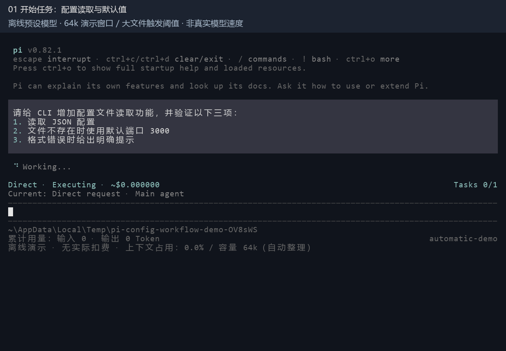
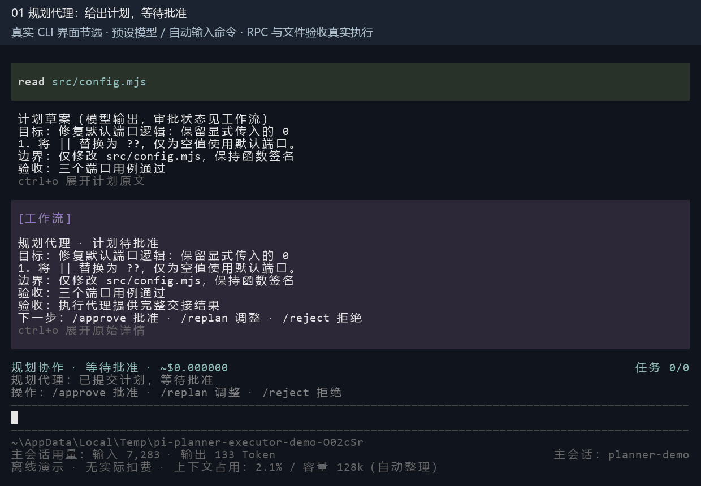
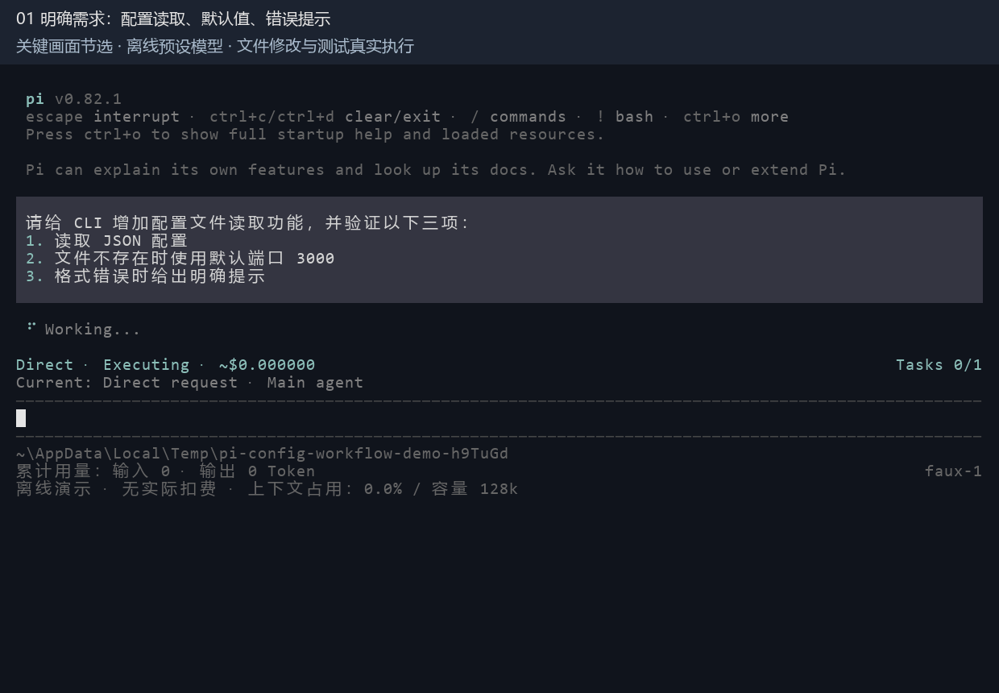

# CodeRelay Agent 可复现演示

## 主演示：达到阈值后自动切窗



15 秒，五张现有 `InteractiveMode` 的真实终端画面。模型回复预设，演示模型窗口配置为 64,000 Token，`reserveTokens=16000` 被运行时按 20% 上限调整为 12,800，因此软阈值为 38,400、硬阈值为 51,200。自定义 `inspect_reference` 工具完整读取临时大文件，使工具结果的上下文估计超过硬阈值；不是把模拟用量计数改大，也不是默认 `read` 工具的输出上限。窗口容量、资料体积是为演示选择的，不代表自然长任务耗时。

完成仓库依赖安装和 `npm run hydrate:model-data` 后运行：

```powershell
npx tsx packages/coding-agent/examples/sdk/25-config-workflow-demo.ts --automatic
npx tsx packages/coding-agent/examples/sdk/25-config-workflow-demo.ts --automatic --interactive
```

真实执行顺序：写入初始实现 → 读取大参考文件 → 在工具结束后自动切窗 → 从保留的目标继续读取已有代码 → 补全默认值 → 三项 Node 测试一次通过。脚本没有开放 `new_context` 工具，断言只有一次切窗且原因为 `threshold`；还断言旧资料已移出当前上下文但仍在历史记录中、原始目标仍可见、已写代码未丢失，以及最终文件与测试结果正确。全部通过才输出 `[demo] PASS`。

这不是逐字交接的保证：自动强制切窗不会替模型补写自由文本待办，本例从原始目标和已有代码继续。History 仍可按需回查，但本例无需调用。普通 CLI 默认摘要模式，显式 `--context-mode windowed` 才启用硬切窗；自动检查还要求 `compaction.enabled` 未关闭。连续工具执行会在切窗后继续；已结束的回答不会仅因切窗而启动新任务。

## 补充演示：Planner / Executor 分工



12 秒，三张现有 `InteractiveMode` 的真实界面画面：规划代理提交计划 → 执行代理接手实现 → 返回修改结果与验收。运行：

```powershell
npx tsx packages/coding-agent/examples/sdk/26-planner-executor-demo.ts
npx tsx packages/coding-agent/examples/sdk/26-planner-executor-demo.ts --interactive
```

入口：[`26-planner-executor-demo.ts`](../packages/coding-agent/examples/sdk/26-planner-executor-demo.ts)。真实 Planner 会话使用 Faux Provider 先读源码，再提交预设计划；脚本检查批准前无可派发任务且文件未改。交互版通过现有 CLI 命令处理器运行 `/plan`、`/approve`、`/agents dispatch 1` 和 `/agent wait`，沿用产品的工作流消息、进度面板和用量底栏，不打印替代界面。命令由脚本提交，不是人工键盘录屏。为逐步展示分工，本例关闭自动调度，由派发命令启动一个 Worker；不代表普通自动模式必须手动派发。两个模型标识为 `faux/planner-demo` 和 `faux/executor-demo`，不代表真实模型强弱或速度。

CLI 默认用中文卡片显示计划、执行角色、接收范围和交付结果。展开操作（默认 Ctrl+O，可配置）可查看原始 JSON 和内部编号；`/workflow`、`/agent show` 等详细命令保留技术信息。底栏明确标注主会话模型和用量，执行代理模型显示在执行卡片与进度中。卡片中的“项检查”统计运行时验收记录，不是测试脚本中的用例数；执行任务完成也不代表整个工作流完成。

通过产品 `PlanWorkflowRuntime`、`SubagentRuntime` 和 `RpcSubagentSessionFactory` 启动独立 Worker 子进程。默认文本模式仍使用 `createPlannerExecutorSession`，保留原 SDK 示例；`--record` 仅为该文本模式添加停留时间，README 的 GIF 使用 `--interactive` 录制。

Worker 校验收到固定执行契约，用真实 `edit` 将默认端口逻辑的 `||` 改成 `??`。父运行时的演示验收适配器核对指定命令，并直接启动 Node 子进程运行同一测试脚本，检查缺失值、显式 0、自定义端口三个用例。脚本断言两个会话不同、模型路由正确、文件差异符合计划、验收仅运行一次、Worker Task 为 `succeeded`，然后输出 `[demo] PASS`。

演示使用共享临时工作目录，不演示 Git Worktree 隔离；展示到 Worker 交付为止，没有将它称为整个 Workflow 完成，也没有运行后置 Delivery / Reviewer。模型输出和修复方案预设，不提供成本收益结论。

## 重新生成两段 GIF

捕获脚本使用 `@xterm/headless` 解析实际终端输出；渲染脚本需要 Python 与 Pillow，Windows 使用 Consolas、微软雅黑、Segoe UI Symbol。中文与英文按同一基线绘制。命令中的 `python` 可以替换成本机 Python 路径或 Windows 的 `py`。

```powershell
node scripts/record-workflow-demo.mjs automatic
python scripts/render-workflow-demo.py automatic
node scripts/record-workflow-demo.mjs planner
python scripts/render-workflow-demo.py planner
```

只有演示进程正常退出并输出 `[demo] PASS` 才保存录制。原始 ANSI、终端单元格、选帧时间和联络表留在 `.artifacts/github-demo-recording/automatic-*` 与 `planner-*`，GIF 和静态图输出到 `docs/images/`。GIF 增加顶部阶段说明并调整关键画面停留时间，不是连续桌面录屏，也不代表实际执行速度。

## 原有演示：主动切窗、历史回查与失败修复



动画 18 秒、1240×860，依次展示需求清单（3 秒）、失败测试（3 秒）、切窗保留待办（4 秒）、History 恢复证据（2 秒）、修复差异（2 秒）和三项测试通过（4 秒）。运行现有 `InteractiveMode`，捕获原始 ANSI 输出并交给终端模拟器解析，从一次通过断言的运行中选取六张真实终端画面，调整停留时间；顶部中文阶段条为编辑标注。没有重绘工具区或伪造任务状态，不是连续桌面录屏，也不代表模型执行速度。[静态封面](images/coderelay-config-demo.png)展示切窗后的待办。

从仓库根目录运行，要求 Node.js 22.19 或更新版本：

```powershell
npm install --ignore-scripts
npm run hydrate:model-data
npx tsx packages/coding-agent/examples/sdk/25-config-workflow-demo.ts
```

在现有 CLI 界面中观看同一段引导演示：

```powershell
npx tsx packages/coding-agent/examples/sdk/25-config-workflow-demo.ts --interactive
```

交互演示自动开始，显示最终验证结果后退出；文本模式额外输出 `/workflow` 报告。输入框上方左侧显示模式、阶段与工作流估算费用，右侧显示已完成/总任务数，下一行显示当前任务；窄终端会把进度换到下一行。完成后保留简短结果，不再在底栏重复执行状态和完整任务 UUID。底栏使用中文标签显示累计输入/输出 Token、会话估算费用与当前上下文占用；输入包含缓存读取和写入，与 `/session` 的统计口径一致。缓存明细和会话累计命中率通过 `/session` 查看。正常预算不显示，接近上限或超限时提示，详情仍在 `/workflow`。详细任务编号与执行尝试可展开进度面板或通过 `/workflow` 查看。任务计数不代表耗时百分比，新增修复任务会增加总数。费用是本地使用量估算，不代表账户剩余额度；本例明确显示“离线演示 · 无实际扣费”。本例的检查属于自定义工具，不会伪造 Delivery 的 Verification/Repair 计数。普通自由交互仍使用 `./pi-test.ps1`。

重新生成 GIF（依赖已安装的 `@xterm/headless` 和 Python Pillow；Windows 使用 Consolas、微软雅黑和 Segoe UI Symbol，其他系统需安装 DejaVu Sans / Mono 和 Noto Sans CJK。不同字体按统一基线绘制）：

```powershell
node scripts/record-workflow-demo.mjs
python scripts/render-workflow-demo.py
```

原始 ANSI、逐帧终端单元格与生成记录保存在 `.artifacts/github-demo-recording/interactive-*`，图片输出到 `docs/images/`。

入口：[`25-config-workflow-demo.ts`](../packages/coding-agent/examples/sdk/25-config-workflow-demo.ts)。沿用 Direct Workflow、真实文件工具、本地 Node 测试和 History 恢复入口。首次安装依赖及初始化公开模型目录元数据需要网络；不下载模型权重。完成初始化后，演示不调用外部模型，不需要 API Key、Docker 或 WSL。原问候语示例仍可通过 `npm run demo:direct-workflow` 运行。

固定任务是为 CLI 实现 `src/config.ts` 的配置读取函数，验证 JSON 读取、缺失文件默认端口和格式错误提示。三项要求是一个 Direct 任务内的验收清单，不是三个调度任务，因此底栏 Tasks 从 0/1 变为 1/1，测试结果从 2/3 变为 3/3。演示在临时目录中执行：

1. `write` 工具写入初始代码。
2. `verify_config` 启动真实的 `node --test` 子进程，三项测试中有两项通过，缺失文件默认值用例失败。界面摘要由实际 TAP 测试结果解析生成。
3. `new_context` 携带未完成的检查及下一步，创建一个新上下文窗口。
4. 脚本断言新窗口保留待办、排除旧测试输出。本例交接未携带具体失败用例，因此按需通过 `history` 找回失败记录。
5. `edit` 工具补上缺失文件的处理，再次运行相同的三项测试并全部通过。
6. 核对检查退出码依次为 1、0，测试通过/失败计数依次为 2/1、3/0，硬切换恰好一次，最终文件符合要求，输出 `[demo] PASS`。

History 用于按需检索旧消息和工具结果，不是每次切窗后的固定步骤。交接信息足够时应直接继续；本例特意设置缺少诊断细节的情形来演示查证。默认卡片显示结果数量、来源和原文预览；展开可看本次返回的完整内容、记录编号、窗口编号和时间。截断或分页会明确提示，展开不会自动读取未返回的历史。

真实运行输出节选：

```text
[tool] write
[tool] verify_config
[verify] Node test FAIL (expected before repair)
[tool] new_context
[context] Fresh window retains the pending check; old test output excluded
[tool] history
[history] Recovered the original failing check
[tool] edit
[tool] verify_config
[verify] Node test PASS
[demo] PASS
```

工作目录由系统临时目录生成，正常完成或报错后都会尝试清理，不修改使用者的项目文件。源码、测试断言、工具返回和上下文切换是真实执行；模型回复、交接内容和修复方案预先写在脚本里。因此，这验证的是工具与恢复链路，不是模型自主解决问题的能力，也不是自然触发长上下文的性能测试。

报告中的 `Tests: not configured` 指 Direct Workflow 没有配置 Delivery Runtime 的测试要求；本演示的 Node 检查通过自定义工具执行，并由脚本独立断言。需要展示正式 Completion Gate 时，运行下面的 Plan 演示。

## 补充演示：审批、调度与交付闭环

```powershell
npm run demo:cli-agent-showcase
```

入口：[`22-cli-agent-showcase.ts`](../packages/coding-agent/examples/sdk/22-cli-agent-showcase.ts)。演示完全离线，使用固定 Plan、模拟 Job 和伪 Subagent，不实际实现示例 CLI 命令。Workflow 状态转换、Repair 创建、Completion Gate 和恢复逻辑使用产品实现。脚本依次展示：

1. 提交预先定义的 Plan 并停在 Awaiting Approval。
2. 批准后生成 Task Graph。
3. Scheduler 将 Command Task 交给后台 Job。
4. 首轮 Test 失败并创建有次数上限的 Repair Task。
5. Writer Subagent 完成 Repair，并返回结构化 Handoff。
6. 第二轮 Test 通过 Completion Gate。
7. 输出 Task、Verification、风险、资源用量和停止原因。
8. 从内存 Session 中的 Snapshot 与 Event Log 重建终态 Workflow（不是进程崩溃后的磁盘恢复）。
9. 创建第二个 Workflow 并演示取消。

预期最后一行：

```text
[showcase] PASS
```

自动调度版本：

```powershell
npm run demo:autonomous-workflow
```

入口：[`23-autonomous-workflow-showcase.ts`](../packages/coding-agent/examples/sdk/23-autonomous-workflow-showcase.ts)。批准固定 Plan 后，由 runner 自动执行调度、验证和修复，结束时输出 `[autonomous-showcase] PASS`。Job 与 Subagent 同样是模拟实现，不代表真实模型质量。

## 回归检查与故障排查

原有固定评测入口仍可单独运行：`npm run eval:cli-agent`。它用于开发检查，不是主演示的必需步骤。

```powershell
npm run check
Set-Location packages/coding-agent
node ../../node_modules/vitest/dist/cli.js --run test/suite/workflow-direct.test.ts test/suite/workflow-plan.test.ts
```

- 原有主动切窗演示的首次 Node 检查失败是预期步骤；自动切窗版只验收一次并全部通过。两者最终都必须出现 `[demo] PASS` 且进程退出码为 0。
- 缺少 `tsx` 时，先从根目录完成 `npm install --ignore-scripts`。
- 缺少 `packages/ai/src/providers/data/*.json` 时，运行 `npm run hydrate:model-data`；该生成目录不纳入 Git，新检出需要初始化。
- Node 无法读取 `.ts` 或运行测试时，核对 `node --version` 是否达到最低版本。
- 这些演示不需要配置模型密钥；出现认证请求时应核对运行的命令。

产品修复的证据和仍未解决的限制见[上下文验证回归记录](../packages/coding-agent/docs/context-window-regressions.md)。
