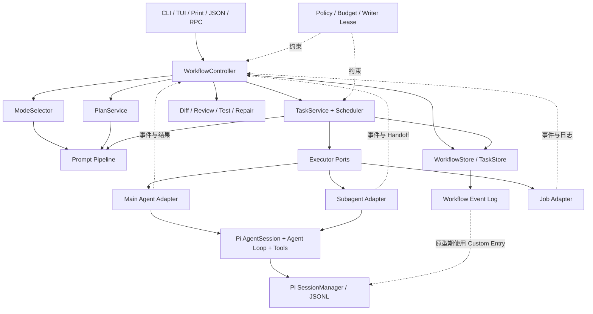

# M0：CLI Coding Agent 架构基线

> 状态：已验证
> 范围：M0 设计，不包含运行时代码
> 配套文档：
>
> - [`m0-domain-model.md`](./m0-domain-model.md)
> - [`m0-state-event-protocol.md`](./m0-state-event-protocol.md)
> - [`m0-acceptance-cases.md`](./m0-acceptance-cases.md)
> - [`m0-validation-report.md`](./m0-validation-report.md)

## 1. 目标

本项目在 Pi 的 CLI Coding Agent 能力上增加一层可追踪、可审批、可调度、可验证的 Workflow。新增层负责组织工作，不替代 Pi 已有的模型调用、Agent Loop、工具、会话和终端 UI。

最终定位：

> 基于 Pi 二次开发的个人 CLI Coding Agent，重点产品化 Direct/Plan、Task、Subagent、Job 和代码交付闭环。

## 2. 已核对的 Pi 边界

### 2.1 可以直接复用

| Pi 能力 | 本项目用法 |
|---|---|
| `AgentSession` | 执行一次主 Agent 对话、流式响应、工具调用和取消 |
| `AgentSessionRuntime` | 创建、替换、恢复和销毁当前 AgentSession |
| Agent Loop | 执行 Agent Task，不重新实现 Tool Calling Loop |
| 内置 Coding Tools | 执行读、搜索、编辑、写入和命令 |
| Extension API | 原型期注册命令、工具、事件钩子、状态栏和 Widget |
| `SessionManager` | 复用 JSONL 会话、树形分支和 Custom Entry |
| Prompt Templates、Skills、项目规则 | 作为 Prompt Pipeline 的输入 |
| TUI、Print、JSON、RPC | 作为不同 CLI 输出适配器 |
| Token、费用和上下文统计 | 汇总到 Workflow、Task 和 Agent 用量 |
| Fake Provider 与测试 Harness | 实现阶段用于确定性测试 |

### 2.2 只有示例或实验性雏形

| 能力 | 当前实现 | 本项目需要补齐 |
|---|---|---|
| Plan Mode | Extension 切换工具、注入提示词、解析编号步骤和 `[DONE:n]` | 结构化 Plan、审批记录、版本、状态机、Plan 转 Task |
| Subagent | Extension 为每次调用启动独立 `pi --mode json --no-session` 进程，支持 single、parallel、chain | Registry、可寻址 API、父子关系、持久化状态、预算与权限继承 |
| Handoff | Chain 使用 `{previous}` 或直接返回文本 | 结构化结果、校验、压缩和冲突识别 |
| Orchestrator | 实验性 Pi 实例管理，提供实例状态和进程/RPC 管理 | 不直接当作 Task Scheduler；后续只评估可复用的进程监管部分 |
| 权限和 Git Checkpoint | 分散的 Extension 示例 | 统一策略、Writer Lease、审批和修改归属 |

### 2.3 明确不重复实现

- LLM Provider 和流式协议。
- 单 Agent Tool Calling Loop。
- Coding Tool 本身。
- Pi 的会话树、上下文压缩和模型统计。
- 一套新的通用 TUI 框架。

## 3. 总体架构



### 3.1 各层职责

| 层 | 职责 | 不负责 |
|---|---|---|
| CLI | 接收输入、显示状态、请求必要批准、提供控制命令 | 不直接修改业务状态 |
| Workflow | 选择流程阶段、处理命令、应用状态守卫、决定何时验证或结束 | 不执行 LLM Tool Loop |
| Domain/State | 定义模型、状态机、不变量和结果 | 不依赖 TUI |
| Prompt | 为不同角色组装有预算的上下文 | 不保存 Workflow 状态 |
| Task/Scheduler | 推导 Ready Task、处理依赖和选择执行器 | 不直接绕过权限运行工具 |
| Policy | 计算有效权限、预算、并发、Writer Lease 和取消范围 | 不决定任务内容 |
| Runtime Adapter | 将 Task 转交 Main Agent、Subagent 或 Job | 不决定 Workflow 是否完成 |
| Delivery | 收集 Diff、Review、Test、Repair 和最终报告 | 不把命令退出码直接当成验证通过 |
| Store/Event | 保存当前聚合状态和不可覆盖的事件历史 | 不接受 Agent 直接写入 |

## 4. 用户运行流程

### 4.1 未指定模式

```text
用户输入
  → ModeSelector 生成 ModeDecision
  → 低风险简单任务：Direct
  → 复杂或高风险任务：Plan
  → 只有关键澄清、Plan 批准或权限扩大才暂停用户
```

模式选择顺序固定为：

```text
用户明确指定 Plan
  > 强制安全策略要求 Plan
  > 用户明确指定 Direct
  > Agent 建议
  > 默认规则
```

Agent 只提供结构化建议，最终模式转换由 WorkflowController 执行。

### 4.2 Direct

```text
Received
  → ModeDecision 后创建根 Agent Task
  → 复用 Main Agent 的 Pi AgentSession
  → 收集执行结果
  → Verifying
  → Completed / Repair / Failed / Cancelled
```

Direct 也必须创建根 Task。简单任务可以没有子 Task，中等任务可以生成轻量步骤。

### 4.3 Plan

```text
Received
  → ModeDecision 后创建 pending 的根 Control Task
  → Planning（只读）
  → 生成结构化 Plan
  → AwaitingApproval
  → 修改：创建新 Plan 版本
  → 拒绝：Cancelled
  → 批准：Plan Step 转为根 Task 下的执行 Task Graph
  → Executing
  → Verifying
```

Plan 只管理方案与审批，执行进度从关联 Task 推导。

## 5. 实现目录边界

M1 将权威 Workflow 状态直接实现到 Core：

```text
packages/coding-agent/src/core/workflow/
├── types.ts
├── transitions.ts
├── events.ts
├── event-log.ts
├── stores.ts
├── controller.ts
├── agent-session-adapter.ts
└── index.ts

packages/coding-agent/test/workflow/
```

Plan、Subagent 等交互可以继续在 `packages/coding-agent/examples/extensions/` 中做原型，但不能保存 Workflow/Task 权威状态。

### 5.1 M1 限制

- 一个 Workflow 绑定一个 Pi Session 和一个工作目录。
- Workflow Event 暂存在 Session Custom Entry，不进入 LLM 上下文。
- M1 只运行 Main Agent；Subagent 和 Job 在后续里程碑接入。
- M1 不尝试跨会话、跨工作目录或跨机器调度。

### 5.2 后续 Core 拆分条件

M1 只建立 `core/workflow`。达到对应里程碑后再拆分：

```text
packages/coding-agent/src/core/workflow/
packages/coding-agent/src/core/tasks/
packages/coding-agent/src/core/subagents/
packages/coding-agent/src/core/jobs/
packages/coding-agent/src/core/policy/
```

## 6. 术语表

| 术语 | 定义 |
|---|---|
| Workflow | 一次用户编码需求从接收到最终报告的完整生命周期 |
| Execution Mode | Workflow 的入口策略，只允许 `auto`、`direct`、`plan` |
| ModeDecision | 模式选择结果及其来源、原因和风险等级 |
| Plan | 写入前供用户审查的结构化方案 |
| Plan Version | Plan 的不可变版本；修改或重新规划产生新版本 |
| Plan Step | Plan 中的逻辑步骤，批准后可以映射为一个或多个 Task |
| Task | 可调度、可追踪、可验证的执行工作项 |
| Task Graph | Task 的父子关系和依赖关系组成的 DAG |
| Attempt | Task 的一次实际执行；重试产生新 Attempt |
| Main Agent | 当前 CLI 主会话中的 Pi AgentSession |
| Subagent | 由父 Workflow 创建、具有独立上下文的受限 Agent 实例 |
| Agent Profile | Agent 的角色、模型、Prompt、工具和权限上限 |
| Job | 不经过 LLM Agent Loop 的后台命令进程 |
| Handoff | Agent 向父 Workflow 返回的结构化压缩结果 |
| Verification | 对 Diff、Review、Test 或其他交付条件的检查 |
| Repair Task | Verification 失败后创建的显式修复任务 |
| Store | 对当前聚合状态提供唯一读写入口的内存投影 |
| Event Log | 保存状态变化事实的追加式持久化记录 |
| Writer Lease | 同一工作区唯一写执行者的租约 |
| Budget | Token、费用、轮次、时间、并发、深度和重试限制 |
| Terminal State | 不允许继续普通转换的最终状态 |

状态用词固定：

- Workflow 成功终态：`completed`。
- Task 成功终态：`succeeded`。
- Attempt、Agent 和 Job 成功终态：`succeeded` 或 `stopped`，按实体语义使用。
- Job 退出码为 0 只代表命令成功结束，不代表 Verification 已通过。

## 7. 非目标

当前项目不做：

- Web UI、桌面 GUI 或移动端。
- 远程 Agent 服务、跨机器或分布式调度。
- 通用工作流 DSL 和可视化流程编辑器。
- 企业级组织、租户、RBAC 或审批平台。
- 完整容器沙箱和网络隔离平台。
- 自动 Git worktree 合并与复杂冲突解决。
- 通用自主 Agent 社会或无限递归 Agent。
- 复杂的学习型 Agent 自动选择算法。
- 替换 Pi Provider、Agent Loop、Coding Tools、SessionManager 或 TUI。

## 8. 核心不变量

1. 用户明确指定模式时，Agent 建议不能覆盖它。
2. 强制安全策略可以阻止 Direct，但不能静默扩大权限。
3. 未批准的 Plan 不能触发写操作。
4. ModeDecision 完成后、进入 Planning 或 Executing 前，每个 Workflow 必须创建且只创建一个根 Task。
5. Task 依赖必须无环。
6. Agent 和 Job 只能提交事件，不能直接修改 Store。
7. Durable Event 必须先写入成功，再应用到当前 Store 投影。
8. 子 Agent 的有效权限和预算不能超过父级。
9. 同一工作区同时最多一个 Writer Lease。
10. 父 Workflow 取消必须级联取消 Task、Agent 和 Job。
11. Task 未满足验证要求时不能进入 `succeeded`。
12. Workflow 只有在必要 Task 均 `succeeded` 且 Completion Gate 通过后才能 `completed`。
13. 重试创建新 Attempt，不覆盖失败记录。
14. 重启后不确定的运行资源必须标记为 `interrupted`，不能推断成功。
15. CLI/TUI 是状态投影，不是状态事实源。

## 9. M0 架构决策

| 决策 | 结论 |
|---|---|
| Workflow 与 AgentSession 关系 | Workflow 在上层协调，一个 Workflow 可以驱动一个或多个 AgentSession |
| Plan 与 Task 关系 | Plan 管方案和批准；Task 管执行和验证 |
| Store 与 Event Log 关系 | Event Log 保存持久事实，Store 是通过事件得到的当前权威投影 |
| Agent 状态汇报 | Agent 产生结构化事件和 Handoff，Controller 决定 Workflow 转换 |
| M1 存储 | Core 先复用 Session Custom Entry，并明确其生命周期限制 |
| 第一版执行器 | 只接入 Main Agent，先形成 Direct 纵向闭环 |
| 多 Agent 写入 | 第一版多 Agent Runtime 强制单 Writer |
| Orchestrator | 不直接采用实验包作为 Task Orchestrator，只在后续评估进程监管复用 |
| M1 代码位置 | Workflow 权威状态直接进入 Core，Extension 只做交互原型 |

## 10. M0 评审出口

满足以下条件后才进入 R3 Direct MVP：

- 架构层之间没有循环依赖。
- 所有术语只有一个含义。
- Workflow、Task、Plan 的 ID 和关系可以稳定持久化。
- 状态机不存在无守卫的写入或完成路径。
- Event 可以重放得到相同状态。
- Direct 最小场景不依赖尚未实现的 Subagent 或 Job。
- Core 与 Extension 的职责边界及 M1 限制已经显式记录。
- M0 验收用例没有未解释的冲突。
