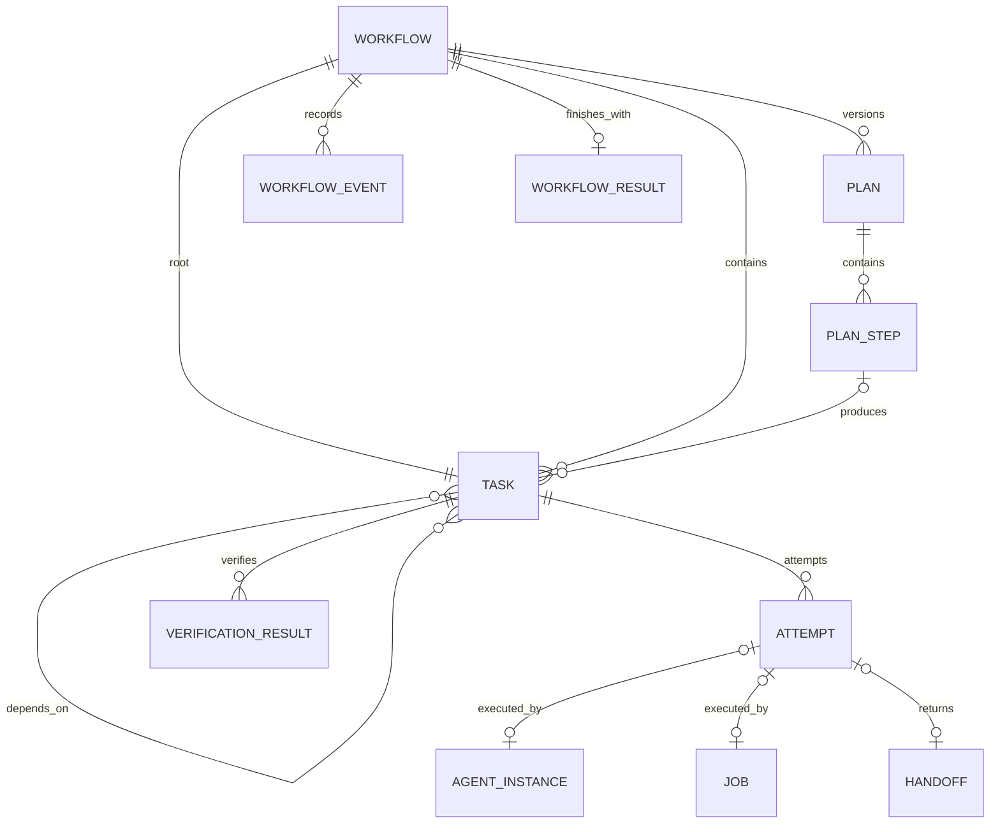

# M0：核心领域模型

> 状态：已验证
> 本文是设计 Schema，不是准备提交的 TypeScript 实现。

## 1. 模型关系



## 2. 公共类型

```ts
type WorkflowId = string;
type PlanId = string;
type PlanStepId = string;
type TaskId = string;
type AttemptId = string;
type AgentId = string;
type JobId = string;
type HandoffId = string;
type VerificationId = string;
type EventId = string;
type EventBatchId = string;
type CommandId = string;
type CorrelationId = string;

type IsoDateTime = string;
type ExecutionMode = "auto" | "direct" | "plan";
type RiskLevel = "low" | "medium" | "high";

interface EntityMetadata {
  schemaVersion: number;
  revision: number;
  createdAt: IsoDateTime;
  updatedAt: IsoDateTime;
}
```

ID 必须在所属实体生命周期内稳定。`revision` 每次接受状态事件后递增，用于检测并发更新。

## 3. Workflow

```ts
type WorkflowStatus =
  | "received"
  | "clarifying"
  | "planning"
  | "awaiting_approval"
  | "executing"
  | "verifying"
  | "blocked"
  | "cancelling"
  | "completed"
  | "failed"
  | "cancelled";

interface UserRequest {
  text: string;
  cwd: string;
  requestedMode?: Exclude<ExecutionMode, "auto">;
  attachments: string[];
}

interface ModeDecision {
  mode: Exclude<ExecutionMode, "auto">;
  source: "user" | "forced_policy" | "agent" | "default";
  reason: string;
  riskLevel: RiskLevel;
  decidedAt: IsoDateTime;
}

interface Workflow extends EntityMetadata {
  id: WorkflowId;
  status: WorkflowStatus;
  request: UserRequest;
  modeDecision?: ModeDecision;
  currentPlanId?: PlanId;
  rootTaskId?: TaskId;
  budget: BudgetLimit;
  usage: ResourceUsage;
  blockedReason?: WorkflowBlockedReason;
  result?: WorkflowResult;
}
```

不变量：

- `planning` 和 `awaiting_approval` 必须存在 `currentPlanId`。
- `received` 和 `clarifying` 可以暂时没有根 Task。
- 进入 `planning` 或 `executing` 前必须创建且只创建一个根 Task。
- `planning`、`awaiting_approval`、`executing`、`verifying`、`blocked`、`completed` 和 `failed` 必须存在 `rootTaskId`。
- `cancelling` 或 `cancelled` 在模式决定前可以没有根 Task；如果根 Task 已创建，则必须一并取消。
- `completed` 必须存在成功的 `WorkflowResult`。
- `failed`、`cancelled` 必须记录明确原因。
- `blocked` 可恢复，不是终态。
- `cancelling` 表示级联终止尚未完成，不是终态。

## 4. Plan

```ts
type PlanStatus =
  | "draft"
  | "awaiting_approval"
  | "approved"
  | "rejected"
  | "superseded";

interface FileIntent {
  path: string;
  action: "inspect" | "create" | "modify" | "delete";
  reason: string;
}

interface PlanRisk {
  level: RiskLevel;
  description: string;
  mitigation: string;
}

interface VerificationRequirement {
  id: string;
  kind: "diff" | "review" | "test" | "build" | "manual";
  description: string;
  required: boolean;
  command?: string;
}

interface PlanStep {
  id: PlanStepId;
  title: string;
  description: string;
  dependsOn: PlanStepId[];
  fileIntents: FileIntent[];
  verificationRequirementIds: string[];
}

interface ApprovalRecord {
  decision: "approved" | "rejected" | "revision_requested";
  actor: "user";
  comment?: string;
  decidedAt: IsoDateTime;
}

interface Plan extends EntityMetadata {
  id: PlanId;
  workflowId: WorkflowId;
  version: number;
  supersedesPlanId?: PlanId;
  status: PlanStatus;
  goal: string;
  assumptions: string[];
  steps: PlanStep[];
  risks: PlanRisk[];
  verificationRequirements: VerificationRequirement[];
  approval?: ApprovalRecord;
}
```

不变量：

- 已批准、拒绝或被替代的 Plan 内容不可原地修改。
- Replan 创建新 `PlanId` 和递增版本，并通过 `supersedesPlanId` 关联旧版本。
- Plan Step 依赖必须无环。
- Plan 至少包含一个 VerificationRequirement；每个 Step 引用的验证 ID 必须存在。
- 只有 `approved` Plan 可以生成执行 Task。
- Plan 不保存生成后的 Task ID 或执行进度；通过 Task 的 `sourcePlanId` 和 `sourcePlanStepId` 反向查询。

## 5. Task 与 Attempt

```ts
type TaskStatus =
  | "pending"
  | "ready"
  | "running"
  | "verifying"
  | "blocked"
  | "succeeded"
  | "failed"
  | "cancelled"
  | "skipped";

type TaskKind = "agent" | "command" | "control" | "repair";
type ExecutorKind = "main_agent" | "subagent" | "job";

interface TaskAssignment {
  executorKind: ExecutorKind;
  agentProfile?: string;
  agentId?: AgentId;
  jobId?: JobId;
}

interface TaskResult {
  summary: string;
  changedFiles: string[];
  verificationIds: VerificationId[];
  handoffId?: HandoffId;
  completedAt: IsoDateTime;
}

interface Task extends EntityMetadata {
  id: TaskId;
  workflowId: WorkflowId;
  parentTaskId?: TaskId;
  sourcePlanId?: PlanId;
  sourcePlanStepId?: PlanStepId;
  kind: TaskKind;
  title: string;
  description: string;
  status: TaskStatus;
  dependencyIds: TaskId[];
  assignment?: TaskAssignment;
  budget: BudgetLimit;
  usage: ResourceUsage;
  attemptIds: AttemptId[];
  currentAttemptId?: AttemptId;
  verificationRequirements: VerificationRequirement[];
  blockedReason?: TaskBlockedReason;
  result?: TaskResult;
}

type AttemptStatus =
  | "queued"
  | "running"
  | "waiting"
  | "succeeded"
  | "failed"
  | "timed_out"
  | "cancelled"
  | "interrupted";

interface Attempt extends EntityMetadata {
  id: AttemptId;
  workflowId: WorkflowId;
  taskId: TaskId;
  number: number;
  status: AttemptStatus;
  executorKind: ExecutorKind;
  agentId?: AgentId;
  jobId?: JobId;
  startedAt?: IsoDateTime;
  endedAt?: IsoDateTime;
  usage: ResourceUsage;
  failure?: FailureRecord;
}
```

不变量：

- Workflow 进入 planning 或 executing 前，必须存在且只存在一个没有 `parentTaskId` 的根 Task。
- 子 Task 通过 `parentTaskId` 关联父 Task，子列表由 TaskStore 查询得出，不在父 Task 重复保存。
- 父子关系和依赖关系都必须无环，Task 不能依赖自己或后代。
- `pending` Task 可能在等待依赖、Plan 批准或 Workflow 进入 executing；`ready` Task 的依赖必须全部 `succeeded`。
- `control` Task 不分配给 Agent 或 Job，其状态由 TaskService 根据 Workflow 阶段和子 Task 推导。
- 每次执行必须创建新的 Attempt；Attempt 编号在 Task 内严格递增。
- Task 成功使用 `succeeded`，不使用 `completed`。
- `succeeded` Task 必须存在 `TaskResult`，并满足所有 required Verification。
- `blocked` 可恢复；`succeeded`、`failed`、`cancelled`、`skipped` 是终态。

## 6. Agent Profile 与运行实例

```ts
interface AgentProfile {
  name: string;
  role: "mode_advisor" | "planner" | "explorer" | "worker" | "reviewer";
  description: string;
  model?: string;
  systemPrompt: string;
  allowedTools: string[];
  permissionCeiling: PermissionSet;
  defaultBudget: BudgetLimit;
}

type AgentStatus =
  | "starting"
  | "idle"
  | "running"
  | "waiting"
  | "stopping"
  | "stopped"
  | "failed"
  | "interrupted";

interface AgentInstance extends EntityMetadata {
  id: AgentId;
  workflowId: WorkflowId;
  parentAgentId?: AgentId;
  taskId: TaskId;
  attemptId: AttemptId;
  profileName: string;
  sessionId?: string;
  status: AgentStatus;
  effectivePermissions: PermissionSet;
  budget: BudgetLimit;
  usage: ResourceUsage;
}
```

`AgentProfile` 是配置，`AgentInstance` 是一次可寻址运行实例。项目本地 Profile 属于仓库控制内容，必须服从 Project Trust。

## 7. Job

```ts
type JobStatus =
  | "queued"
  | "running"
  | "succeeded"
  | "failed"
  | "timed_out"
  | "killed"
  | "interrupted";

interface Job extends EntityMetadata {
  id: JobId;
  workflowId: WorkflowId;
  taskId: TaskId;
  attemptId: AttemptId;
  command: string;
  cwd: string;
  status: JobStatus;
  pid?: number;
  exitCode?: number;
  startedAt?: IsoDateTime;
  endedAt?: IsoDateTime;
  timeoutMs: number;
  stdoutRef?: string;
  stderrRef?: string;
}
```

Job 不经过 LLM Agent Loop。`succeeded` 只表示命令按定义成功退出，Task 是否成功仍由验证要求决定。

## 8. Handoff

```ts
interface SourceLocation {
  path: string;
  line?: number;
  note?: string;
}

interface Handoff {
  id: HandoffId;
  workflowId: WorkflowId;
  taskId: TaskId;
  attemptId: AttemptId;
  agentId: AgentId;
  conclusion: string;
  evidence: SourceLocation[];
  architectureFindings: string[];
  changedFiles: string[];
  verificationSummary: string[];
  risks: string[];
  unfinishedItems: string[];
  createdAt: IsoDateTime;
}
```

Handoff 是父 Agent 所需的压缩事实，不复制子 Agent 的完整消息历史。Worker 成功但缺少必要 Handoff 字段时，Attempt 可以结束，但 Task 不能直接进入 `succeeded`。

## 9. Verification 与最终结果

```ts
type VerificationStatus =
  | "not_started"
  | "running"
  | "passed"
  | "failed"
  | "skipped";

interface VerificationResult {
  id: VerificationId;
  workflowId: WorkflowId;
  taskId?: TaskId;
  requirementId: string;
  status: VerificationStatus;
  command?: string;
  exitCode?: number;
  summary: string;
  evidenceRefs: string[];
  skipReason?: string;
  startedAt?: IsoDateTime;
  endedAt?: IsoDateTime;
}

interface WorkflowResult {
  status: "completed" | "failed" | "cancelled";
  summary: string;
  completedTaskIds: TaskId[];
  failedTaskIds: TaskId[];
  changedFiles: string[];
  verificationIds: VerificationId[];
  risks: string[];
  unfinishedItems: string[];
  usage: ResourceUsage;
  durationMs: number;
  reason?: string;
}
```

`blocked` 不生成最终结果，因为它仍可恢复。只有三个真正终态生成 `WorkflowResult`。

## 10. 权限、预算和错误

```ts
interface PermissionSet {
  read: boolean;
  write: boolean;
  executeCommands: boolean;
  network: boolean;
  allowedPaths: string[];
  deniedPaths: string[];
}

interface BudgetLimit {
  maxInputTokens?: number;
  maxOutputTokens?: number;
  maxCost?: number;
  maxTurns?: number;
  maxDurationMs?: number;
  maxConcurrentAgents?: number;
  maxConcurrentJobs?: number;
  maxAgentDepth?: number;
  maxRetries?: number;
}

interface ResourceUsage {
  inputTokens: number;
  outputTokens: number;
  cacheReadTokens: number;
  cacheWriteTokens: number;
  cost: number;
  turns: number;
  durationMs: number;
}

interface BlockedReason<TResumeStatus extends string> {
  code:
    | "awaiting_input"
    | "dependency_failed"
    | "permission_required"
    | "budget_exhausted"
    | "writer_unavailable"
    | "external_resource";
  message: string;
  since: IsoDateTime;
  resumeStatus: TResumeStatus;
}

type WorkflowBlockedReason = BlockedReason<
  "planning" | "executing" | "verifying"
>;

type TaskBlockedReason = BlockedReason<
  "pending" | "ready" | "running" | "verifying"
>;

interface FailureRecord {
  code: string;
  message: string;
  retryable: boolean;
  details?: unknown;
}
```

有效权限由以下集合求交得到：

```text
父级有效权限 ∩ Agent Profile 上限 ∩ Workflow 策略 ∩ 项目策略
```

预算分配使用父级剩余额度，不允许子实体自行扩大。

## 11. 持久化边界

M0 固定以下原则：

- 持久化事件只包含可序列化数据，不保存进程句柄、AbortController 或 UI 对象。
- PID 只能作为诊断信息，重启后不能仅凭旧 PID 推断 Job 仍在运行。
- Prompt 正文和大日志使用引用或摘要，避免 Event Log 无限膨胀。
- Schema 通过 `schemaVersion` 演进；未知版本必须拒绝恢复或显式迁移。
- Snapshot 是性能优化，不是历史事实源。
