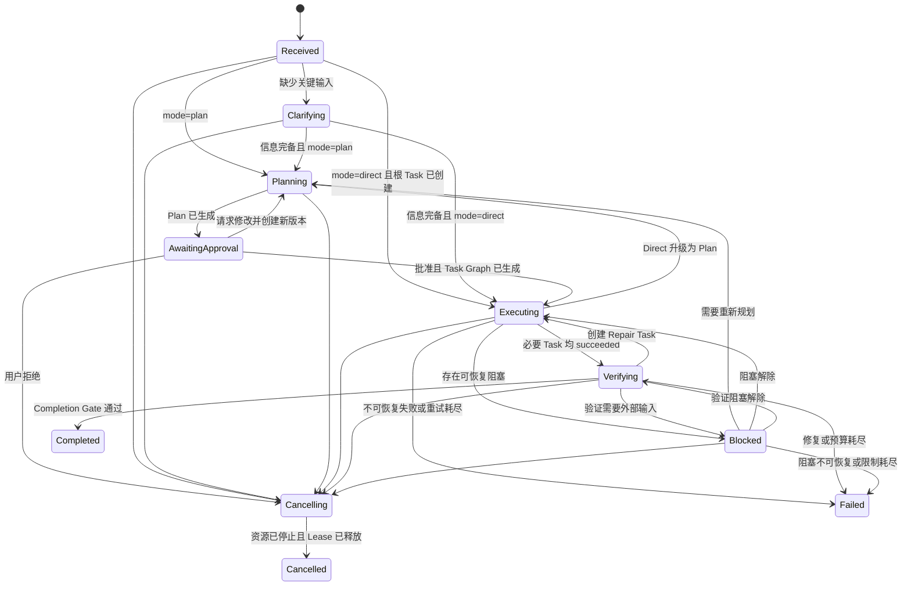
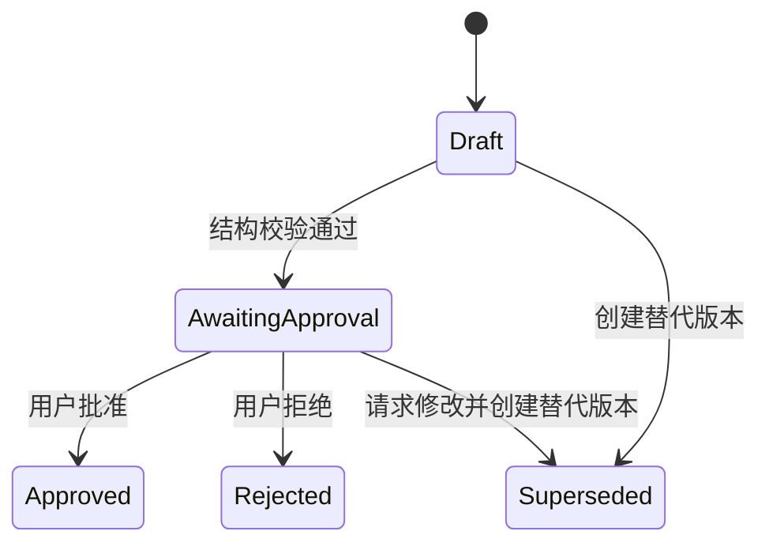
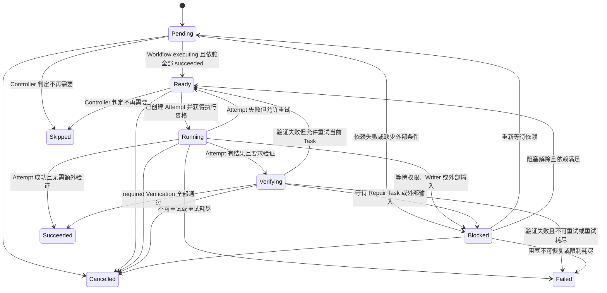

# M0：状态、Store 与事件协议

> 状态：已验证
> 本文定义转换规则和接口边界，不实现运行时代码。

## 1. 状态所有权

| 状态 | 唯一修改入口 | 事件来源 |
|---|---|---|
| Workflow | `WorkflowController` | CLI、PlanService、TaskService、VerificationService |
| Plan | `PlanService` 经 Controller 协调 | Planner、用户审批 |
| Task | `WorkflowStore` 经 TaskService 修改；R6 可拆 `TaskStore` | Scheduler、Agent、Job、Verification |
| Agent | 后续 `AgentRegistry` | Subagent Runtime |
| Job | 后续 `JobRegistry` | Job Runtime |

Agent 和 Job 只能汇报观察到的事实。它们不能直接将 Workflow 标记为完成。

## 2. Workflow 状态机



### 2.1 Workflow 转换守卫

| 从 | 到 | 必须满足 |
|---|---|---|
| `received` | `clarifying` | 存在会改变实现方案的缺失信息 |
| `received` | `planning` | ModeDecision 为 plan，根 Task 已创建 |
| `received` | `executing` | ModeDecision 为 direct，根 Task 已创建 |
| `clarifying` | `planning` | 关键输入已补齐、ModeDecision 为 plan，根 Task 已创建 |
| `clarifying` | `executing` | 关键输入已补齐、ModeDecision 为 direct，根 Task 已创建 |
| `planning` | `awaiting_approval` | Plan 结构有效、只读阶段无写操作 |
| `awaiting_approval` | `planning` | 请求修改或重新规划，且已创建替代 Plan 版本 |
| `awaiting_approval` | `executing` | 当前 Plan 已批准，Task Graph 已生成且有效 |
| `awaiting_approval` | `cancelling` | 用户明确拒绝，记录 `plan_rejected` 并取消根 Task |
| `executing` | `planning` | Direct 发现高风险，停止新增写操作并释放当前写执行资格 |
| `executing` | `verifying` | 所有必要 Task 均为 `succeeded` |
| `executing` | `failed` | 必要 Task 不可恢复失败或限制已耗尽，且活动运行资源已清理 |
| `verifying` | `completed` | 所有 required Verification 为 `passed`，允许项才可 `skipped` |
| `verifying` | `executing` | Verification 失败、允许修复且 Repair Task 已创建 |
| 任意可取消状态 | `cancelling` | 收到有效取消命令并持久化 `cancel_requested` |
| `cancelling` | `cancelled` | 子 Task、Agent、Job 已终止，Writer Lease 已释放 |

`completed`、`failed`、`cancelled` 是终态。`blocked` 和 `cancelling` 不是终态。BlockedReason 保存合法的 `resumeStatus`，阻塞解除时只能返回该阶段，除非用户显式重新规划或取消。

## 3. Plan 状态机



守卫：

- 只有当前 Workflow 的最新 Plan 版本可以等待审批。
- `approved`、`rejected`、`superseded` 均不可修改。
- “重新规划”是创建新版本的命令，不是长期状态。
- 只有 `approved` Plan 可以生成 Task。

## 4. Task 状态机



守卫：

- `ready → running` 前必须创建 Attempt。
- `pending → ready` 还要求 Workflow 已进入 executing，未批准 Plan 对应的执行 Task 不能 Ready。
- `control` Task 不进入 Scheduler，其状态由 TaskService 根据必要子 Task 推导。
- 写 Task 必须持有当前工作区的 Writer Lease。
- `running → succeeded` 只允许没有 required Verification 的 Task。
- `verifying → succeeded` 必须存在完整 `TaskResult`。
- 活动 Attempt 必须先结束或确认中断，Task 才能进入 `cancelled`。
- `failed`、`succeeded`、`cancelled`、`skipped` 是终态。
- 重试是“创建新 Attempt 并回到 ready”，不能把旧 Attempt 改回 running。

## 5. Store 接口

设计接口：

```ts
interface WorkflowStore {
  getWorkflow(workflowId: WorkflowId): Workflow | undefined;
  getTask(taskId: TaskId): Task | undefined;
  listTasks(workflowId: WorkflowId): Task[];
  apply(batch: PersistedWorkflowEventBatch): boolean;
}

interface EventLog {
  read(workflowId?: WorkflowId): PersistedWorkflowEventBatch[];
  append(batch: WorkflowEventBatch): PersistedWorkflowEventBatch;
}
```

约束：

- 外部模块不能获取可变内部引用。
- `apply` 只接受 Event Log 返回的进程内持久化 Batch 凭证。
- Store 检查实体 revision 和转换守卫。
- Store 以 Batch 为原子单位应用；任一 Event 失败时不能留下部分状态。
- Store 和 Event Log 返回防御性副本，外部修改不能改变已记录或投影的状态。
- 创建实体也必须通过已经持久化的 `*.created` Event，不能绕过 Event Log。
- Store 不调用 LLM、不显示 UI、不启动进程。
- 当前状态必须能够由 Event Log 从空 Store 重放得到。

## 6. WorkflowController

Controller 处理命令，不接收“请直接设置成 completed”一类状态写入。

```ts
interface WorkflowController {
  start(command: StartWorkflowCommand): Promise<WorkflowId>;
  provideClarification(command: ProvideClarificationCommand): Promise<void>;
  approvePlan(command: ApprovePlanCommand): Promise<void>;
  rejectPlan(command: RejectPlanCommand): Promise<void>;
  requestReplan(command: RequestReplanCommand): Promise<void>;
  cancel(command: CancelWorkflowCommand): Promise<void>;
  resume(command: ResumeWorkflowCommand): Promise<void>;
  handleRuntimeEvent(event: RuntimeEvent): Promise<void>;
}
```

一次命令的固定处理顺序：

```text
读取当前聚合状态
  → 验证 commandId 是否已处理
  → 检查状态转换守卫
  → 计算待写事件
  → Event Log 使用 expectedRevision 追加事件
  → Store 按相同顺序应用事件
  → 触发后续副作用
  → CLI 读取 Store 投影
```

副作用失败时记录新的失败事件，不回滚或覆盖已写历史。

启动 Agent、Job 或写操作采用持久化意图：

```text
持久化 attempt.created / task.assigned
  → 使用 attemptId 作为幂等键启动副作用
  → 持久化 attempt.started
  → 持久化结果事件
```

如果进程在“意图已写、started 未写”之间退出，恢复时可以安全重新派发；如果 `started` 已写但无法确认运行状态，则标记 `interrupted`。

## 7. 事件信封

```ts
type WorkflowEntityType =
  | "workflow"
  | "plan"
  | "task"
  | "attempt"
  | "agent"
  | "job"
  | "verification";

interface WorkflowEvent<TPayload = unknown> {
  schemaVersion: number;
  eventId: EventId;
  workflowId: WorkflowId;
  sequence: number;
  entityType: WorkflowEntityType;
  entityId: string;
  entityRevision: number;
  eventType: string;
  occurredAt: IsoDateTime;
  actor: {
    kind: "user" | "controller" | "agent" | "job" | "system";
    id?: string;
  };
  commandId: CommandId;
  correlationId: string;
  causationId?: EventId;
  payload: TPayload;
}

interface WorkflowEventBatch {
  schemaVersion: number;
  batchId: EventBatchId;
  workflowId: WorkflowId;
  commandId: CommandId;
  correlationId: CorrelationId;
  expectedLastSequence: number;
  events: WorkflowEvent[];
}
```

排序规则：

- 空 Event Log 的 `expectedLastSequence` 为 `0`，第一个 Event 的 `sequence` 为 `1`。
- `sequence` 在单个 Workflow 内严格递增。
- `entityRevision` 在单个实体内严格递增。
- 不承诺不同 Workflow 之间的全局顺序。
- 同一个 `eventId` 只能出现一次。
- 同一 Batch 的 Event 必须共享 `workflowId`、`commandId` 和 `correlationId`。
- Batch 内的 `causationId` 只能指向更早的 Event；也可以指向历史 Batch 中的 Event。

### 7.1 事件类型与 Payload

实现使用 `eventType` 判别联合约束 Payload：

```ts
interface WorkflowEventPayloadMap {
  "workflow.created": { workflow: Workflow };
  "workflow.status_changed": {
    fromStatus: WorkflowStatus;
    toStatus: WorkflowStatus;
    facts: WorkflowTransitionFacts;
  };
  "task.created": { task: Task };
  "attempt.created": { attempt: Attempt };
  // 其他事件使用各自的结构化 Payload
}
```

创建事件时由 Batch 构造器统一写入 Schema、Workflow、命令、关联 ID 和 sequence。调用方不能单独计算 sequence。状态事件 Payload 保存转换事实，并复用相同状态守卫验证，避免 Controller 和重放逻辑采用不同规则。

## 8. 最小事件集合

### 8.1 Workflow

- `workflow.created`
- `workflow.mode_decided`
- `workflow.status_changed`
- `workflow.blocked`
- `workflow.unblocked`
- `workflow.cancel_requested`
- `workflow.completed`
- `workflow.failed`
- `workflow.cancelled`

### 8.2 Plan

- `plan.created`
- `plan.awaiting_approval`
- `plan.approved`
- `plan.rejected`
- `plan.superseded`
- `plan.tasks_generated`

### 8.3 Task 与 Attempt

- `task.created`
- `task.dependency_added`
- `task.pending`
- `task.ready`
- `task.assigned`
- `task.started`
- `task.verification_started`
- `task.blocked`
- `task.succeeded`
- `task.failed`
- `task.cancelled`
- `task.skipped`
- `attempt.created`
- `attempt.started`
- `attempt.waiting`
- `attempt.succeeded`
- `attempt.failed`
- `attempt.timed_out`
- `attempt.cancelled`
- `attempt.interrupted`

M0 只固定语义和命名。Agent、Job、预算、Writer Lease 和恢复的详细事件在对应里程碑扩展，但仍使用同一事件信封。

## 9. Event Log 设计

### 9.1 原型存储

原型使用 Pi `appendCustomEntry("workflow-event-batch", batch)` 将同一命令产生的 Event Batch 写入一个 Session Custom Entry：

- Custom Entry 不进入 LLM 上下文。
- Workflow 与当前 Session、分支和 cwd 绑定。
- 同一 Batch 内的 Event 使用连续 sequence；例如 ModeDecision、根 Task 创建和 Workflow 阶段变化可以原子记录。
- 恢复时使用 `sessionManager.getBranch()` 读取当前叶节点路径，筛选 `customType === "workflow-event-batch"`，按 sequence 展开并重放；不能混入 `getEntries()` 返回的其他分支事件。
- 发现 sequence 缺口、重复 revision 或未知 schemaVersion 时停止自动恢复。
- Session 分支不会隐式共享可变 Workflow；分支行为必须显式定义为新 Workflow 或受控复制。

Pi 在首次 Assistant 消息前可能暂不创建 Session 文件。此时 Custom Entry 已进入 SessionManager 的追加式内存树，但磁盘刷新仍遵循 Pi 原有 Session 生命周期；M1 不把这段窗口描述为崩溃安全，完整崩溃恢复和独立持久化策略属于 R10。

### 9.2 写入原则

```text
校验 command
  → 构造 event
  → 持久化 event
  → 应用到 Store
  → 触发副作用
```

如果持久化失败，不更新 Store。如果 Store 应用失败，将 Workflow 标记为需要人工恢复，不能跳过事件继续运行。

### 9.3 Snapshot

M0 只预留 Snapshot，不在 R3 首版实现。后续 Snapshot 必须包含：

- `workflowId`
- `lastSequence`
- 所有聚合状态
- `schemaVersion`
- `createdAt`

恢复结果必须与从头重放相同。

## 10. 幂等与并发

| 场景 | 规则 |
|---|---|
| 重复命令 | 相同 `commandId` 返回第一次结果，不生成新事件 |
| 重复 Runtime Event | 通过 `eventId` 或来源序号去重 |
| 并发状态更新 | 使用预期 `entityRevision`；不匹配则重新读取后决定 |
| 重复取消 | 第一次触发级联取消，后续为无副作用成功 |
| 重复批准 | 已批准的同一 Plan 返回原结果；批准旧版本被拒绝 |
| 重复完成 | 终态不生成新的完成事件 |
| Agent 晚到结果 | Attempt 已终止时记录为 late event，不改变 Task 终态 |
| Job 晚到退出 | Job 已 killed/timed_out 时不改为 succeeded |

## 11. 完成状态计算

WorkflowController 根据 Store 中的事实计算状态：

```text
必要 Task 全部 succeeded
  → Workflow 进入 verifying
  → required Verification 全部 passed
  → Workflow completed
```

下列情况不能进入 `completed`：

- Agent 只返回自然语言“完成了”。
- Job 退出码为 0，但 required Test 尚未检查。
- 存在 `failed`、`blocked` 或仍运行的必要 Task。
- required Verification 被无理由标记为 skipped。
- 取消流程尚未完成必要的资源终止。

## 12. 恢复原则

M0 固定语义，完整恢复在 R10 实现：

- 纯数据实体可以从 Event Log 重放。
- 重启时处于 `running`、`waiting` 的 Attempt/Agent/Job 先变为 `interrupted`。
- 不使用旧 PID 推断 Job 存活。
- `blocked` Workflow 恢复后仍为 blocked，等待明确解除条件。
- 终态重放后不得重新执行副作用。
