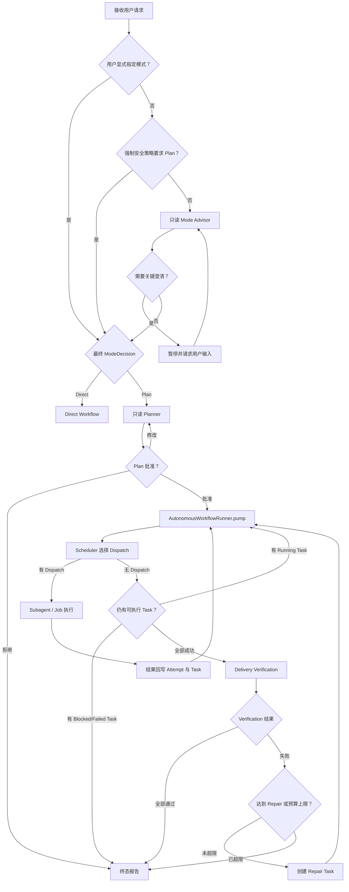

# M6：自动 Workflow 编排实施计划

> 状态：已实现并验证
> 范围：R12
> 前置：R3-R11
> 目标：把已经存在的 Mode、Task Scheduler、Delivery Verification 和 Repair 机制接成默认可运行的自动闭环

实现入口：

- Core Runner：`packages/coding-agent/src/core/workflow/autonomous-workflow-runner.ts`
- 自动化策略与协议：`autonomous-workflow-policy.ts`、`autonomous-workflow-types.ts`
- Mode Advisor Runtime：`mode-advisor-runtime.ts`
- CLI 配置：`--workflow-mode <auto|direct|plan>`，默认 `auto`
- RPC 控制：Mode、自动推进、Plan 决策、澄清提交和显式 Pump
- 离线演示：`npm run demo:autonomous-workflow`

## 1. 背景

当前 Core 已分别具备以下能力：

- `ModeSelector`、`ModeAdvisor`、`ClarificationGate` 和 Direct 升级 Plan 协议。
- 正式 Plan、审批记录、Task Graph、Ready 推导和 Scheduler。
- Subagent Runtime、Background Job Runtime、权限、预算和 Writer Lease。
- Diff、Review、Test/Build、Repair、Completion Gate、Snapshot 和恢复。
- Interactive、Print、JSON、RPC 共用的 `WorkflowView`。

当前 CLI 仍主要依赖用户手动串联这些能力：

```text
/plan
  → 用户发送需求
  → /approve
  → /agents dispatch 或 /jobs dispatch
  → /agent wait 或 /job wait
  → 再次 dispatch
  → /verify
  → Repair 后再次 dispatch
  → 再次 /verify
```

另外，普通 CLI Prompt 当前默认进入 Direct；自动 Mode Advisor、Clarification Gate 和 Direct 运行中升级 Plan 尚未形成完整的默认入口。

M6 不新增另一套 Workflow、Scheduler 或 Delivery Runtime。它新增一个薄的自动编排层，把现有权威状态和运行时能力按确定性规则推进。

## 2. 目标与非目标

### 2.1 目标

1. 未显式指定模式时，在真实 CLI 请求入口执行自动 Mode 判断。
2. 只在会改变实现、安全边界或验证方式时要求用户澄清。
3. Plan 批准后自动调度所有可执行 Task。
4. Task 完成后自动计算后继 Task，并继续调度。
5. 所有可执行 Task 成功后自动进入 Delivery Verification。
6. Verification 失败时自动创建并调度有界 Repair Task。
7. Repair 成功后自动重新验证，直到完成或达到明确停止条件。
8. Interactive、Print、JSON、RPC 使用同一套自动推进语义。
9. 保留现有手动命令，作为观察和显式操作入口。
10. 所有自动动作可持久化、可恢复、可取消、可审计，并保持幂等。

### 2.2 非目标

- 不实现容器或操作系统级沙箱。
- 不实现 Git worktree 多 Writer。
- 不实现远程或跨机器调度。
- 不让 Agent 直接修改 Workflow、Task 或 Verification 权威状态。
- 不自动扩大工具、路径、网络或预算权限。
- 不在 M6 引入通用工作流 DSL。
- 不以启发式循环替代现有状态机和转换守卫。

## 3. 目标体验

### 3.1 Direct

```text
用户请求
  → 自动 Mode 判断为 Direct
  → 创建 Workflow、根 Task 和 Attempt
  → Main Agent 执行
  → 基础结果与修改归属
  → 终态报告
```

### 3.2 Plan

```text
用户请求
  → 自动 Mode 判断为 Plan
  → 只读 Planner
  → awaiting_approval
  → 用户批准
  → 自动调度 Task Graph
  → 自动等待 Agent / Job 结果
  → 自动放行后继 Task
  → 自动 Delivery Verification
  → 必要时自动 Repair
  → Completion Gate
  → 终态报告
```

### 3.3 只在必要时暂停

自动流程只能因为以下原因暂停用户：

- 必要澄清没有安全默认值。
- Plan 等待批准、拒绝或修改。
- 执行需要扩大权限、路径范围、网络或预算。
- Writer Lease 被外部 Workflow 占用且无法自动等待。
- 外部资源不可用，需要用户处理。
- Repair、重试、成本或时间预算耗尽。
- 状态损坏或恢复存在歧义，继续可能造成错误写入。

普通 Task 完成、Job 完成、后继 Task Ready、开始验证和创建预算内 Repair 均不应要求用户手动推进。

## 4. 总体流程



## 5. 自动编排层

### 5.1 新增组件

建议新增：

```text
packages/coding-agent/src/core/workflow/
├── autonomous-workflow-runner.ts
├── autonomous-workflow-policy.ts
└── autonomous-workflow-types.ts
```

`AutonomousWorkflowRunner` 负责协调现有组件：

```text
WorkflowController
PlanWorkflowRuntime
Scheduler
SubagentRuntime
JobRuntime
DeliveryRuntime
RuntimeRegistry
```

它不拥有新的业务状态，不直接修改 Store，也不绕过 Controller。所有动作仍通过现有命令和领域事件完成。

### 5.2 输入与输出

Runner 接收：

- 当前 `WorkflowView` 或对应 Runtime。
- 自动化策略。
- Subagent、Job 和 Delivery 端口。
- 取消信号。
- 可选进度事件接收器。

Runner 输出：

- 本轮执行的动作列表。
- 当前等待原因。
- 是否到达终态。
- 是否需要用户输入。
- 自动动作产生的 Agent、Job、Verification 或 Repair ID。

### 5.3 Pump 模型

自动编排采用可重复调用的 `pump()`，不使用不可审计的无限循环：

```text
pump
  → 读取权威状态
  → 计算一个确定性动作批次
  → 持久化动作对应事件
  → 启动或等待运行资源
  → 资源结束后再次 pump
```

每次 `pump()` 必须满足：

- 同一 Workflow 同时最多一个 Pump 持有推进权。
- 每个动作有稳定幂等键。
- 再次处理同一完成事件不会重复创建 Attempt、Verification 或 Repair。
- 没有可执行动作时返回明确等待原因，不忙轮询。
- 取消信号优先于新调度。

## 6. 自动 Mode

### 6.1 模式优先级

真实 CLI 入口按以下顺序解析：

1. 用户显式选择 `plan`。
2. 强制安全策略要求 `plan`。
3. 用户显式选择 `direct`。
4. 自动 Mode Advisor 建议。
5. Advisor 不可用时使用安全默认规则。

用户显式 Direct 不能绕过强制安全策略。Mode Advisor 失败不得静默选择高风险 Direct；应根据静态风险规则进入 Plan 或明确失败。

### 6.2 CLI 配置

第一版建议提供：

```text
--workflow-mode <auto|direct|plan>
```

配置优先级：

```text
CLI flag
  → Session setting
  → Project setting
  → Global setting
  → auto
```

现有 `/plan` 继续表示“下一条请求强制使用 Plan”。后续可增加 `/direct` 和 `/auto`，但不作为 M6 主流程的必要条件。

### 6.3 Mode Advisor

Mode Advisor：

- 使用内置 `mode_advisor` Profile。
- 默认不获得工具。
- 输出复杂度、风险、置信度、原因和建议模式。
- 使用结构化输出并进行运行时校验。
- 结果必须持久化为 `ModeDecision`，之后才能开始 Direct 或 Planner。

至少满足以下规则：

| 条件 | 结果 |
|---|---|
| 低复杂度、低风险、非低置信度 | Direct |
| 高复杂度 | Plan |
| 中高风险 | Plan |
| 低置信度且会影响实现 | Clarify 或 Plan |
| 删除、迁移、发布、权限扩大等强制策略 | Plan |

### 6.4 Clarification Gate

Mode Advisor 或预检阶段产生结构化候选问题：

- 有安全默认值：记录 Assumption，继续。
- 会实质改变实现且无安全默认值：进入 `clarifying` 并暂停。
- 只影响偏好且不改变实现：忽略或采用默认值。

澄清答案必须作为事件持久化，并进入后续 Planner 或 Direct Prompt Envelope；不得只存在于 TUI 临时状态。

### 6.5 Direct 升级 Plan

Direct 运行中只有收到结构化升级决定时才能升级：

```text
持久化升级请求
  → 关闭新写入准入
  → 停止活动 Writer
  → 等待 AgentSession idle
  → Attempt 标记 interrupted
  → 创建 Draft Plan
  → 进入只读 Planning
  → 请求用户批准
```

升级不得自动批准 Plan，也不得把 Direct 已经产生的工作区修改隐藏起来。Planner Prompt 必须包含已发生修改的 Diff 摘要和升级原因。

## 7. 自动调度

### 7.1 启动条件

满足以下全部条件时自动启动调度：

- Workflow 状态为 `executing`。
- Plan 已批准，或 Direct 已生成可调度 Task。
- 没有等待用户输入或权限扩大。
- Workflow 未取消且预算未耗尽。
- Runtime 恢复已完成。

`/approve` 成功后必须触发 Pump，无需再执行 `/agents dispatch` 或 `/jobs dispatch`。

### 7.2 调度规则

每轮调度：

1. 刷新 Task Readiness。
2. 将依赖失败的 Task 标记为 Blocked。
3. 读取 Agent、Job、Writer 和预算容量。
4. 调用现有 Scheduler 选择 Dispatch。
5. Command Task 路由到 Job。
6. Agent/Repair Task 路由到 Subagent。
7. 需要主 Agent 的 Task 通过显式 Main Agent Executor 运行。
8. 持久化 Attempt 后才启动对应运行资源。

第一版保持现有并发规则：

- 无依赖只读 Task 可并行。
- Command Task 受 `maxConcurrentJobs` 限制。
- Subagent 受 `maxConcurrentAgents` 和 `maxAgentDepth` 限制。
- Writer 继续使用单 Writer Lease。
- 任何子级预算不得超过继承后的有效预算。

### 7.3 完成通知

Runner 订阅 Agent 和 Job 完成事件。运行资源结束后：

```text
资源终态
  → 结果与用量回写 Attempt
  → Handoff 或 Job 结果校验
  → Task 进入 succeeded/failed/interrupted
  → 刷新后继 Task
  → 再次 Pump
```

不得依赖用户执行 `/agent wait` 或 `/job wait` 才回写 Task。

### 7.4 无可调度任务

无 Dispatch 时必须区分：

| 状态 | 动作 |
|---|---|
| 存在 Running Task | 等待完成事件 |
| 全部可执行 Task 成功 | 进入自动验证 |
| 存在可重试失败且策略允许 | 创建新 Attempt 并继续 |
| 依赖失败 | 标记 Blocked，生成停止原因 |
| Writer 暂时不可用 | 等待 Lease 事件或进入 Blocked |
| 预算耗尽 | 停止调度并终止 Workflow |
| 状态矛盾 | 失败并报告不变量错误 |

## 8. 自动验证

### 8.1 触发条件

满足以下条件后自动调用 Delivery Runtime：

- Workflow 为 `executing` 或可恢复的 `verifying`。
- 所有非 Control Task 均为 `succeeded`。
- 没有活动 Agent、Job 或 Writer。
- 当前交付版本尚未存在完整的最新 Verification。

交付版本建议由以下内容计算稳定指纹：

- 当前 Plan ID 和版本。
- 成功 Task 及其最新 Attempt ID。
- 已登记修改文件和修改记录 revision。
- Verification Requirement 集合。

同一交付版本不得重复启动相同 Verification。

### 8.2 验证顺序

第一版使用确定性顺序：

1. Diff 收集与修改归属。
2. Read-only Review。
3. Test。
4. Build。
5. Completion Gate。

如果某个必要步骤失败：

- 保存失败 Verification 和证据。
- 停止后续高成本步骤。
- 进入 Repair 决策。

可选 Verification 可以 `skipped`，但必须包含原因。必要 Verification 的缺失或跳过不能被当作通过。

### 8.3 Direct 验证边界

M6 不把 Direct 的“未配置 Review/Test/Build”伪装成完整交付验证。

第一版可选策略：

- Direct 继续使用基础验证并诚实报告未配置项。
- 如果请求或项目规则要求 Test/Build，则在执行前升级 Plan。
- 后续再设计 Direct 的轻量 Verification Requirement 推导。

## 9. 自动 Repair

### 9.1 创建条件

只有以下条件全部满足时才能自动创建 Repair：

- 存在最新的失败 Verification。
- 失败 Verification 尚未关联有效 Repair Task。
- `maxRetries`、费用、Token、Turn 和时间预算未耗尽。
- 失败不是权限拒绝、用户取消、状态损坏或不可恢复的外部资源错误。

### 9.2 Repair 输入

Repair Task 必须包含：

- 失败 Verification ID、类型和摘要。
- 测试或构建命令、退出码和必要日志片段。
- 当前交付 Diff。
- Reviewer 风险和未完成项。
- 相关 Task Handoff。
- 已尝试 Repair 的结果，避免重复同一方案。
- 明确的文件和权限范围。

Repair 只修复对应验证失败，不得借机扩展原始需求。

### 9.3 Repair 生命周期

```text
Verification failed
  → 创建 repairIteration = N 的 Repair Task
  → Scheduler 自动分配 Worker
  → Writer Lease
  → 结构化 Handoff
  → Repair Task succeeded
  → 生成新的交付版本
  → 自动重新验证
```

同一个失败 Verification 最多只能有一个活动 Repair Task。Repair 自身失败时，重试必须创建新的 Attempt；需要新策略时才创建下一次 Repair Task。

### 9.4 停止条件

出现以下任一情况时停止自动 Repair：

- 达到 `maxRetries`。
- 预算任一硬限制耗尽。
- 连续 Repair 没有产生新的修改或 Verification 结果。
- 两次 Repair 产生相同失败指纹。
- 需要扩大权限、网络、路径或命令范围。
- 用户取消。
- Reviewer 判断存在无法自动接受的高风险。

停止时 Workflow 进入 `failed` 或 `blocked`，并报告最后失败证据、已执行 Repair、预算使用和建议人工动作。

## 10. 手动命令兼容

现有命令全部保留：

```text
/workflow
/plan
/approve
/reject
/replan
/tasks
/task
/agents
/agent
/jobs
/job
/verify
/cancel
/workflow-resume
```

语义调整：

- `/approve`：批准并触发自动 Pump。
- `/agents dispatch`、`/jobs dispatch`：自动调度关闭时使用；自动调度开启时只请求立即 Pump，不绕过策略。
- `/agent wait`、`/job wait`：观察运行结果，不承担 Task 回写职责。
- `/verify`：请求立即验证；不满足前置条件时返回原因。
- `/task retry`：显式操作优先，但仍受预算、权限和 Writer 约束。
- `/cancel`：始终抢占后续自动动作并执行级联取消。

## 11. Interactive、Print、JSON 与 RPC

### 11.1 Interactive

- Footer 展示 `auto/direct/plan`、当前阶段和等待原因。
- 自动 Dispatch、Verification 和 Repair 使用可折叠通知。
- 审批和关键澄清仍由用户显式输入。

### 11.2 Print

Print 模式不能无限等待交互：

- Direct 自动运行到终态。
- Plan 默认在 `awaiting_approval` 返回非成功结果和结构化报告。
- 后续可增加显式非交互审批策略，但 M6 不默认自动批准。
- Workflow Blocked、Failed 或 Cancelled 返回非零退出码。

### 11.3 JSON

除现有 AgentSession 事件外，至少输出：

- `workflow_mode_decided`
- `workflow_waiting_for_user`
- `workflow_dispatch_started`
- `workflow_dispatch_settled`
- `workflow_verification_started`
- `workflow_repair_created`
- `workflow_result`

事件载荷使用稳定 Schema，不能只输出人类文本。

### 11.4 RPC

RPC 的 `get_workflow` 继续返回统一 View。自动流程需要增加显式控制命令：

- 设置下一次请求的 Workflow Mode。
- 提交 Plan 决策。
- 提交澄清答案。
- 启用或禁用当前 Session 的自动推进。
- 请求 Pump。

具体 RPC Schema 在实现前单独评审，避免破坏现有客户端。

## 12. 持久化、恢复与幂等

### 12.1 自动动作记录

每个自动动作必须具有：

- `workflowId`
- `commandId`
- `actionKind`
- 输入状态 revision
- 目标实体 ID
- 发生时间

以下动作必须可去重：

- Mode Advisor 结果应用。
- Task Dispatch。
- Agent/Job 完成回写。
- Verification 启动和完成。
- Repair Task 创建。
- Completion Gate。

### 12.2 恢复

恢复后不直接重放副作用：

```text
Snapshot + Event Log
  → 重建权威状态
  → 将不确定运行资源标记 interrupted
  → 回收失效 Writer Lease
  → 计算可恢复动作
  → Pump
```

恢复策略：

- `awaiting_approval`：继续等待用户。
- `executing`：重算 Ready，自动重试允许恢复的 interrupted Task。
- `verifying`：根据交付版本和 Verification 记录决定继续、重跑或失败。
- 已存在活动 Repair：恢复该 Task，不重复创建。
- 终态 Workflow：只生成 View 和报告，不再自动执行。

## 13. 并发与取消

### 13.1 单推进器

同一 Workflow 同时只允许一个 Runner 推进。实现可以使用：

- 进程内异步互斥保护 Pump。
- Event Log commandId 幂等保护跨回调重复。
- Writer Lease 保护实际工作区写入。

不能只依赖布尔字段，因为 Agent、Job、RPC 和取消事件可能并发到达。

### 13.2 取消优先级

收到取消后：

1. 停止接受新 Dispatch。
2. 取消未启动 Attempt。
3. 中断活动 Agent。
4. 终止活动 Job。
5. 等待资源终态。
6. 释放 Writer Lease。
7. 完成 `cancelled` 终态。

在 `cancelling` 状态下不得启动 Verification 或 Repair。

## 14. 实施任务

### R12：自动 Workflow 编排

| ID | 状态 | 任务 | 交付物与验收标准 | 依赖 |
|---|---|---|---|---|
| R12.1 | `DONE` | 定义自动化策略与 Runner 端口 | 固定 Mode、调度、验证、Repair 开关、动作结果和等待原因 | R11 |
| R12.2 | `DONE` | 实现单 Workflow Pump | 可重复调用、单推进器、无忙轮询、取消优先 | R12.1 |
| R12.3 | `DONE` | 接入真实自动 Mode | CLI 普通请求调用 Advisor、Clarification Gate 和 ModeSelector，并持久化决策 | R4、R12.2 |
| R12.4 | `DONE` | 接入 Direct 升级 Plan | 运行中升级走停止写入、Attempt interrupted、Draft Plan 和审批链路 | R4.11、R12.3 |
| R12.5 | `DONE` | 审批后自动启动调度 | `/approve` 后无需手动 dispatch，自动创建并启动 Attempt | R5、R6、R12.2 |
| R12.6 | `DONE` | 事件驱动持续调度 | Agent/Job 完成后自动回写、刷新 Ready 并继续调度 | R8、R9、R12.5 |
| R12.7 | `DONE` | 自动进入 Delivery | 所有可执行 Task 成功后按交付版本幂等触发验证 | R10、R12.6 |
| R12.8 | `DONE` | 自动创建并调度 Repair | Verification 失败后在预算内创建唯一 Repair，并在成功后重新验证 | R10.6-R10.7、R12.7 |
| R12.9 | `DONE` | 完善停止与等待原因 | 澄清、审批、扩权、Lease、外部资源、预算和重复失败均有明确状态 | R12.3-R12.8 |
| R12.10 | `DONE` | 接入四种表现层 | Interactive、Print、JSON、RPC 使用同一 Runner 和 View | R11、R12.9 |
| R12.11 | `DONE` | 实现自动流程恢复 | 重启后从权威状态继续，不重复 Dispatch、Verification 或 Repair | R10.9-R10.12、R12.2 |
| R12.12 | `DONE` | 建立自动闭环测试 | 覆盖 Mode、审批、并发调度、验证、Repair、取消、恢复和幂等 | R12.1-R12.11 |
| R12.13 | `DONE` | 建立离线演示和真实任务基线 | Showcase 无手动 dispatch/verify；真实模型评测与机制评测分开 | R12.12 |

## 15. 分批实现建议

### 批次 A：Runner 骨架

- 自动化策略类型。
- Pump 和单推进器。
- 等待原因。
- 手动命令调用 Pump 的兼容层。
- 纯状态和伪 Runtime 测试。

### 批次 B：自动 Mode

- CLI flag 与配置。
- Mode Advisor AgentSession 执行。
- Clarification 持久化和恢复。
- Direct 升级 Plan 接线。
- Faux Provider 集成测试。

### 批次 C：自动调度

- `/approve` 自动 Pump。
- Agent/Job 完成通知触发 Pump。
- 并发、Writer Lease、预算和取消。
- 多批次 DAG 集成测试。

### 批次 D：自动验证与 Repair

- 交付版本指纹。
- Verification 幂等。
- Repair 唯一性、失败指纹和停止条件。
- Snapshot 恢复。
- 离线端到端 Showcase。

每个批次独立提交设计、实现、测试、演示和 Changelog，不把四条链路一次性塞入一个不可审查的改动。

## 16. 测试矩阵

### 16.1 Mode

- 用户 Plan 覆盖 Advisor Direct。
- 强制策略覆盖用户 Direct。
- Advisor 高复杂度选择 Plan。
- Advisor 失败时不进入不安全 Direct。
- 有安全默认值的澄清不暂停。
- 必要澄清暂停并可恢复。
- Direct 升级时 Writer 已停止且历史修改保留。

### 16.2 Scheduler

- 审批后自动 Dispatch。
- 两个只读 Task 并行。
- Writer 等待依赖并独占 Lease。
- Command Task 路由 Job。
- Agent/Job 完成后自动放行下游。
- 重复完成事件不重复完成 Task。
- 取消与完成并发时取消优先。

### 16.3 Verification

- 全部 Task 成功后自动验证。
- Running Task 存在时不验证。
- 同一交付版本只验证一次。
- 必要 Verification skipped 阻止完成。
- 新 Repair 修改产生新交付版本并重新验证。

### 16.4 Repair

- 首次失败创建唯一 Repair。
- Repair 成功后自动重新验证。
- 重复失败指纹停止循环。
- 无修改 Repair 停止循环。
- 达到重试、成本或时间上限后停止。
- 权限扩大需求进入 Blocked，不自动放宽。

### 16.5 恢复

- 审批等待状态恢复后不自动执行。
- Running Agent/Job 恢复为 interrupted。
- 可重试 Task 自动重新进入调度。
- 已完成 Verification 不重复运行。
- 已存在 Repair 不重复创建。
- 取消中的 Workflow 恢复后继续清理而不是重新调度。

## 17. 验收标准

M6 完成必须同时满足：

1. 普通 CLI 请求真实执行自动 Mode，而不是只调用纯函数评测。
2. 复杂任务自动进入只读 Plan，并在批准前零写入。
3. `/approve` 后不需要 `/agents dispatch`、`/jobs dispatch`、`wait` 或 `/verify`。
4. 多批次 DAG 可以自动执行到全部 Task 终态。
5. Test 首次失败时自动创建 Repair，Repair 后自动重新验证。
6. 重复完成事件、重复 Pump 和恢复不会产生重复 Attempt、Verification 或 Repair。
7. 取消可以抢占自动调度并清理 Agent、Job 和 Writer Lease。
8. 预算、权限和 Repair 上限在自动模式下仍然生效。
9. Interactive、Print、JSON、RPC 对同一 Workflow 给出一致状态。
10. 离线 Showcase 最终输出 `PASS`，且脚本中不存在手动 dispatch 和 verify 步骤。
11. 聚焦测试、CLI 集成测试和 `npm run check` 通过。
12. 文档明确区分机制评测和真实模型任务效果，不虚构成功率。

## 18. 风险与应对

| 风险 | 影响 | 应对 |
|---|---|---|
| Pump 重入导致重复 Dispatch | 同一 Task 多次执行 | 单推进器、稳定 commandId、事件幂等 |
| Agent/Job 完成事件丢失 | Workflow 永久等待 | Registry 终态查询、恢复扫描、超时 |
| 自动循环掩盖等待原因 | 用户不知道为何停住 | 结构化 WaitingReason 和统一 View |
| Repair 无限循环 | 成本和修改失控 | 次数、预算、失败指纹、无修改检测 |
| 自动 Mode 误判 | 简单任务变慢或高风险任务直接写入 | 用户覆盖、强制策略、保守失败默认、记录原因 |
| 自动验证重复执行 | 浪费时间和费用 | 交付版本指纹和 Verification 幂等键 |
| 取消与完成竞态 | 取消后又启动后继任务 | cancelling 优先，关闭 Dispatch admission |
| 四种表现层语义分叉 | CLI 与 RPC 行为不一致 | Runner 下沉 Core，UI 只调用统一端口 |

## 19. 完成定义

M6 的完成不是“已有 Mode、Scheduler、Verification 和 Repair 类”，而是：

> 用户提交任务后，除关键澄清和 Plan 审批外，系统能够依靠权威状态自动推进执行、验证和有界修复，直到完成、明确阻塞、失败或取消；全过程可观察、可恢复且不会重复副作用。
