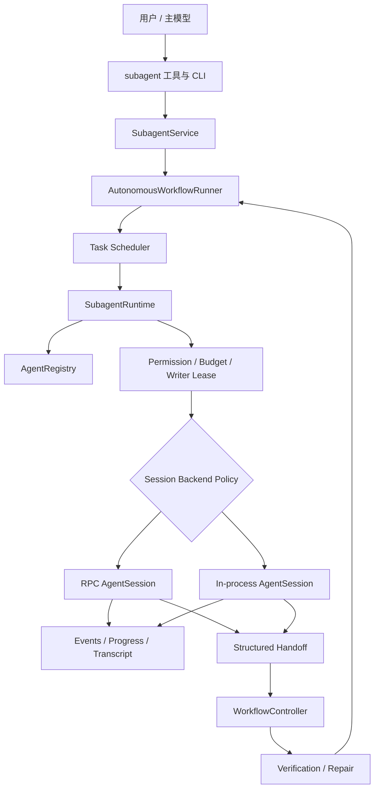

# M7：Subagent Runtime 融合实施计划

> 状态：已完成
> 范围：R13
> 前置：R8、R10、R12
> 目标：保留 R12 的权威 Workflow 闭环，同时吸收 `@gotgenes/pi-subagents` 的轻量调用、自定义 Agent、实时观察和扩展接口优势

## 1. 决策摘要

本方案不把 `@gotgenes/pi-subagents` 直接安装进当前 Pi，也不维护两套 Subagent Runtime。

融合后的系统只有一套权威状态：

```text
WorkflowController
  → Task Graph / Scheduler
  → SubagentRuntime
  → AgentRegistry
  → AgentSession Backend
  → structured Handoff
  → Verification / Repair
```

`SubagentRuntime` 继续拥有 Agent 执行生命周期，`WorkflowController` 继续拥有 Workflow、Task 和 Attempt 状态。轻量版的能力以 Profile Loader、工具接口、事件接口、Session Viewer 和可选 In-process Backend 的形式接入现有 Runtime。

核心选择：

- 保留 R12 的 Task Graph、Scheduler、权限交集、预算、Writer Lease、Handoff、验证、Repair、取消、恢复和幂等。
- 吸收轻量版的 `.pi/agents/*.md`、`subagent` 工具、前后台执行、steer、resume、会话 Transcript、实时活动显示和 typed Service。
- 默认写入型、高风险和 Repair Agent 使用独立 RPC Session。
- 只读、离线、无嵌套的 Agent 可以选择 In-process Session，以降低启动成本。
- 两种 Backend 只负责 Session 执行，不拥有 Agent、Task 或 Workflow 状态。
- 不引入第二个并发队列；所有准入继续由 Scheduler 和 Runtime Policy 决定。

## 2. 背景

### 2.1 当前 R12 的优势

当前实现已经具备：

- 自动 Mode、Clarification Gate 和 Direct 升级 Plan。
- Plan、审批、Task Graph、Ready 推导和 Scheduler。
- 独立 RPC Subagent Session。
- Parent、Profile、Workflow、Task 权限交集。
- Token、费用、Turn、时间、深度、并发和重试预算。
- 单 Writer Lease 和修改归属。
- 结构化 Handoff。
- Background Job Runtime。
- Diff、Review、Test、Build、Completion Gate 和 Repair。
- Snapshot、Event Log、恢复、取消和幂等。
- Interactive、Print、JSON 和 RPC 的统一 Workflow View。

这些能力构成完整交付闭环，不能被轻量调用体验绕过。

### 2.2 轻量版值得吸收的优势

`@gotgenes/pi-subagents` 的优势集中在使用体验和扩展边界：

- `.pi/agents/<name>.md` 定义项目级 Agent。
- 全局 Agent 定义和项目覆盖。
- 单个 `subagent` 工具完成 Agent 类型、模型、思考级别、前后台和上下文选择。
- `get_subagent_result` 和 `steer_subagent` 提供明确的模型调用接口。
- 同进程独立 Session，启动开销低。
- Foreground 流式进度和 Background 常驻状态。
- Session resume 和 Transcript 查看。
- typed Service API。
- Agent 生命周期事件。
- UI 默认紧凑，可展开查看活动、工具调用和 Token。

这些能力应当成为现有 R12 Runtime 的入口和观察层，而不是新的执行权威。

## 3. 融合原则

### 3.1 单一权威状态

- Workflow 状态只由 `WorkflowController` 转换。
- Task 和 Attempt 只通过现有 Command/Event 路径更新。
- Agent 状态只由 `AgentRegistry` 维护。
- UI、工具、RPC 和扩展只能调用 Runtime 端口，不能直接改 Store。
- In-process 和 RPC Backend 不保存独立业务状态。

### 3.2 快速调用不能绕过 Workflow

用户或主模型直接调用 `subagent` 时：

1. 如果已有 Workflow 和 Task，Agent 必须绑定当前 Task 和 Attempt。
2. 如果处于 Direct 且没有显式 Task，系统创建内部 `delegation` Task 和 Attempt。
3. 如果请求需要写入，仍需经过权限、预算和 Writer Lease。
4. Agent 完成后仍需生成结构化 Handoff。
5. 其修改仍进入 Delivery Verification。

`subagent` 是便捷入口，不是旁路。

### 3.3 Backend 只决定执行位置

Backend 不改变以下语义：

- Profile 解析。
- 权限和预算。
- Agent ID、父子关系和深度。
- Scheduler 准入。
- 事件和用量。
- Handoff。
- 取消和恢复策略。

Backend 只能决定 Agent Session 在独立 RPC 进程还是当前进程内运行。

### 3.4 安全优先降级

无法确定 Backend 是否安全时使用 RPC，不自动降级为权限更宽的 In-process Session。

## 4. 能力取舍

| 能力 | 来源 | 融合决定 |
|---|---|---|
| Task Graph、Scheduler | R12 | 保留为唯一调度器 |
| 权限、预算、Writer Lease | R12 | 保留并覆盖所有入口 |
| 结构化 Handoff | R12 | 保留为成功必要条件 |
| Verification、Repair | R12 | 保留为交付闭环 |
| Snapshot、恢复、幂等 | R12 | 保留 |
| `.pi/agents/*.md` | 轻量版 | 接入 `AgentProfileLoader` |
| `subagent` 工具 | 轻量版 | 接入现有 Runtime |
| `get_subagent_result` | 轻量版 | 作为 AgentRegistry 查询工具 |
| `steer_subagent` | 轻量版 | 委托 `SubagentRuntime.send` |
| Foreground/Background | 轻量版 | 作为调用表现，不改变调度语义 |
| In-process Session | 轻量版 | 只允许策略批准的只读任务 |
| Transcript Viewer | 轻量版 | 接入持久化 Session 记录 |
| 实时 Agent Widget | 轻量版 | 融入现有 Workflow Progress |
| typed Service 和事件 | 轻量版 | 在 Core 定义稳定接口 |
| 独立并发队列 | 轻量版 | 不引入 |
| 核心外置权限插件 | 轻量版 | 不采用，权限继续内建 |
| 运行结束立即删除 Worktree | 轻量版 | 不采用 |

## 5. 目标架构



## 6. Agent Profile 文件

### 6.1 发现位置

按优先级从高到低：

```text
<cwd>/.pi/agents/<name>.md
<agentDir>/agents/<name>.md
内置 Agent Profile
```

项目定义可以覆盖同名全局或内置 Profile。文件名是默认 Profile 名称，必须使用小写 kebab-case。

### 6.2 Frontmatter

建议支持：

```yaml
---
description: Repository security reviewer
role: reviewer
model: openai/gpt-5
thinking: high
tools: read, grep, find, ls
run_in_background: true
inherit_context: false
permission:
  read: true
  write: false
  execute_commands: false
  network: false
budget:
  max_turns: 12
  max_duration_ms: 300000
---

Review the assigned changes for correctness and security.
Return evidence-backed findings and the required structured handoff.
```

### 6.3 校验规则

- Profile 加载失败不能静默变成权限更高的默认 Agent。
- `tools` 必须受 `permissionCeiling` 限制。
- 只读 Role 不能声明写入、命令或网络权限。
- Profile Budget 只能收紧继承预算。
- `thinking` 必须属于运行时支持的级别。
- 项目文件不能覆盖 Workflow 强制安全策略。
- 自定义 Prompt 不能删除结构化 Handoff 协议。
- 自定义 Agent 默认不能继续创建子 Agent；只有预算和深度策略显式允许时才开放。

## 7. 统一调用接口

### 7.1 `subagent` 工具

建议参数：

```text
prompt              必填，任务描述
description         必填，短标题
subagent_type       必填，Profile 名称
model               可选，只能在策略允许范围内覆盖
thinking            可选
max_turns           可选，只能收紧预算
run_in_background   可选
inherit_context     可选
resume              可选，恢复已有 Agent Session
```

处理流程：

```text
解析 Profile
  → 解析或创建绑定 Task / Attempt
  → 计算有效权限与预算
  → Scheduler / Runtime 准入
  → 选择 Session Backend
  → 启动或排队
  → 返回 Agent ID 或 Foreground 结果
```

### 7.2 `get_subagent_result`

功能：

- 查询 `queued/running/waiting/completed/failed/interrupted` 的展示状态。
- `wait: true` 必须同时等待 queued 和 running Agent。
- 默认返回有界摘要和结构化 Handoff。
- `verbose: true` 返回 Transcript 摘要；完整内容通过 Session Viewer 或文件读取。
- Agent 终态查询不承担 Task 回写职责，回写由 Runtime 完成事件自动触发。

### 7.3 `steer_subagent`

- 只接受 `running` 或明确允许缓冲的 `starting` Agent。
- steering 进入 Agent Event Log。
- steering 不得修改权限、预算、Task 范围或 Writer Lease。
- 对终态、停止中和恢复中的 Agent返回结构化拒绝原因。

### 7.4 Resume

Resume 必须满足：

- Agent 已到达终态，不允许运行中并发 resume。
- Session 未释放，或存在可验证的恢复快照。
- 原 Workspace 仍有效，或能够从持久化快照安全重建。
- 权限和预算重新计算，只能保持或收紧。
- 同一 Agent 同时最多一个 Resume Attempt。
- Resume 产生新的运行段和事件序号，但保留原 Agent 和 Session 关系。

## 8. Session Backend

### 8.1 RPC Backend

默认用于：

- Worker。
- Repair。
- 需要 `bash` 的 Agent。
- 任何写入任务。
- 需要网络的任务。
- 自定义扩展或安全状态不确定的任务。
- 可能继续创建子 Agent 的任务。

优势：

- 进程和上下文隔离。
- 取消边界清晰。
- 环境变量和工具集合可显式收窄。
- 单个子进程异常不直接破坏主 Session。

### 8.2 In-process Backend

第一阶段只允许：

- `mode_advisor`、`planner`、`explorer`、`reviewer`。
- `write=false`。
- `executeCommands=false`。
- `network=false`。
- `maxAgentDepth=0`。
- 无 Workspace 切换。

优势：

- 启动快。
- Session 事件和 UI 集成直接。
- 适合短时只读分析。

限制：

- 与父进程共享故障和内存边界。
- 不能成为写入型 Agent 的默认 Backend。
- Extension 工具绑定后仍需重新执行递归保护，禁止调用 `subagent`、`get_subagent_result` 和 `steer_subagent` 形成未授权嵌套。

### 8.3 Backend Policy

建议提供：

```text
auto        根据权限和 Role 决定
rpc         强制独立进程
in-process  仅在静态安全检查通过时允许
```

用户选择 `in-process` 不能覆盖安全策略；检查失败时返回原因或使用 RPC，不能静默放宽。

## 9. 调度与并发

轻量版的 FIFO 并发限制不作为第二个 Scheduler 引入。

统一规则：

- `Scheduler` 负责 Task Readiness、依赖、优先级和资源选择。
- `SubagentRuntime` 负责 `maxConcurrentAgents`、深度、重试和实际 Session 容量。
- UI 展示的 queued 状态由 `waiting + concurrency_capacity` 派生。
- Foreground 只影响调用方是否等待，不允许绕过并发和 Writer Lease。
- 高优先级 Repair 可以由 Scheduler 提升优先级，但必须保留稳定、可审计的排序依据。
- 取消 queued Agent 必须从准入队列移除或使其 Promise 立即结算，不能等待未来获得空槽。

## 10. Workspace 与 Worktree

Worktree 作为可选 `WorkspaceProvider` 接入，但生命周期必须与 Agent Session 对齐：

```text
prepare
  → Agent Session start
  → run / steer / resume
  → Session close 或 retention 到期
  → commit/patch/export
  → dispose
```

约束：

- 初次 run 完成后不能立即删除仍可 resume 的 Worktree。
- Resume 必须复用原 Worktree，或从明确的 branch/commit 重建。
- Workspace ID、路径、基线 commit 和结果 branch 必须持久化。
- 崩溃恢复时扫描孤立 Worktree，先核对所有权再清理。
- 多 Worktree Writer 在设计 Patch 合并、冲突和验证协议前不开放。
- 主工作区仍受单 Writer Lease 保护。

## 11. 事件与 typed Service

### 11.1 Core Service

建议在 Core 定义稳定端口：

```ts
interface SubagentService {
  spawn(input: SpawnSubagentRequest): Promise<SpawnSubagentResult>;
  get(agentId: AgentId): AgentView | undefined;
  list(filter?: AgentFilter): readonly AgentView[];
  wait(agentId: AgentId, signal?: AbortSignal): Promise<AgentView>;
  steer(agentId: AgentId, message: string): Promise<SteerResult>;
  interrupt(agentId: AgentId, reason: string): Promise<AgentView>;
  resume(agentId: AgentId, prompt: string, signal?: AbortSignal): Promise<AgentView>;
  getTranscript(agentId: AgentId): Promise<TranscriptView>;
}
```

内建 CLI、RPC、工具和 Extension Adapter 都调用此接口。Core 不依赖 `globalThis` 单例；如果需要跨扩展访问，由 Extension API 发布受控 Service Adapter。

### 11.2 稳定事件

至少发布：

```text
subagent_created
subagent_queued
subagent_started
subagent_progress
subagent_waiting
subagent_steered
subagent_usage
subagent_completed
subagent_failed
subagent_interrupted
subagent_resumed
subagent_session_released
```

事件要求：

- 包含 `workflowId`、`taskId`、`attemptId`、`agentId` 和 sequence。
- 状态事件必须持久化；高频文本增量可以只作为瞬时观察事件。
- 观察者失败不能改变 Agent 结果。
- 事件载荷使用不可变快照，不能暴露可修改 Session 对象。

## 12. UI 与使用体验

### 12.1 默认常驻面板

继续放在输入框上方，默认只显示：

```text
Workflow  5/8 tasks
Agents    2 running · 1 queued
Stage     executing
```

不显示百分比和预计剩余时间。

### 12.2 展开视图

用户展开后显示：

- Agent 名称、Profile、Task 和 Backend。
- running、queued、waiting、failed 等状态。
- 当前工具或当前活动摘要。
- Tool Use、Token 和运行时间。
- Writer Lease、权限等待和预算停止原因。
- Transcript、steer、interrupt 和 resume 操作提示。

### 12.3 Foreground 与 Background

- Foreground 在当前工具调用中流式显示活动，结束后返回 Handoff 摘要。
- Background 立即返回 Agent ID，由常驻面板和完成通知观察。
- 两者使用相同 Runtime、Registry、事件和验证流程。

### 12.4 Session Viewer

提供只读 Session 查看入口：

```text
/agent sessions
/agent transcript <agent>
```

Viewer 优先读取活动 Session；Session 释放后读取持久化 Transcript。Viewer 不持有 Session 生命周期，也不能直接 steering。

## 13. 生命周期与竞态不变量

融合实现必须显式修复轻量版暴露的边界问题：

1. 已经 aborted 的 `AbortSignal` 在绑定时立即触发取消。
2. running Agent 不允许 resume。
3. 同一 Agent 同时只允许一个 prompt 驱动运行段。
4. `wait` 同时覆盖 queued、starting、running 和 waiting。
5. 取消 queued Agent 后其等待 Promise 必须立即结算。
6. Widget、Observer、Timer 和 Session Subscription 在 shutdown/reload 时全部释放。
7. Workspace 只在 Session 真正关闭后释放。
8. Session dispose 和 Workspace dispose 必须幂等。
9. Observer 异常不能阻止状态进入终态。
10. Parent 取消优先于新的 Dispatch、Resume、Verification 和 Repair。
11. Agent 完成与取消并发时，权威转换只接受一个终态。
12. 重复完成事件不能重复创建 Handoff、完成 Attempt 或推进 Task。

## 14. CLI 与现有命令

现有命令继续作为权威管理入口：

```text
/agents
/agent show <agent>
/agent send <agent> <message>
/agent wait <agent>
/agent interrupt <agent> [reason]
/agent retry <agent>
```

新增：

```text
/agent profiles
/agent profile <name>
/agent sessions
/agent transcript <agent>
/agent resume <agent> <prompt>
```

`/agents dispatch` 继续受 R12 自动推进策略控制。新增工具不能直接操作 Scheduler 队列。

## 15. 持久化与恢复

需要持久化：

- Profile 来源和解析后的稳定快照。
- Session Backend。
- Session ID、Transcript 路径和 Workspace ID。
- 每次运行段的开始、结束和终态。
- steering 消息。
- Backend 选择原因。
- Session retention 和释放事件。

恢复规则：

- RPC 或 In-process 的不确定活动运行段恢复为 `interrupted`。
- queued Agent 重新通过 Scheduler 计算，不直接重放旧 Promise。
- 可恢复 Session 必须先验证 Transcript、Workspace 和权限快照。
- 已释放 Session 只能查询结果，不能伪装为可 resume。
- Workflow 终态后不自动恢复 Agent 执行。

## 16. 实施任务

### R13：Subagent Runtime 融合

| ID | 状态 | 任务 | 交付物与验收标准 | 依赖 |
|---|---|---|---|---|
| R13.1 | `DONE` | 定义融合边界 | 固定单 Runtime、Backend、Service、事件和状态映射 | R12 |
| R13.2 | `DONE` | Agent Profile Loader | 加载内置、全局和项目 Markdown，严格校验权限与预算 | R13.1 |
| R13.3 | `DONE` | 统一 SubagentService | CLI、工具、RPC 和扩展共用 typed Core 端口 | R13.1 |
| R13.4 | `DONE` | 增加三个模型工具 | `subagent`、`get_subagent_result`、`steer_subagent` 不绕过 Task/Attempt | R13.3 |
| R13.5 | `DONE` | 完善 Session 生命周期 | terminal-only resume、Scheduler queued wait、预取消和幂等 dispose | R13.3 |
| R13.6 | `DONE` | 接入 Transcript | 活动和已释放 Session 均可只读查看 | R13.5 |
| R13.7 | `DONE` | 稳定 Agent 事件 | 持久状态事件与瞬时活动事件分层 | R13.3 |
| R13.8 | `DONE` | 融合进度面板 | 默认任务计数，展开后显示 Agent 活动和操作入口 | R13.6、R13.7 |
| R13.9 | `DONE` | Backend 抽象 | 保持 RPC 默认，不改变 Registry 和 Scheduler | R13.5 |
| R13.10 | `DONE` | 只读 In-process Backend | 仅允许静态策略批准的只读 Role | R13.9 |
| R13.11 | `DONE` | Workspace Provider 协议 | 生命周期覆盖 resume，暂不开放多 Writer 合并 | R13.5、R13.9 |
| R13.12 | `DONE` | 恢复与清理 | Session、Timer、Observer、Workspace 和孤立资源可恢复或清理 | R13.6-R13.11 |
| R13.13 | `DONE` | 测试与真实烟测 | 单元、Faux Provider、伪 RPC、In-process 和真实模型烟测 | R13.1-R13.12 |

## 17. 分批实施

### 批次 A：入口和 Profile

- Agent Profile Loader。
- typed SubagentService。
- 三个模型工具。
- 现有 RPC Runtime 适配。

此批次不引入 In-process 和 Worktree，先统一入口。

### 批次 B：观察和 Session

- 稳定事件。
- Transcript 持久化与 Viewer。
- 常驻进度面板展开视图。
- Resume、wait、steer 和 shutdown 生命周期修复。

### 批次 C：混合 Backend

- Backend Policy。
- 只读 In-process Backend。
- RPC 与 In-process 一致性测试。
- Backend 失败和取消测试。

### 批次 D：Workspace

- Workspace Provider。
- Session 级 Workspace 生命周期。
- Resume 与恢复。
- 孤立资源清理。

多 Writer Worktree 合并需要单独设计，不包含在 R13 首次完成范围。

### 当前实现

- `SubagentService` 是 CLI、模型工具、Workflow、自动调度、Delivery Reviewer 和 SDK 使用的统一 Core 边界。
- `AgentProfileLoader` 支持项目级覆盖全局、全局覆盖内置；未知字段、越权权限、预算扩张和非法工具直接失败。
- `subagent`、`get_subagent_result`、`steer_subagent` 已默认接入启用 Workflow Tracking 的主 Session。
- Direct 委派复用当前权威 Task 和 Attempt；写入委派以前台方式转移同一 Writer Lease，完成后恢复给父代理。
- Plan 委派继续通过现有 Scheduler 和 `startSubagentTask`，没有第二套队列或状态机。
- `AgentInstance` 持久化 Profile 快照、Backend 选择原因、Session、Workspace、Task 和 Attempt 归属。
- RPC 是默认 Backend；`auto` 仅在只读、离线、无命令、无嵌套且非 Worker 时选择 In-process。
- Session 支持 terminal-only resume、steer、interrupt、显式 release 和幂等 dispose。
- Transcript、稳定状态事件和成功 Handoff 写入父 Session；进程恢复后，未知活动运行段转为 interrupted，已释放 Session 保持只读可查。
- `/agent profiles`、`/agent profile`、`/agent sessions`、`/agent transcript` 和 `/agent resume` 已接入。
- 常驻面板默认显示完成/总 Task 数与 Agent 数；`Ctrl+Shift+A` 展开 Backend、Task、状态、Token/Turn 和操作提示。
- `WorkspaceProvider` 覆盖 prepare、Session retention、release、recover 和 orphan cleanup；R13 仍不开放多 Writer Worktree 合并。
- 聚焦测试、Windows CLI、Faux Provider In-process 以及真实模型 Subagent 工具烟测已通过。

## 18. 测试矩阵

### 18.1 Profile

- 项目 Profile 覆盖全局和内置。
- 非法 YAML、未知 Role、空 Prompt 明确失败。
- 只读 Role 声明写工具被拒绝。
- Profile 预算不能扩大父预算。
- 修改 Profile 后新 Agent 使用新快照，已有 Agent 不受影响。

### 18.2 工具

- Foreground 返回结构化结果。
- Background 立即返回 Agent ID。
- 未绑定 Task 时创建 delegation Task。
- queued Agent 的 `wait: true` 等到终态。
- running Agent resume 被拒绝。
- steering 不改变权限和预算。

### 18.3 Backend

- Worker 和 Repair 始终走 RPC。
- Planner、Explorer、Reviewer 满足条件时可走 In-process。
- In-process 请求写入、命令、网络或嵌套时拒绝或转 RPC。
- 两种 Backend 产生一致的 Runtime 事件和 Handoff。
- Backend 异常不会破坏 Workflow 权威状态。

### 18.4 并发与取消

- 预先 aborted 的 Signal 不启动 Agent。
- queued 取消立即结算。
- 取消与完成竞争只产生一个终态。
- Resume 并发请求只接受一个。
- Parent 取消阻止后继 Dispatch 和 Verification。

### 18.5 Session 与 Workspace

- Transcript 在 Session 释放后仍可读取。
- Session retention 到期后 resume 明确拒绝。
- Worktree 在可 resume 期间不清理。
- Resume 复用或重建正确 Workspace。
- dispose 重复调用不重复提交、删除或发事件。
- shutdown 清理 Timer、Observer、Subscription 和活动 Session。

### 18.6 Workflow 闭环

- 自定义 Worker 完成后 Handoff 回写 Task。
- 自定义 Reviewer 进入 Delivery Verification。
- Repair 仍受 Scheduler、Writer Lease 和预算限制。
- 重复 Agent 完成事件不重复推进 Task。
- 恢复后不重复 Dispatch、Handoff、Verification 或 Repair。

## 19. 验收标准

R13 完成必须同时满足：

1. 系统只有一个 `SubagentRuntime` 和一个 `AgentRegistry` 权威状态。
2. `.pi/agents/*.md` 可以定义并覆盖 Agent Profile。
3. 主模型可以通过三个工具启动、查询和 steer Agent。
4. 快速委派仍绑定 Workflow、Task 和 Attempt。
5. 写入型 Agent 继续受到权限、预算和 Writer Lease 保护。
6. Foreground 与 Background 使用同一套状态和交付语义。
7. queued wait、运行中 resume、预取消和 shutdown 清理测试通过。
8. 默认进度面板只显示任务总数、完成数和 Agent 数量，不显示百分比或预计时间。
9. Transcript 在活动和释放后均可查看。
10. RPC 继续作为安全默认 Backend。
11. In-process 只服务经过策略批准的只读任务。
12. Agent 结果继续经过 Handoff、Verification、Repair 和 Completion Gate。
13. Interactive、Print、JSON 和 RPC 对同一 Agent 给出一致状态。
14. Windows 聚焦测试、Faux Provider 测试、伪 RPC 测试、`npm run check` 和真实模型烟测通过。

## 20. 风险与应对

| 风险 | 影响 | 应对 |
|---|---|---|
| 两种 Backend 产生语义分叉 | 同一任务结果不一致 | Backend 只实现 Session 接口，共用 Runtime 测试合同 |
| 工具入口绕过 Scheduler | Agent 不可审计 | 自动绑定 Task/Attempt，Runtime 二次校验 |
| 自定义 Profile 扩权 | 安全边界失效 | 权限交集、只允许收紧、严格校验 |
| In-process 故障影响父进程 | 主 Session 不稳定 | 仅限只读低风险，RPC 为默认和降级目标 |
| UI 高频刷新消耗资源 | TUI 卡顿或 Timer 泄漏 | 生命周期事件驱动、活动期定时刷新、shutdown 强制 dispose |
| Resume 与 Workspace 脱节 | 在失效目录继续执行 | Workspace 生命周期绑定 Session |
| Transcript 占用过多磁盘 | 长期资源增长 | retention、大小上限和显式释放事件 |
| 多 Writer Worktree 冲突 | 修改丢失或错误合并 | R13 不开放，后续单独设计合并协议 |

## 21. 非目标

- 不直接依赖或嵌入 `@gotgenes/pi-subagents` 源码。
- 不保留第二套 Agent Registry、Limiter 或 UI 状态。
- 不让 In-process Backend 执行写入和高风险任务。
- 不在 R13 自动开放多 Writer。
- 不引入通用 DAG DSL。
- 不改变 R12 的 Plan 审批和 Repair 停止条件。
- 不为了兼容轻量版参数而绕过当前领域模型。

## 22. 完成定义

R13 的完成不是“同时安装两套子代理实现”，而是：

> 用户既能像使用轻量插件一样快速定义、启动、观察、steer 和恢复子代理，又不会失去 R12 的 Task Graph、权限、预算、Writer Lease、Handoff、验证、Repair、取消、恢复和幂等保证；所有入口和 Backend 最终落入同一套权威 Runtime。

## 23. 参考

- 当前实现：`docs/design/m3-subagent-runtime-implementation-plan.md`
- 自动闭环：`docs/design/m6-autonomous-workflow-implementation-plan.md`
- Runtime：`packages/coding-agent/src/core/subagents/subagent-runtime.ts`
- RPC Session：`packages/coding-agent/src/core/subagents/rpc-session.ts`
- Agent Profile：`packages/coding-agent/src/core/workflow/agent-profile.ts`
- 外部参考：`https://github.com/gotgenes/pi-packages/tree/main/packages/pi-subagents`
