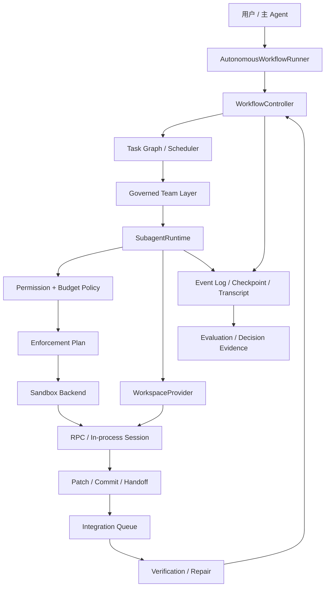

# M8：Subagent 生产加固与受治理团队实施计划

> 状态：实施中（R14-R16 已完成；R17-R18 待实施）
> 范围：R14-R18
> 前置：R13 Subagent Runtime 融合
> 目标：在不破坏 Workflow 权威状态的前提下，把现有 Subagent 从“功能完整”推进到“隔离可靠、可恢复、可评测、可协作”

## 1. 决策摘要

R13 已经完成统一 Subagent Runtime、自定义 Agent、前后台执行、Transcript、Resume、进度显示、Workflow/Task/Attempt 绑定、权限预算、Writer Lease、Handoff、Verification 和 Repair。

下一阶段不优先增加更多 Agent 数量，而是按以下顺序补强：

```text
R14 真实执行隔离 + 单 Writer Worktree
  → R15 持久化、Retention 与任务级恢复
  → R16 真实模型质量评测与调度解释
  → R17 受治理的 Agent Team
  → R18 多 Writer Worktree、集成与冲突处理
```

排序依据：

1. 先保证 Agent 不能越过权限边界。
2. 再保证写入失败不会污染用户工作区。
3. 再保证长时间运行和异常重启后可以继续。
4. 用评测证明多 Agent 确实带来质量收益。
5. 最后增加成员自治和多 Writer，避免自由度先于治理能力。

## 2. 当前基线与明确缺口

### 2.1 已完成能力

- `WorkflowController` 是 Workflow 状态的唯一写入者。
- Task、Attempt、Verification 和 Repair 通过领域命令与事件更新。
- `SubagentRuntime` 和 `AgentRegistry` 是唯一 Agent Runtime。
- Direct 快速委派和 Plan 调度都绑定权威 Task/Attempt。
- RPC 是写入、高风险和不确定 Agent 的默认 Backend。
- In-process 只用于经过静态检查的只读、离线、无命令、无嵌套角色。
- 权限和预算只能继承或收紧。
- 主工作区使用单 Writer Lease。
- 成功必须产生结构化 Handoff，并进入 Delivery Verification。
- Transcript、Agent 事件、前后台控制、steer、interrupt 和 terminal-only resume 已接入。

### 2.2 R15 完成后的剩余缺口

#### 基线 Backend 不是完整操作系统 Sandbox

R14 已将有效权限编译为稳定 Enforcement Plan，并落实 RPC 最小环境、工具路径守卫、进程树清理和独立 Worktree。Windows 基线 Backend 会报告实际保障等级；strict 模式拒绝当前平台不能硬限制的命令、网络和非隔离写入，best-effort 模式则显式列出缺失保障。

基线 Backend 仍不等同于容器或操作系统级 Sandbox。允许命令或网络的 best-effort Agent 不能被描述为 `sandboxed`。

#### 高级 Workspace 集成尚未开放

R14 已实现单 Writer Git Worktree、Patch Artifact、基线校验和串行 Integration Queue。多个 Writer、自动冲突 Attempt、验证失败自动回滚仍属于 R18，不在 R14 范围内。

#### 缺少真实模型对比评测

现有评测主要验证状态机、调度和恢复机制，没有证明多 Agent 相比单 Agent 的正确率、成本和修复收益。

#### 没有团队协作协议

现有 Agent 有父子关系和主代理控制接口，但没有共享任务视图、受控邮箱、任务提议和成员间协作协议。

#### 多 Writer 尚未开放

这是刻意限制，不是缺陷。自动合并、冲突处理、合并后验证和失败回滚没有完成前，多个 Writer 不能同时修改并直接进入交付。

## 3. 目标与非目标

### 3.1 目标

- 权限由 Runtime 声明，并由执行环境强制落实。
- 写入 Agent 默认在独立 Worktree 中运行。
- Agent 失败、取消或超时不会污染用户当前工作区。
- Transcript 和事件长期存储有界、可迁移、可脱敏。
- 崩溃后可以从 Handoff、Diff、Task 和检查点创建新 Attempt 继续。
- 能量化单 Agent 与多 Agent 的质量、成本和延迟差异。
- Agent 可以协作，但不能绕过 Scheduler、Controller 和 Completion Gate。
- 多 Writer 只通过 Patch/Commit 集成队列进入权威工作区。

### 3.2 非目标

- 不建设远程分布式 Agent 平台。
- 不引入 Web UI。
- 不让 Agent 直接改变 Workflow、Task 或 Attempt 状态。
- 不允许 Agent 自主扩大权限、预算或可写范围。
- 不承诺所有平台使用同一种 Sandbox 实现。
- 不把模型会话恢复当作任务恢复的唯一方式。
- R14-R17 不开放多个 Writer 自动合并。

## 4. 核心设计原则

### 4.1 声明权限必须等于实际权限

```text
Effective Permission
  → Enforcement Plan
  → Sandbox Backend
  → 可验证的实际执行边界
```

如果当前平台无法落实某项限制，应明确拒绝或降级到更安全的执行方式，不能只把限制写入 Prompt。

### 4.2 Workspace 与 Repository Identity 分离

- Workspace Path 表示 Agent 实际工作的目录。
- Repository Identity 表示这些 Worktree 属于哪个逻辑仓库。
- Writer Lease 在 R14-R17 按 Repository Identity 获取，而不是按 Worktree 路径获取。

这样即使不同 Worktree 路径不同，系统仍保持全仓库单 Writer。

### 4.3 Session 恢复与任务恢复分离

- Session Resume：继续同一个模型 Session，属于可选优化。
- Task Recovery：根据权威状态和稳定产物创建新 Attempt，属于必须能力。

系统不能因为 Provider 不支持 Session Resume 就失去恢复能力。

### 4.4 Agent 只能提议，Controller 才能决定

Agent 可以：

- 提交发现。
- 请求补充信息。
- 提议拆分 Task。
- 请求 Reviewer 或 Explorer。
- 向其他 Agent 发送受控消息。

Agent 不可以：

- 创建权威 Task。
- 将 Attempt 标记为成功。
- 修改依赖关系。
- 直接触发交付完成。
- 扩大权限、预算或写入范围。

所有提议必须经过 Scheduler/Controller 的确定性校验。

### 4.5 并行结果必须串行集成

探索、评审和测试可以并行；写入产物最终进入一个受控 Integration Queue，逐个应用、验证和确认。

## 5. 目标架构



`Governed Team Layer` 只是 Workflow Task Graph 的协作入口，不维护第二套 Task 状态。

## 6. R14：真实隔离与单 Writer Worktree

### 6.1 Enforcement Plan

新增由有效权限编译得到的稳定执行计划：

```ts
interface AgentEnforcementPlan {
  readonly filesystem: {
    readonly readableRoots: readonly string[];
    readonly writableRoots: readonly string[];
    readonly deniedRoots: readonly string[];
  };
  readonly environment: {
    readonly allowedKeys: readonly string[];
    readonly injectedKeys: readonly string[];
  };
  readonly commands: {
    readonly enabled: boolean;
    readonly workingDirectory: string;
  };
  readonly network: {
    readonly enabled: boolean;
    readonly allowedHosts: readonly string[];
  };
  readonly digest: string;
}
```

约束：

- Plan 只能由 Runtime Policy 生成。
- Agent Profile 只能收紧，不能直接构造 Enforcement Plan。
- Plan 稳定快照和摘要写入 AgentInstance。
- Backend 启动前必须返回“已落实”或结构化拒绝原因。
- Prompt 中的权限描述仅用于帮助模型理解，不作为安全证明。

### 6.2 环境变量隔离

RPC 子进程从“继承全部后覆盖”改为“最小基础环境加显式白名单”：

- 保留平台启动必需变量。
- 只注入当前 Provider 所需凭据。
- 不把其他 Provider Key、Git 凭据和无关 Token 传给子 Agent。
- Transcript 和事件不记录 Secret 值，只记录 Key 名与策略摘要。
- 调试日志必须经过 Secret Redactor。

### 6.3 Sandbox Backend

定义平台无关接口：

```ts
interface SandboxBackend {
  prepare(plan: AgentEnforcementPlan): Promise<SandboxHandle>;
  verify(handle: SandboxHandle): Promise<SandboxVerification>;
  release(handle: SandboxHandle): Promise<void>;
}
```

保障等级必须明确展示：

| 等级 | 可落实能力 | 不得宣称 |
|---|---|---|
| `tool-guarded` | 工具白名单、规范化路径检查、环境变量白名单、禁用命令和网络工具 | 不能声称隔离任意子进程 |
| `process-restricted` | 上述能力、进程树生命周期、资源限制、独立 Worktree | 不能在未验证时声称限制了子进程文件系统或网络 |
| `sandboxed` | 文件系统、环境、命令和网络均由执行环境强制限制 | 只能在 Backend 自检通过后使用该标记 |

第一阶段要求：

- Windows 基线至少实现环境白名单、工具路径守卫、进程树清理和独立 Worktree。
- 无完整 Sandbox 时，strict 模式禁止无法硬限制的命令和网络能力。
- best-effort 模式可以按用户明确策略使用 RPC，但必须显示实际保障等级和缺失项。
- 用户开启 strict 模式时，无法落实的权限直接拒绝运行。
- Windows 和 Unix 实现可以不同，但必须通过相同合同测试。
- Sandbox release 幂等，异常退出后可以扫描孤立资源。

### 6.4 Git Worktree Provider

新增正式 `GitWorktreeWorkspaceProvider`：

```text
prepare
  → 记录 Repository Identity 和 baseline commit
  → 创建内部 branch 与 Worktree
  → Agent Session 执行
  → Worktree 内验证
  → 生成 Patch/Commit Artifact
  → 进入 Integration Queue
  → Session/Retention 到期后释放
```

必须持久化：

- Workspace ID。
- Repository Identity。
- Worktree Path。
- Baseline Commit。
- Result Commit 或 Patch ID。
- Internal Branch。
- Owner Workflow/Task/Attempt/Agent。
- Retention Deadline。
- Release 状态。

### 6.5 单 Writer 集成

R14 仍然只允许一个 Writer：

1. 写入 Agent 获取 Repository Identity 级 Writer Lease。
2. Agent 在独立 Worktree 修改和验证。
3. Agent 完成后生成不可变 Patch/Commit Artifact。
4. Integration Queue 校验基线是否仍有效。
5. 将产物应用到权威目标工作区。
6. 在目标工作区再次执行必要验证。
7. 验证成功后才进入 Completion Gate。
8. 应用或验证失败时保留 Artifact，并创建 Repair/Conflict Attempt。

不能把“Agent Worktree 内通过”直接等同于最终交付通过。

### 6.6 R14 任务

| ID | 状态 | 任务 | 验收标准 |
|---|---|---|---|
| R14.1 | `DONE` | 定义 Enforcement Plan | 权限、环境、文件、命令和网络形成可序列化稳定计划 |
| R14.2 | `DONE` | 收紧 RPC 环境 | 子进程只获得白名单变量，Secret 不进入日志 |
| R14.3 | `DONE` | 定义 Sandbox Backend | strict、best-effort 和拒绝原因行为一致 |
| R14.4 | `DONE` | 实现 Windows 基线 Backend | 正确报告保障等级；strict 模式拒绝无法落实的能力 |
| R14.5 | `DONE` | 实现 Git Worktree Provider | prepare、recover、release、orphan cleanup 可重复执行 |
| R14.6 | `DONE` | Repository Identity Writer Lease | 不同 Worktree 仍受同一仓库单 Writer 约束 |
| R14.7 | `DONE` | Patch/Commit Artifact | Agent 结果可以审查、保存和重新应用 |
| R14.8 | `DONE` | 单 Writer Integration Queue | 应用后重新验证，失败不会误判完成 |
| R14.9 | `DONE` | CLI 与状态展示 | 显示 Sandbox、Workspace、Artifact 和集成阶段 |
| R14.10 | `DONE` | 安全与 Worktree 测试 | 覆盖越权、Secret、崩溃、冲突、恢复和清理 |

### 6.7 R14 当前实现

- `SubagentRuntime` 在启动 Session 前生成并持久化 Enforcement Plan、Sandbox Verification 和保障摘要。
- RPC 子进程不再继承整个父进程环境，只接收平台启动变量、Pi 运行变量和当前 Provider 所需凭据。
- 文件工具统一执行规范化路径和真实路径检查，拒绝越过允许根、Denied Root 和符号链接边界。
- Windows 基线提供 `tool-guarded`/`process-restricted` 保障；strict 模式不会把缺失的命令或网络隔离降级为 Prompt 约束。
- 写入 Agent 默认创建 Git Worktree，并复制目标仓库启动时的已跟踪修改和未跟踪文件作为私有基线。
- Writer Lease 使用 Repository Identity，因此 Worktree 路径不同也不能形成第二个并发 Writer。
- Agent 完成后生成不可变二进制 Patch Artifact；Integration Queue 校验目标指纹和 Patch 适用性后串行应用。
- Artifact 应用后仍进入原有 Delivery Verification、Repair 和 Completion Gate，Worktree 内验证不能直接完成 Workflow。
- Worktree 元数据支持恢复、正常释放和孤儿清理；Artifact 在 Workspace 释放后继续保留。
- `/agent show` 和展开的常驻进度面板显示保障等级、缺失保障、Workspace 类型、Repository Identity 和 Artifact 状态。

当前明确边界：

- `best-effort` 允许的命令子进程尚无文件系统 Sandbox，允许的网络也尚无目标地址限制。
- `strict` 会拒绝上述无法落实的能力，以及不能创建独立 Worktree 的写入任务。
- R14 仍是仓库级单 Writer；多 Writer、冲突 Attempt 和可回滚集成由 R18 实现。

## 7. R15：持久化、Retention 与任务级恢复

### 7.1 有界 Transcript

每个 Agent Transcript 分为：

- 关键记录：Prompt、steer、最终回答、Handoff、停止原因。
- 活动记录：工具开始、工具更新、流式增量。

策略：

- 关键记录默认保留。
- 高频活动按时间窗口合并。
- 单条文本和单 Session 设大小上限。
- 超限后保留头部摘要、关键事件和尾部窗口。
- Secret Redactor 在持久化前运行。
- Session release 后按 Retention Policy 压缩或删除。

### 7.2 版本与压缩

- Persistence Record 增加 Schema Version。
- 新版本提供显式迁移器。
- Event Log 仍是事实来源。
- Checkpoint 只加速恢复，不覆盖未归档事件。
- Compaction 完成后记录覆盖范围和校验摘要。
- 损坏记录不能被静默跳过并继续交付。

### 7.3 恢复检查点

稳定检查点至少包含：

- Workflow、Task 和 Attempt 状态。
- Agent Profile 与 Enforcement Plan 摘要。
- Workspace、baseline 和 Artifact。
- 最后成功 Handoff。
- 已完成验证。
- 未完成项和停止原因。

### 7.4 任务级恢复

```text
检测 interrupted
  → 验证 Workspace / Artifact / Event Log
  → 计算已完成事实
  → 创建新的 Recovery Attempt
  → 注入恢复上下文
  → 重新获取权限、预算和 Writer Lease
  → 从稳定检查点继续
```

恢复必须创建新 Attempt，不能覆盖中断历史。

### 7.5 R15 任务

| ID | 状态 | 任务 | 验收标准 |
|---|---|---|---|
| R15.1 | `DONE` | Transcript Retention | 大小、时间、压缩和删除策略可配置且有界 |
| R15.2 | `DONE` | Secret Redactor | 凭据不会进入 Transcript、事件和错误报告 |
| R15.3 | `DONE` | Persistence Schema 版本 | 支持迁移、拒绝未知版本和损坏检测 |
| R15.4 | `DONE` | Checkpoint 与 Compaction | 可重放结果与压缩前一致 |
| R15.5 | `DONE` | Recovery Attempt | 中断任务从稳定事实创建新 Attempt |
| R15.6 | `DONE` | Workspace/Artifact 恢复 | Worktree 和 Patch 可以校验、继续或安全放弃 |
| R15.7 | `DONE` | 故障注入测试 | 覆盖进程退出、部分写入、损坏记录和重复恢复 |

### 7.6 R15 当前实现

- `SubagentRetentionPolicy` 同时限制活动/已释放 Transcript 的条数、单条字符数、总字符数、保留时间、事件数和 Checkpoint 周期。
- 高频活动和历史尾部压缩进稳定 Checkpoint；Session 只保留最新 Subagent Checkpoint，并使用临时文件替换方式物理压缩旧记录。
- `SecretRedactor` 在文本进入 Runtime Transcript、Handoff、错误状态和 Persistence Envelope 前运行，同时覆盖已知环境凭据、Bearer、常见 Token 格式和敏感字段。
- Subagent Persistence 使用 Schema v2 Envelope；旧的无版本记录显式迁移，未知版本、损坏记录和损坏 Worktree 元数据直接拒绝。
- Checkpoint 保存 Agent、Handoff、事件尾部、有界 Transcript 和 Spawn Input；恢复结果与压缩前的终态结果一致。
- 重启时活动 Agent 保留为历史 `interrupted`，Scheduler 为原 Task 创建新的 Recovery Attempt；旧 Attempt 不覆盖，基础设施恢复不消耗模型重试次数。
- Recovery Context 包含来源 Agent/Attempt、最后 Prompt/Assistant、Handoff、Artifact 和 Workspace 校验状态，并在新 Agent Prompt 中明确要求重新验证。
- 中断 Worktree 可先捕获为不可变 Patch Artifact；Artifact 使用 SHA-256 摘要验证，来源 Worktree 只有在产物安全保留后才释放。
- `/agent show`、Task Details 和展开进度面板显示 Recovery 来源、原因以及 Workspace 的 `available`、`artifact-only`、`unavailable` 或 `invalid` 状态。

当前明确边界：

- Recovery 恢复的是权威任务事实和稳定产物，不承诺 Provider 能继续原模型 Session。
- 损坏或摘要不匹配的 Workspace/Artifact 不会自动应用；系统保留诊断并从新的隔离 Workspace 继续。
- R15 不改变仓库级单 Writer 限制，也不开放 R18 的自动冲突解决和回滚合并。

## 8. R16：真实模型评测与调度解释

### 8.1 两类评测严格分开

#### 机制评测

继续使用 Faux Provider 和确定性输入，验证：

- 状态转换。
- 调度顺序。
- 权限和预算。
- 取消、恢复和幂等。
- Worktree 和 Artifact 生命周期。

#### 模型效果评测

使用固定版本的真实模型和固定任务集，比较：

- 单主 Agent。
- 主 Agent + Explorer。
- 主 Agent + Reviewer。
- Planner + Worker + Reviewer。
- 自动调度策略。

### 8.2 指标

至少记录：

- 最终任务成功率。
- 必要测试通过率。
- Reviewer 有效发现率。
- Repair 成功率和次数。
- 无效委派率。
- Handoff 完整率。
- 总 Token、费用、Turn 和运行时间。
- 每个成功任务的平均成本。
- Agent 数量增加后的边际收益。

不使用“面板更忙”或“输出更多”作为质量指标。

### 8.3 调度解释

每个自动决策产生稳定 Reason Code：

- 为什么选择 Direct 或 Plan。
- 为什么创建某种 Agent。
- 为什么选择 RPC、In-process 或 Sandbox。
- 为什么排队、阻塞或停止。
- 为什么触发 Reviewer 或 Repair。
- 为什么不再重试。

默认进度面板仍只显示任务完成数和 Agent 数量；详细原因在展开视图和命令中显示，不增加百分比和预计时间。

### 8.4 R16 任务

| ID | 状态 | 任务 | 验收标准 |
|---|---|---|---|
| R16.1 | `DONE` | 固定真实任务集 | 任务、仓库基线、验证命令和成功标准可重复 |
| R16.2 | `DONE` | 单 Agent 基线 | 记录模型、Prompt、成本和失败样本 |
| R16.3 | `DONE` | 多 Agent 对照 | 使用相同任务和预算进行公平比较 |
| R16.4 | `DONE` | 决策事件 | 自动 Mode、Agent、Backend、Repair 都有 Reason Code |
| R16.5 | `DONE` | 评测报告 | 同时展示成功率、成本、失败类型和限制 |
| R16.6 | `DONE` | 回归门禁 | 新策略不能在无解释的情况下显著降低质量或扩大成本 |

### 8.5 R16 当前实现

- `evals/r16/task-set.json` 固定三个带缺陷的独立 Git Fixture，保存任务 Prompt、成功标准、验证命令、预算和内容 SHA-256。
- `npm run eval:cli-agent:model` 使用当前活动 Provider/Model 创建全新仓库，支持单 Agent、Explorer、Reviewer、Planner/Worker/Reviewer 和自动策略。
- 比较器拒绝不同 Task Set、Model、Prompt、仓库基线或预算进入同一报告；策略要求的 Agent 未真正创建时记录为 `strategy_protocol`，不会误算多 Agent 成功。
- 报告同时统计成功率、验证、Reviewer 发现、Repair、无效委派、Handoff、Token、费用、Turn、时长、成功成本和边际收益，并输出 JSON 与 Markdown。
- Mode、Agent 创建、Backend 选择、Scheduler 选择/排队、Automation 等待、Retry 和 Repair 使用稳定 Reason Code；详细 Workflow View 展示解释，默认进度面板仍不增加百分比或预计时间。
- 回归门禁拒绝不可比较报告、显著成功率/验证回归、无质量收益的成本扩张和未解释自动决策。
- 真实 `deepseek/deepseek-v4-pro` 烟测验证了固定任务、外部测试、用量统计、失败分类和 Reason Code 链路；评测过程中发现并修复 Planner 嵌套输出校验与执行前 Workflow 失败边界。

当前明确边界：

- 单次烟测不代表策略质量结论；正式结论需要完整矩阵和重复运行。
- Reviewer 发现率使用固定缺陷关键词匹配结构化 Handoff，可能低估语义等价表述。
- 时长预算主动终止；Token 和费用预算在 Run 完成后审计，尚不执行流式硬中断。

## 9. R17：受治理的 Agent Team

### 9.1 不建立第二套 Task 系统

团队共享任务板直接使用现有 Workflow Task Graph 的只读投影：

```text
Shared Task Board = Workflow Task Graph View
```

Agent 看到的 Task 状态来自 Controller，不维护独立的 Team Task 状态。

### 9.2 Team 角色

- Coordinator：读取 Task Graph，提交调度和拆分建议。
- Explorer：只读调查并提交证据。
- Worker：执行已批准的写入 Task。
- Reviewer：对 Artifact 和 Handoff 提交发现。
- Repair：只处理已创建的 Repair Task。

角色不赋予状态修改权。

### 9.3 受控邮箱

消息必须包含：

- Workflow ID。
- 来源 Agent。
- 目标 Agent 或角色。
- 关联 Task/Attempt。
- 消息类型。
- 有界正文或 Artifact 引用。
- Sequence 和时间。

允许的消息类型：

- `information`
- `question`
- `answer`
- `review_finding`
- `task_proposal`
- `handoff_request`

约束：

- 只能在同一 Workflow 内通信。
- 不能通过消息修改权限、预算和 Writer Lease。
- 消息进入 Event Log，并受大小和频率限制。
- Agent 终态后不能继续发送消息。
- 邮箱内容是上下文，不是权威状态。

### 9.4 Task Proposal

Agent 可以提交：

```text
目标
原因
建议依赖
所需角色
读写模式
风险
验证方式
```

Scheduler/Controller 校验后：

- 接受并创建正式 Task。
- 合并到已有 Task。
- 拒绝并记录原因。
- 要求用户批准扩权或高风险变更。

### 9.5 R17 任务

| ID | 状态 | 任务 | 验收标准 |
|---|---|---|---|
| R17.1 | `DONE` | Team View | 直接投影 Workflow Task Graph，不复制状态 |
| R17.2 | `DONE` | Agent Mailbox | 消息可寻址、有界、持久化、可审计 |
| R17.3 | `DONE` | Task Proposal | Agent 提议不能绕过 Controller 创建 Task |
| R17.4 | `DONE` | 协作调度策略 | 依赖、预算、角色和权限统一准入 |
| R17.5 | `DONE` | Team CLI | 显示成员、消息、提议和处理结果 |
| R17.6 | `DONE` | 自由度保护测试 | 消息风暴、循环委派、越权和重复提议被阻止 |
| R17.7 | `DONE` | Team 效果评测 | 只有证明质量收益后才作为默认策略候选 |

### 9.6 R17 实现记录

- `GovernedAgentTeam` 只持久化消息、Task Proposal 和处理结果；Team View 每次从 Agent Registry 与 Workflow Controller 读取成员和 Task，不存在可独立修改的 Team Task 状态。
- 邮箱强制绑定 Workflow、来源 Agent、Task、Attempt 和目标 Agent/角色；正文、Artifact 引用、窗口频率和可见数量有界，消息写入独立的追加式 Team Event Log。
- 终态 Agent、跨 Workflow 目标、重复消息、消息风暴和形成环路的 `handoff_request` 会在写入前被拒绝。消息结构不提供权限、预算和 Writer Lease 修改字段。
- Task Proposal 保存目标、原因、依赖、角色、读写模式、风险和验证方法。提交只产生 `pending` Proposal；只有 Controller/Scheduler 决策可接受、合并、拒绝或要求批准。
- 接受 Proposal 时由 `WorkflowController.createProposedTask()` 再次校验已批准 Plan、Workflow 状态、依赖、风险批准和角色/读写模式，并创建带 `sourceProposalId` 的正式 Task；预算继续使用 Workflow 与内置 Agent Profile 的交集。
- Scheduler 仍从唯一 Task Graph 选择任务；Task 的推荐角色只影响 Profile 选择，实际权限继续由 Task Access Mode、Profile Ceiling、Workflow Budget 和 Writer Lease 共同收紧。
- `/team`、`/team messages` 和 `/team proposals` 只展示权威 Task 投影、成员、邮箱和处理结果，不提供直接修改 Task 状态的旁路。
- Agent Team 默认候选门禁要求重复样本、明确质量收益、无协作退化、成本受控和自动决策解释完整。R17 完成机制门禁不等于已经证明真实模型收益，因此默认自动策略仍不启用 Agent Team。

当前明确边界：

- Team Event Log 与 Workflow Event Log 分开持久化，但 Proposal 只有通过 Controller 生成 `task.created` 后才成为权威执行状态。
- R17 仍使用单 Writer；多个写入 Agent、独立 Worktree、冲突 Attempt 和自动集成属于 R18。
- 受控邮箱和 Proposal Core API 已可由 Runtime/SDK 使用；是否向特定远程 Agent Backend 暴露对应模型工具，必须继续经过该 Backend 的身份绑定和权限审查。

## 10. R18：多 Writer Worktree 与自动集成

### 10.1 开放前置条件

必须同时满足：

- R14 Sandbox 和 Worktree 稳定。
- R15 Workspace/Artifact 恢复通过故障注入。
- R16 证明并行 Writer 对目标任务有明确收益。
- 所有写入都能生成不可变 Patch/Commit Artifact。
- Integration Queue 可以重复应用、回滚和重新验证。

### 10.2 多 Writer 模型

每个 Writer 使用独立 Worktree，但不能直接写入权威目标工作区：

```text
Writer A ─→ Artifact A ┐
                       ├→ Integration Queue → Apply → Verify
Writer B ─→ Artifact B ┘
```

新增两类 Lease：

- Workspace Writer Lease：限制单个 Worktree 内的写入所有者。
- Repository Integration Lease：保证同一时间只有一个 Artifact 被集成。

### 10.3 冲突处理

集成前执行：

- Baseline 检查。
- 修改路径重叠检查。
- Patch 适用性检查。
- 依赖顺序检查。
- 生成文件与锁文件特殊规则检查。

冲突不能由 Runtime 静默选择一方。应创建 Conflict Resolution Attempt，输入双方 Handoff、Artifact、共同基线和当前目标状态。

### 10.4 合并后验证

每个 Artifact 在自己的 Worktree 内通过，只能证明局部正确。最终完成必须：

1. 按确定性顺序集成。
2. 对集成结果运行 Review。
3. 执行受影响测试。
4. 执行全局必要验证。
5. Completion Gate 通过。

失败时回滚该次集成，保留 Artifact 和诊断证据，再创建 Repair 或 Conflict Attempt。

### 10.5 R18 任务

| ID | 状态 | 任务 | 验收标准 |
|---|---|---|---|
| R18.1 | `TODO` | 多 Workspace Writer Lease | Writer 只能修改自己的 Worktree |
| R18.2 | `TODO` | Repository Integration Lease | Artifact 串行进入目标工作区 |
| R18.3 | `TODO` | 重叠与依赖分析 | 明确可自动集成和必须人工/Agent 解决的情况 |
| R18.4 | `TODO` | Conflict Attempt | 冲突保留双方历史，不覆盖原 Attempt |
| R18.5 | `TODO` | 可回滚集成 | 应用失败或验证失败后恢复目标基线 |
| R18.6 | `TODO` | 合并后验证 | 局部通过不能绕过全局 Completion Gate |
| R18.7 | `TODO` | 多 Writer 评测 | 只对收益高于额外成本的任务启用 |

## 11. CLI 与可观察性

建议新增：

```text
/sandbox
/sandbox show <agent>
/agent workspace <agent>
/agent artifact <agent>
/workflow recovery <workflow>
/team
/team messages
/team proposals
```

默认常驻面板保持简洁：

```text
Workflow  5/8 tasks
Agents    2 running · 1 queued
Stage     integrating
```

展开视图增加：

- Sandbox 状态和 Enforcement Plan 摘要。
- Workspace、baseline 和 Artifact。
- 当前是执行、集成、验证还是恢复阶段。
- 阻塞和决策 Reason Code。
- Team 消息和待处理 Proposal 数量。

不显示百分比和预计剩余时间。

## 12. 测试策略

### 12.1 安全

- 子 Agent 无法读取未允许路径。
- 子 Agent 无法写入未允许根目录。
- 无关 Provider Key 不进入 RPC 环境。
- 禁止网络时请求失败且有明确原因。
- strict 模式不能静默退化成 Prompt 约束。

### 12.2 Worktree

- 创建、恢复、释放和孤立清理幂等。
- Agent 失败不修改用户目标工作区。
- Baseline 变化后旧 Artifact 不被直接应用。
- 集成后验证失败可以恢复。
- Windows 路径、长路径和进程占用得到覆盖。

### 12.3 持久化与恢复

- Transcript 超限后关键记录仍可查询。
- Secret 在任何持久化记录中均被清理。
- 新旧 Schema 可以迁移或明确拒绝。
- 崩溃点覆盖 prepare、执行、Artifact、apply、verify 和 release。
- 重复恢复不重复应用 Patch 或创建 Task。

### 12.4 Team

- Agent 消息不能改变权威 Task 状态。
- 跨 Workflow 消息被拒绝。
- 循环委派受深度、预算和频率限制。
- 重复 Proposal 不重复创建 Task。
- Parent 取消后停止新消息、Proposal 和 Dispatch。

### 12.5 多 Writer

- 无重叠 Patch 按依赖顺序集成。
- 同文件冲突创建 Conflict Attempt。
- 锁文件和生成文件走特殊验证规则。
- 两个局部通过的 Artifact 合并失败时不能完成 Workflow。
- 回滚后目标工作区与集成前一致。

## 13. 实施门禁

每一阶段必须同时完成：

1. 设计和领域模型。
2. Core 实现。
3. Interactive、Print、JSON 和 RPC 一致视图。
4. Windows 聚焦测试。
5. Faux Provider 和故障注入测试。
6. 可重复离线演示。
7. 真实模型烟测。
8. 文档中的 `TODO` 只有通过验收后才能改为 `DONE`。

阶段依赖不能跳过：

```text
R14 → R15 → R16 → R17 → R18
```

R17 可以进行接口原型，但不能在 R14-R16 完成前成为默认执行路径。R18 在全部前置条件完成前保持关闭。

## 14. 完成定义

M8 完成不是“能够同时启动更多 Agent”，而是：

> 每个 Agent 的权限都有真实执行边界，写入发生在可恢复的独立 Workspace 中，异常后可以从权威事实继续；系统能够证明多 Agent 的质量收益；成员可以协作但不能绕过 Task/Attempt、预算、Writer Lease、Verification 和 Completion Gate；多个 Writer 的结果只能通过可回滚、可验证的集成协议进入最终交付。

## 15. 参考

- R13 融合设计：[`M7 Subagent Runtime 融合实施计划`](./m7-subagent-runtime-fusion-plan.md)
- 自动闭环：[`M6 自动 Workflow 编排实施计划`](./m6-autonomous-workflow-implementation-plan.md)
- 长期路线：[`Pi CLI Coding Agent 长期改进路线图`](../cli-agent-long-term-roadmap.md)
- 当前 Workspace 协议：`packages/coding-agent/src/core/subagents/workspace-provider.ts`
- 当前 RPC Session：`packages/coding-agent/src/core/subagents/rpc-session.ts`
- 当前 Subagent Runtime：`packages/coding-agent/src/core/subagents/subagent-runtime.ts`
