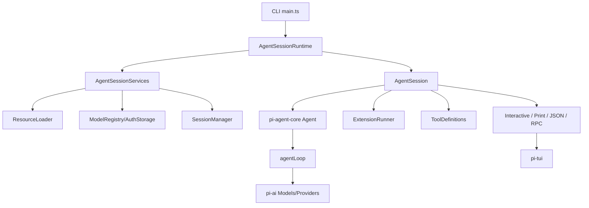

# Pi 项目学习大纲

这份大纲用于从项目思想、代码分层和源码阅读路径三个角度理解 `pi`。它基于根目录 `README.md`、各包 README、`packages/coding-agent/docs/` 文档，以及核心入口和运行时实现整理。

配套的第一天精读笔记见 `docs/day1-agent-core-study.md`，它只聚焦 `packages/agent` 和 `coding-agent` 的消息转换边界。

## 1. 一句话理解

Pi 是一个最小核心、强扩展的终端 coding agent harness。它把 LLM provider 抽象、agent loop、会话管理、终端 UI、扩展系统拆成独立层，让核心保持小而稳定，把工作流差异留给 extensions、skills、prompt templates、themes 和 pi packages。

## 2. 项目核心思想

### 2.1 Minimal core

核心默认只提供足够完成 coding agent 工作的能力：模型调用、工具调用、会话、终端交互、上下文管理。项目刻意不把 sub-agent、plan mode、权限弹窗、todo、后台 bash 等做成固定内置功能，而是让用户用扩展按自己的工作流实现。

### 2.2 Extension-first

扩展不是外围装饰，而是架构中心之一。扩展可以注册工具、命令、快捷键、UI、provider，拦截输入、工具调用、上下文、provider payload、会话切换、压缩等事件。

### 2.3 Session as durable tree

会话不是简单线性聊天记录，而是 append-only JSONL tree。每个 entry 有 `id` 和 `parentId`，所以 `/tree`、fork、clone、branch summary、compaction 都建立在同一套持久化模型上。

### 2.4 Provider abstraction

LLM provider 被抽象成统一的 `Model`、`Provider`、`Context`、event stream 和 auth resolution。业务层不直接绑定 OpenAI、Anthropic 或 Gemini，而是面向统一事件和消息结构。

### 2.5 Terminal-native product

Pi 的交互面是 TUI，而不是 Web UI。`pi-tui` 自己实现差分渲染、overlay、输入编辑器、markdown、inline image、IME cursor 定位等能力，让 interactive mode 能长期运行在终端内。

## 3. Monorepo 分层

### 3.1 Root

- `package.json`: workspace、统一 check/build/release 脚本。
- `README.md`: 项目定位、包列表、安全和供应链策略。
- `AGENTS.md`: 本仓库开发规则。
- `scripts/`: release、模型生成、依赖检查、统计和本地发行脚本。
- `test.sh`: 非 e2e 测试入口。

### 3.2 `packages/ai`

定位：统一 LLM API。

主要职责：

- 管理 built-in providers 和 models。
- 把不同 API 协议转成统一 stream event。
- 统一 tool calling、thinking、image input/output、usage/cost。
- 处理 provider auth、OAuth、credential store。
- 支持跨 provider context handoff。

关键文件：

- `packages/ai/src/models.ts`: `Models` 集合、`Provider` 抽象、auth 应用、stream/complete 分发。
- `packages/ai/src/types.ts`: 消息、模型、工具、事件类型。
- `packages/ai/src/api/*`: 各 provider wire protocol 实现。
- `packages/ai/src/providers/*`: provider factory 和模型目录。
- `packages/ai/scripts/generate-models.ts`: 生成模型目录。

### 3.3 `packages/agent`

定位：通用 agent runtime。

主要职责：

- 管理 agent state。
- 把 prompt、assistant streaming、tool call、tool result 串成事件流。
- 支持 parallel/sequential tool execution。
- 支持 steering/follow-up 队列。
- 支持 context transform 和 `convertToLlm`。

关键文件：

- `packages/agent/src/agent-loop.ts`: agent loop 主流程。
- `packages/agent/src/agent.ts`: stateful `Agent` 类和队列管理。
- `packages/agent/src/types.ts`: agent message、event、tool 类型。
- `packages/agent/src/harness/*`: compaction、session、skills、prompt templates 等可复用 harness 能力。

### 3.4 `packages/coding-agent`

定位：Pi 产品层，提供 CLI、interactive、print、JSON、RPC、SDK。

主要职责：

- CLI 参数解析和启动流程。
- 会话持久化、切换、fork、tree navigation。
- 工具定义：`read`、`bash`、`edit`、`write`、`grep`、`find`、`ls`。
- settings、auth storage、model registry、project trust。
- extensions、skills、prompt templates、themes、packages 资源加载。
- interactive TUI、print mode、RPC mode。

关键文件：

- `packages/coding-agent/src/main.ts`: CLI bootstrap，总入口。
- `packages/coding-agent/src/core/agent-session.ts`: 所有 run mode 共用的会话业务层。
- `packages/coding-agent/src/core/agent-session-runtime.ts`: cwd-bound runtime 切换和重建。
- `packages/coding-agent/src/core/session-manager.ts`: JSONL session tree。
- `packages/coding-agent/src/core/resource-loader.ts`: extensions、skills、prompts、themes、AGENTS.md 加载。
- `packages/coding-agent/src/core/extensions/runner.ts`: extension event dispatch 和上下文。
- `packages/coding-agent/src/core/model-registry.ts`: built-in/custom models、auth、dynamic provider。
- `packages/coding-agent/src/modes/interactive/interactive-mode.ts`: TUI 交互产品层。
- `packages/coding-agent/src/modes/print-mode.ts`: one-shot 输出。
- `packages/coding-agent/src/modes/rpc/rpc-mode.ts`: JSONL RPC 协议。

### 3.5 `packages/tui`

定位：终端 UI 框架。

主要职责：

- Component/Container/TUI 基础模型。
- 差分渲染和 synchronized output。
- overlay、focus、hardware cursor、IME 支持。
- editor、input、markdown、select list、settings list、image 等组件。
- key parsing、keybindings、autocomplete。

关键文件：

- `packages/tui/src/tui.ts`: 渲染器、overlay、focus、cursor、diff。
- `packages/tui/src/components/editor.ts`: 多行输入编辑器。
- `packages/tui/src/keys.ts`: 终端键盘输入解析。
- `packages/tui/src/terminal-image.ts`: Kitty/iTerm2 inline image。

### 3.6 `packages/orchestrator`

定位：实验性 orchestrator 包，目前文档标记为不稳定。当前学习优先级低于前四个核心包。

## 4. 关键执行流

### 4.1 启动流

1. `packages/coding-agent/src/main.ts` 解析 CLI。
2. 创建 `SettingsManager`、`AuthStorage`、`SessionManager`。
3. 解析 project trust，决定是否加载项目 `.pi` 资源。
4. `createAgentSessionRuntime()` 创建 cwd-bound services。
5. `ResourceLoader` 加载 extensions、skills、prompts、themes、AGENTS.md。
6. `ModelRegistry` 合并 built-in models、`models.json`、extension providers。
7. `createAgentSessionFromServices()` 创建 `AgentSession`。
8. 根据 mode 进入 interactive、print、json 或 rpc。

### 4.2 Prompt 流

1. mode 层接收用户输入。
2. `AgentSession.prompt()` 处理 slash command、prompt template、skill、input extension hooks。
3. 构建 system prompt：tools、context files、skills、extension snippets。
4. `Agent.prompt()` 进入 `agentLoop()`。
5. `agentLoop()` 转换 context，调用 `pi-ai` stream。
6. streaming event 进入 UI/JSON/RPC，并写入 agent state。
7. assistant tool calls 被校验、preflight、执行、postprocess。
8. tool results 回填 context，必要时继续下一 turn。
9. `AgentSession` 持久化 message、触发 auto compaction/retry。

### 4.3 Tool 流

1. tool 定义来自 built-in、SDK custom tools、extensions。
2. `AgentSession` 把 `ToolDefinition` 转成 `AgentTool`。
3. `agent-loop.ts` 在 assistant message 中发现 `toolCall`。
4. `beforeToolCall` 调用 extension `tool_call` hook，可阻止执行。
5. 工具执行，可 streaming update。
6. `afterToolCall` 调用 extension `tool_result` hook，可改结果。
7. 结果作为 `toolResult` message 写回上下文和 session。

### 4.4 Session tree 流

1. `SessionManager` 用 append-only entry 保存历史。
2. 当前对话位置由 `leafId` 表示。
3. `/tree` 改变 leaf，而不是删除历史。
4. fork/clone 从某个 entry path 创建新 session。
5. compaction entry 用摘要替换旧上下文，但原始 entries 仍留在 JSONL 文件中。

### 4.5 Extension 流

1. `ResourceLoader` 发现并加载 extension。
2. `ExtensionRunner` 绑定 core actions、UI context、command context。
3. extension 可注册工具、命令、快捷键、provider、message renderer。
4. runtime 在关键节点发事件：`project_trust`、`session_start`、`input`、`before_agent_start`、`context`、`tool_call`、`tool_result`、`session_before_compact`、`session_shutdown` 等。

## 5. 值得学习的设计点

### 5.1 Event stream as boundary

`pi-ai` 输出模型事件，`pi-agent-core` 输出 agent 事件，`pi-coding-agent` 输出 session 事件。每层都用事件作为边界，所以 UI、RPC、扩展、持久化可以监听同一事实源。

### 5.2 Runtime replacement

`AgentSessionRuntime` 把 session 和 cwd-bound services 放在一起。切换 session 或 cwd 时，不是只替换消息数组，而是重建 settings、resources、extensions、model registry，这能避免项目资源泄漏。

### 5.3 Append-only persistence

Session entries 不修改、不删除，只追加。branch、label、compaction、model change、thinking change 都是 entry。这让历史可审计，也让 tree navigation 更简单。

### 5.4 Provider compatibility layer

不同模型 API 在最底层适配，往上都变成统一 `Context`、`Message`、`AssistantMessageEventStream`。这让 agent loop 不需要知道 provider 细节。

### 5.5 Project trust before project resources

项目本地 extensions/settings 是高权限资源，所以加载前必须经过 trust 决策。用户/global/CLI extension 可以参与 trust，但 project-local extension 不能在信任前运行。

### 5.6 Tool definitions as product surface

内置工具不是裸函数，而是带 schema、rendering、prompt snippets、guidelines、source info 的 `ToolDefinition`。这让工具同时服务于 LLM、UI、扩展和文档。

### 5.7 Terminal rendering discipline

`pi-tui` 强制每行不能超过宽度，渲染时做 diff 和最终保护。这个约束让复杂终端 UI 在长期运行中更可控。

## 6. 建议阅读路线

### Phase 1: 先读产品定位

1. `README.md`
2. `packages/coding-agent/README.md`
3. `packages/coding-agent/docs/index.md`
4. `packages/coding-agent/docs/usage.md`
5. `packages/coding-agent/docs/extensions.md`

目标：理解为什么项目强调 minimal core 和 extensibility。

### Phase 2: 读启动和产品层

1. `packages/coding-agent/src/main.ts`
2. `packages/coding-agent/src/core/agent-session-services.ts`
3. `packages/coding-agent/src/core/agent-session-runtime.ts`
4. `packages/coding-agent/src/core/agent-session.ts`

目标：理解 CLI 如何组装 settings、resources、models、session、mode。

### Phase 3: 读 agent loop

1. `packages/agent/src/agent.ts`
2. `packages/agent/src/agent-loop.ts`
3. `packages/agent/src/types.ts`

目标：理解 prompt、streaming、tool calls、steering/follow-up 是怎么流动的。

### Phase 4: 读模型层

1. `packages/ai/src/types.ts`
2. `packages/ai/src/models.ts`
3. `packages/ai/src/providers/all.ts`
4. 选择一个 API 实现细读，例如 `packages/ai/src/api/anthropic-messages.ts` 或 `packages/ai/src/api/openai-responses.ts`

目标：理解 provider、model、context、stream event 的统一抽象。

### Phase 5: 读会话和上下文

1. `packages/coding-agent/src/core/session-manager.ts`
2. `packages/coding-agent/docs/session-format.md`
3. `packages/coding-agent/docs/sessions.md`
4. `packages/coding-agent/docs/compaction.md`

目标：理解 JSONL tree、branch、compaction、session restore。

### Phase 6: 读扩展系统

1. `packages/coding-agent/src/core/resource-loader.ts`
2. `packages/coding-agent/src/core/extensions/loader.ts`
3. `packages/coding-agent/src/core/extensions/runner.ts`
4. `packages/coding-agent/src/core/extensions/types.ts`
5. `packages/coding-agent/examples/extensions/README.md`

目标：理解扩展如何被发现、加载、绑定、运行，以及为什么 stale context 要被保护。

### Phase 7: 读 TUI

1. `packages/tui/src/tui.ts`
2. `packages/tui/src/components/editor.ts`
3. `packages/tui/src/components/markdown.ts`
4. `packages/coding-agent/src/modes/interactive/interactive-mode.ts`
5. `packages/coding-agent/src/modes/interactive/components/*`

目标：理解终端 UI、差分渲染、overlay、输入和消息渲染。

### Phase 8: 读 headless 和集成

1. `packages/coding-agent/src/modes/print-mode.ts`
2. `packages/coding-agent/src/modes/rpc/rpc-mode.ts`
3. `packages/coding-agent/docs/rpc.md`
4. `packages/coding-agent/docs/sdk.md`

目标：理解同一个 `AgentSession` 如何支撑 CLI one-shot、JSON、RPC 和 SDK。

## 7. 学习时应重点追问的问题

- 为什么 `pi-ai` 新 API 强调 provider-owned auth，而不是全局 API？
- `AgentMessage` 和 LLM `Message` 为什么分开？
- 为什么 session 是 tree，而不是线性 transcript？
- 为什么 extension context 在 session replacement 后要失效？
- 为什么工具结果顺序要按 assistant source order 持久化，即使 parallel 执行完成顺序不同？
- project trust 如何避免项目本地代码在信任前运行？
- compaction 为什么作为 session entry，而不是直接改写旧消息？
- interactive、print、rpc 三种模式复用 `AgentSession` 的边界在哪里？

## 8. 可画的架构图

## 9. 最小复盘清单

读完项目后，应该能用自己的话解释：

- Pi 的核心为什么故意小。
- provider、model、context、message、tool、session entry 分别是什么。
- 一条用户 prompt 从 TUI 到 provider 再到 tool result 的完整路径。
- session tree 如何支持 `/tree`、fork、clone 和 compaction。
- extension 能在哪些生命周期点介入。
- 为什么 `coding-agent` 不是只调用 `agent-core`，而是还需要 `AgentSession` 这层。
- `pi-tui` 为什么单独成包，而不是放在 interactive mode 内部。
